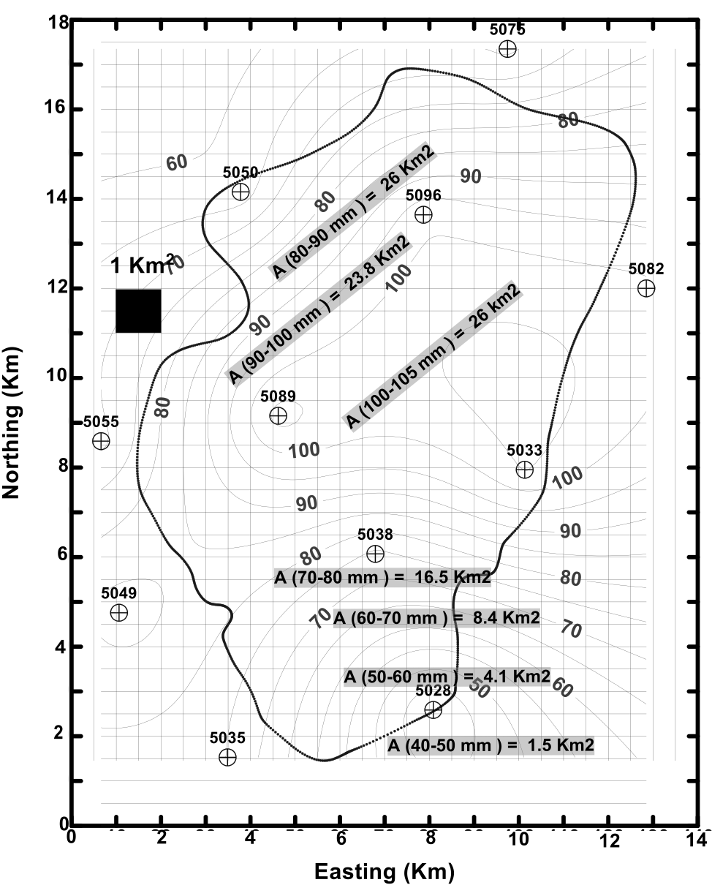
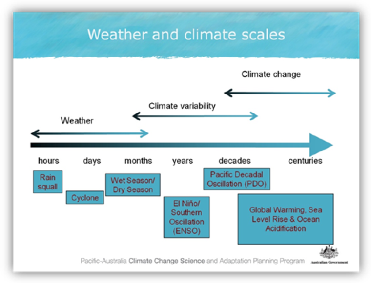

# Exercise 1: Catchment Rainfall and Runoff {#E1_1 -}

## Part 1: Spatial Rainfall Variability {#E1_2 -}

### Introduction {#E1_3 -}

Many factors affect the extent to which the measured rainfall amount at one rain-gauge can be extended to
the surrounding area:

- the distance from the rain-gauge to the centre of the representative area,
- the size of the area,
- the topography,
- the nature of the rainfall quantity (storm event, daily, monthly),
- the characteristics of the local storm patterns (convective versus low intensity events).

Most hydrological analysis at the catchment scale requires knowledge of the areal distribution of precipitation in the form of an average depth (mm) of water for the entire catchment over a specified time period, using information from a set of unevenly placed rain-gauges spread around the area. In order to calculate the flow discharge produced by a large storm (convective type) in the catchment in, it is necessary to calculate the **average depth of rainfall** (**ADR**) over the catchment. 

Three approaches are currently used for estimating the total rainfall: 

<ol type="a">
  <li>an arithmetic average of gauged quantities, </li>
  <li>the isohyetal method, and </li>
  <li>the Thiessen polygon method.</li>
</ol>

In this exercise you will compare these three different approaches for calculating the ADR and runoff generated by a single rainfall event.

To annotate this page, make sure you do so in the 'Hydrology Class 2020' group - you can join it [here](https://hypothes.is/groups/VKL9wvoG/hydrology-class-2020).   

Download the answer sheet for this exercise by clicking the download button in the tool bar <i class="fa fa-download" aria-hidden="true"></i>. 

### Methods {#E1_4 -}

In this exercise you are required to calculate the average rainfall (ADR) over the entire catchment using: 

<ol type="a">
  <li>the arithmetic mean (considering only stations within the catchment boundary),</li>
  <li>the Thiessen polygon weighting system, and</li>
  <li>the Isohyetal method. Rainfall data for each station in the catchment is provide in Table \@ref(tab:table1). </li>
</ol>

You are then required to produce an estimate of **catchment runoff**, which we will assume is equal to the stream **discharge out of the catchment** ($Q$). Recall from lecture slides that a rough estimate of runoff may be estimated using the total rainfall over the catchment during a given period of time, and a **runoff coefficient**. 

<center>
```{r image5, echo=FALSE, fig.cap="A depth of rain ($P$, mm/day) is falling over a catchment area ($A$, km^2^) to produce stream discharge ($Q$, m^3^/day).", out.width = '80%'}
knitr::include_graphics("images/exercise1/image5.png")
```
</center>

#### Arithmetic Average {#E1_5 -}

The most basic measure of average rainfall depth is the arthimetic average, whereby you sum the observed rainfall at each rain gauge inside the catchment and divide by the number of gauges.

#### Theisson Polygon Method {#E1_6 -}

The average depth of rainfall (ADR) over the entire catchment can be calculated using:

<center>
\begin{equation}
\mathrm{ADR\ (mm)\ =\ }\frac{\sum{A_i\ast P_i}}{\sum A_i}
(\#eq:exercise1-1)
\end{equation}
</center>

Where $A_{i}$  is the polygon area (km^2^), $P_{i}$ is the rainfall (mm) corresponding to the $i$ polygon, and $\sum{A_{i}}$ is the catchment area (km^2^).

#### Isohyetal Method {#E1_7 -}

The average depth of rainfall over the entire catchment can be calculated using:

<center>
\begin{equation}
\mathrm{ADR\ (mm)\ =\ }\frac{\sum{A_i\ast P_i}}{\sum A_i}
(\#eq:exercise1-2)
\end{equation}
</center>

where in this method $A_{i}$  is the area between isohyets $P_{i}$ and $P_{i+1}$ (km^2^), $P_{i}$ is the average rainfall (mm) corresponding to the area $A_{i}$  between the isohyets, and $\sum{A_{i}}$ is the total catchment area (km^2^).

### Activity {#E1_8 -}

You are given the measured data for each rainfall gauge in Table \@ref(tab:table2). Calculate the arithmetic mean and write this in your summary table (Table \@ref(tab:table1)). Next work out the ADR based on the other two methods. 

Once we have computed ADR, we can now estimate the likely amount of runoff. Remember the relationship between rainfall and discharge as outlined in the lecture. You'll need to choose an appropriate runoff coefficient, and calculate the stream discharge at the bottom of the catchment - rember to watch out for unit conversions! (<span style="color: red;"><b>8 marks</b></span>). 

<center>
```{r image1, echo=FALSE, fig.cap="Catchment map, station locations, and isohyetal map for a storm event. Isoheytal map corresponds to rainfall total over a 24hr period.", out.width = '80%'}
knitr::include_graphics("images/exercise1/image1.jpg")
```
</center>

#### Thiessen Polygons: Sketch the polygons {#E1_9 -}

To construct the Thiessen polygons, first draw dashed straight lines between the gauges. Next, find the mid-points of each of these lines and draw another solid line, perpendicular to the dashed line. These solid lines drawn perpendicular to the dashed lines will meet to form irregular polygons 
<center>
<video width="85%" height="85%" controls>
  <source src="images/exercise1/video2.mp4" type="video/mp4">
</video>
</center>
<br>
<center>
```{r image2, echo=FALSE, fig.cap="Gridded map for polygon construction and area estimates.", out.width = '80%'}
knitr::include_graphics("images/exercise1/image2.jpg")
```
</center>
<br>
```{r table2, echo=FALSE, message=FALSE, warning=FALSE}
library(knitr)
library(kableExtra)
options(kableExtra.html.bsTable = F, knitr.kable.NA = '')
table2 <- read.csv("tables/exercise1/table2.csv", check.names=FALSE)
kable(table2,"html", escape = F, align = rep('c'), caption = "Rainfall data for Thiessen polygon method (<span style='color:red'><b>3 marks</b></span>).",
      bootstrap_options = "hover") %>%
  kable_styling(table2, bootstrap_options = "hover", "striped", 
                full_width = F, position = "center",
                font_size = 12) %>%
  column_spec(1, width_min = "15em") %>%
  column_spec(2, width_min = "12em") %>%
  column_spec(3, width_min = "12em") %>%
  column_spec(4, width_min = "12em") %>%
  column_spec(5, width_min = "10em") %>%
  row_spec(1:11, background = 'white') %>%
  row_spec(12, background = 'lightgrey') %>%
  scroll_box(width = "100%",
             fixed_thead = FALSE) 
```

#### Contoured Rainfall (Isohyets) {#E1_10 -}

<center>
```{r image3, echo=FALSE, fig.cap="Isohyets on catchment with inter-isohyetal areas.", out.width = '71%'}

```
</center>
<br>
```{r table3, echo=FALSE, message=FALSE, warning=FALSE}
library(knitr)
library(kableExtra)
options(kableExtra.html.bsTable = F, knitr.kable.NA = '')
table3 <- read.csv("tables/exercise1/table3.csv", check.names=FALSE)
kable(table3,"html", escape = F, align = rep('c'), caption = "Iso-hyetal method data (<span style='color:red'><b>3 marks</b></span>).",
      bootstrap_options = "hover") %>%
  kable_styling(table2, bootstrap_options = "hover", "striped", 
                full_width = F, position = "center",
                font_size = 12) %>%
  column_spec(1, width_min = "15em") %>%
  column_spec(2, width_min = "12em") %>%
  column_spec(3, width_min = "12em") %>%
  column_spec(4, width_min = "12em") %>%
  column_spec(5, width_min = "10em") %>%
  row_spec(1:7, background = 'white') %>%
  row_spec(8, background = 'lightgrey') %>%
  scroll_box(width = "100%",
             fixed_thead = FALSE) 
```

#### Calculate Catchment Discharge {#E1_11 -}

```{r table1, echo=FALSE, message=FALSE, warning=FALSE}
library(knitr)
library(kableExtra)
options(kableExtra.html.bsTable = F, knitr.kable.NA = '')
table1 <- read.csv("tables/exercise1/table1.csv", check.names=FALSE)
kable(table1,"html", escape = F, align = rep('c', 5), caption = "ADR and catchment discharge using three different rainfall averaging methods.",
      bootstrap_options = "hover") %>%
  kable_styling(table1, bootstrap_options = "hover", "striped", 
                full_width = F, position = "center",
                font_size = 12) %>%
  column_spec(1, width_min = "7em") %>%
  column_spec(2, width_min = "7em") %>%
  column_spec(3, width_min = "7em") %>%
  column_spec(4, width_min = "7em") %>%
  column_spec(5, width_min = "7em") %>%
  row_spec(1:3, background = 'white') %>%
  scroll_box(width = "100%",
             fixed_thead = FALSE) 
```

### Conclusions  {#E1_12 -}

What conclusions can you draw from these results? You should always go back to your original objectives (or aims) and see what you have learnt from your analysis. Do this now and briefly summarise the aims of this exercise, your conclusions after doing this analysis, the limitations of your approach, and any recommendations. 

- The aim(s) of this exercise was (<span style="color: red;"><b>2 marks</b></span>):
- After doing this exercise I have been able to conclude (<span style="color: red;"><b>4 marks</b></span>):
- Limitations, assumptions and sources of error (<span style="color: red;"><b>4 marks</b></span>):
- Based on this study I would recommend (<span style="color: red;"><b>3 marks</b></span>):

## Part 2: Rainfall and Runoff Data Analysis {#E1_13 -}

### Introduction {#E1_14 -}

The previous exercise focussed on estimating rainfall and runoff at catchment scales during a storm event.  This focussed on catchment scale rainfall and processes.  In this exercise we will examine the nature of rainfall data and use some simple statistics to describe these data.  We then look at how rainfall may be changing over time and how it varies over space across Western Australia.  After that we explore how different modes of climate variability affect annual rainfall.  Lastly, we look at the relationships between rainfall and runoff.  To achieve this, we use a large number of weather stations across WA to quantify the variability of rainfall in space and time.

Throughout the exercise we should remember that rainfall will be influenced by a number of processes that operate on different space and time scales (see Figure \@ref(fig:image6)).  We will examine these during this exercise.

<center>
```{r image6, echo=FALSE, fig.cap="A guide to the timescales applicable to weather, climate variability and climate change [Pacific Climate Futures](www.pacificclimatefutures.net).", out.width = '80%'}

```
</center>

### Objectives {#E1_15 -}

By the end of this activity, you should:

1) Be able to source rainfall data, understand the nature of that data and describe it using simple statistics in Excel.
2) Understand how and why rainfall may be changing over time and use statistics and regression to test hypothesis.
3) Know how different modes of climate variability such as IOD and ENSO affect annual rainfall.
4) Determine the relationships between rainfall and runoff to evaluate the nature of the relationship between rainfall and discharge.

### Statistical Properties of Rainfall Data {#E1_16 -}

1) Individually (make sure you have at least one person per station but you can have more than one if needed). Start by downloading the daily rainfall data for your site from the [Bureau of Meteorology](http://www.bom.gov.au/climate/data/) web site.  Use the site ID to get the data as below. Download and extract the zipped file to get a CSV file that can be opened in Excel.

<center>
<video width="100%" height="100%" controls>
  <source src="images/exercise1/video1.mp4" type="video/mp4">
</video>
</center>

2) First, let’s plot the time series of DAILY rainfall. Clean up the plot as required and submit on your answer sheet (<span style="color: red;"><b>1 mark</b></span>). Describe the main features of this data set. What is the most appropriate type of graph for rainfall data? (<span style="color: red;"><b>3 marks</b></span>)

3) Calculate the annual SUM of rainfall. We want to ensure that there are only whole years to calculate the sums or else they will be in error. Delete the rows of data for the last partial year (2019) and any partial years at the start. Select the required data across multiple columns (year C to rainfall amount F). Then insert PIVOT table (Create a new tab). Select Year and Rainfall amount as the FIELDS. Drag the Year FIELD into the ROWS box. Left click on the “Sum of Year” in the VALUES box and remove it. Plot the annual sums as a timeseries. Clean up the plot as required and submit on your answer sheet (<span style="color: red;"><b>1 mark</b></span>). What are the main features of this annual data set? What variability can you see? (<span style="color: red;"><b>2 marks</b></span>)


4) Use the Data Analysis add-in to calculate descriptive statistics (mean annual rainfall, max annual rainfall, min annual rainfall, Standard deviation of annual rainfall, Skewness) for the whole data (you can install by going to *Tools->Add-ins->Analysis ToolPack*).
Copy the results [here](https://docs.google.com/spreadsheets/d/10mHrNWEHoqWif96e7SwvowfQ7sMg_qMxFtw6POr7sG4/edit?usp=sharing) and complete Table \@ref(tab:table4) for your site (and others when they are done). Describe the values you got and what they mean. How “useful” are these statistics for your understanding of the system? What if any assumptions are there about these statistics? (<span style="color: red;"><b>4 marks</b></span>)

5) Next, let’s look at the distribution of the rainfall data. Do this by plotting a histogram of the rainfall data (you will need to decide on a reasonable bin size) and plotting the cumulative probability distribution (you can ask Excel to generate this automatically when it makes the histogram, or generate it manually – each data point represents a probability of 1/#data points). What do these plots tell you about the rainfall data? Are the data normally distributed? (<span style="color: red;"><b>2 marks</b></span>)

6) Plot the seasonal (monthly average) rainfall. Use a PIVOT table again. Insert PIVOT table (select OK to create a new tab). Select **Month** and **Rainfall** amount as the FIELDS; drag the Month FIELD into the ROWS box. Left click on the “Sum of Month” in the VALUES box and remove it. Plot the annual sums as a timeseries. Clean up the plot as required and submit on your answer sheet (<span style="color: red;"><b>2 marks</b></span>).
How would you describe the seasonal pattern of rainfall (hint look at the climate type)? What factors may influence it (hint, think about earth orbit)? (<span style="color: red;"><b>2 marks</b></span>)

<center>
```{r table4, echo=FALSE, message=FALSE, warning=FALSE}
library(knitr)
library(kableExtra)
options(kableExtra.html.bsTable = F, knitr.kable.NA = '')
table4 <- read.csv("tables/exercise1/table4.csv", check.names=FALSE)
kable(table4,"html", escape = F, align = rep('c', 5), caption = "Bureau of Meteorology Automatic Weather Station data and station ID across WA and SWWA. Complete the table for each site.",
      bootstrap_options = "hover") %>%
  kable_styling(table1, bootstrap_options = "hover", "striped",
                full_width = F, position = "center",
                font_size = 12) %>%
  column_spec(1, width_min = "10em") %>%
  column_spec(2, width_min = "10em") %>%
  column_spec(3, width_min = "10em") %>%
  column_spec(4, width_min = "10em") %>%
  column_spec(5, width_min = "10em") %>%
  column_spec(6, width_min = "10em") %>%
  row_spec(1:25, background = 'white') %>%
  scroll_box(width = "100%", height = "515px",
             fixed_thead = FALSE)
```
</center>

### Temporal trends in rainfall {#E1_17 -}

7) Calculate the trend in rainfall for the **last 5 years.**  Copy and paste the annual totals from the PIVOT table (include the year and amount columns) into another sheet.  Select the last 5 years of data and in DATA ANALYSIS start a REGRESSION.  Input the data range. Select “**Line Fit Plots**”.  What did you find and what were you expecting?  Is this long enough for a reliable trend?  Is the relationship really linear – discuss? (<span style="color: red;"><b>3 marks</b></span>)

8) Calculate the trend in rainfall for **all** years available at the site.  Copy and paste the annual totals from the PIVOT table (include the year and amount columns) into another sheet.  Select the all years of data and INSERT a SCATTER plot.  Add a trend line and “**display the equation**” on the chart.  Add the Pearson correlation coefficient (r^2^) value as well.  Add the information for your site into Table \@ref(tab:table5) (and insert the other class data when you can). (<span style="color: red;"><b>2 marks</b></span>)

<center>
```{r table5, echo=FALSE, message=FALSE, warning=FALSE}
library(knitr)
library(kableExtra)
options(kableExtra.html.bsTable = F, knitr.kable.NA = '')
table5 <- read.csv("tables/exercise1/table5.csv", check.names=FALSE)
kable(table5,"html", escape = F, align = rep('c', 5), caption = "Bureau of Meteorology Automatic Weather Station data and station ID across WA and SWWA. Complete the table for each site.",
      bootstrap_options = "hover") %>%
  kable_styling(table1, bootstrap_options = "hover", "striped",
                full_width = F, position = "center",
                font_size = 12) %>%
  column_spec(1, width_min = "9em") %>%
  column_spec(2, width_min = "9em") %>%
  column_spec(3, width_min = "9em") %>%
  column_spec(4, width_min = "9em") %>%
  column_spec(5, width_min = "9em") %>%
  column_spec(6, width_min = "9em") %>%
  row_spec(1:25, background = 'white') %>%
  scroll_box(width = "100%", height = "515px",
             fixed_thead = FALSE)
```
</center>
<br>

9) What hypothesis can we make about changes in rainfall amount over time?  How do we frame the hypothesis?  What statistical test can we use to test the significance of the hypothesis? Describe the results and conclusions of this analysis. Calculate the appropriate t-value and p-value and enter them also into Table \@ref(tab:table5). (<span style="color: red;"><b>5 marks</b></span>)

10) Break into small groups of about 5 and discuss the results of Table \@ref(tab:table5).  Choose a rapporteur to report back at the end of the discussion. Highlight the station where there is a statistically significant slope.  Are there statistically significant changes in rainfall?  Are they consistent across WA?  What may be causing the changes? (<span style="color: red;"><b>5 marks</b></span>)

### Spatial patterns in rainfall {#E1_18 -}

11) Take the information in Table \@ref(tab:table4) and record your values onto the locations of each site on the large class map (whiteboard). Use the maps below to locate your site.  When everyone is finished break back into your groups and discuss the results. Choose a new rapporteur to report back at the end of the discussion. Think about the spatial patterns not the temporal ones (i.e climate modes).  What spatial patterns might you expect and what do you notice?  What may be causing these spatial patterns? (<span style="color: red;"><b>6 marks</b></span>)

<center>
```{r image7, echo=FALSE, fig.cap="", out.width = '90%'}
knitr::include_graphics("images/exercise1/image7.png")
```
</center>

### Interannual variability in rainfall {#E1_19 -}

Here we determine how rainfall correlates with known modes of climate variability (i.e. Indian Ocean Dipole (IOD) and El Nino Southern Oscillation (ENSO)).

Other indicators of temporal variability (look for cyclic patterns).  Does rainfall correlate with known modes of climate variability (i.e. IOD and ENSO using the Southern Oscillation Index (SOI)). SOI is calculated as follows.

<center>
\begin{equation}
\text{SOI} = 10 \frac{P_{\text{diff}} - P_{\text{diffav}}}{SD(P_{\text{diff}})}
(\#eq:exercise-3)
\end{equation}
</center>

Where:

- $P_{\text{diff}}$ = (average Tahiti MSLP for the month) - (average Darwin MSLP for the month)
- $P_{\text{diffav}}$ = long term average of $P_{\text{diff}}$ for the month in question, and
- $SD(P_{\text{diff}})$ = long term standard deciation of $P_{\text{diff}}$ for the month in question.

IOD is calculated by anomalous Sea Surface Temperature gradient between the western equatorial Indian Ocean (50E-70E and 10S-10N) and the south eastern equatorial Indian Ocean (90E-110E and 10S-0N) in units of degrees Kelvin.

We will use the extremely useful [Climate Explorer](https://climexp.knmi.nl/start.cgi?id=someone@somewhere) for the next section.  First you will need to register so you can save data series.  Access the rainfall from the previous site that you used in the previous section. Click on “**Monthly Station Data**” (right hand menu), select "precipitation" from the "GHCN-M (all)" column, search for your station (e.g. type BROOME in the "Select stations" section), and then press "Get stations". If the selection works you will see relevant stations listed, and then click “**get data**”. You will then see graphs and options for further integrating the data. Make a name to save the data (the default should be fine). Click “**Add to list**”.

<center>
<video width="85%" height="85%" controls>
  <source src="images/exercise1/video4.mp4" type="video/mp4">
</video>
</center>

Now get the first climate index for the IOD called the DMI. Go to “**Monthly climate indices**” and then select DMI. Note any trend and variability in the index.

To correlate the index and rainfall select “**Correlate with other time series**”. And tick your previously saved rainfall timeseries and then press “**Correlate**” and copy the results into Table \@ref(tab:table6).

<center>
<video width="85%" height="85%" controls>
  <source src="images/exercise1/video5.mp4" type="video/mp4">
</video>
</center>

<br>

<center>
```{r table6, echo=FALSE, message=FALSE, warning=FALSE}
library(knitr)
library(kableExtra)
options(kableExtra.html.bsTable = F, knitr.kable.NA = '')
table6 <- read.csv("tables/exercise1/table6.csv", check.names=FALSE)
kable(table6,"html", escape = F, align = rep('c', 5), caption = "Rainfall and climate indices (DMI for IOD and SOI for ENSO) correlations (<span style='color:red'><b>1 mark</b></span>).",
      bootstrap_options = "hover") %>%
  kable_styling(table1, bootstrap_options = "hover", "striped",
                full_width = F, position = "center",
                font_size = 12) %>%
  column_spec(1, width_min = "12em") %>%
  column_spec(2, width_min = "12em") %>%
  column_spec(3, width_min = "12em") %>%
  column_spec(4, width_min = "12em") %>%
  column_spec(5, width_min = "12em") %>%
  row_spec(1:12, background = 'white') %>%
  scroll_box(width = "100%",
             fixed_thead = FALSE)
```
</center>

<br>

12) Break into small groups of about 5 and discuss the results of your correlations. Choose a new rapporteur to report back at the end of the discussion. Highlight any months that have a significant p-value (<0.05). What relationships do you see between rainfall and climate mode and why? Do they correlate in specific seasons? How strong are these correlations really? How are they consistent or different across WA? (<span style="color: red;"><b>6 marks</b></span>)

We can do the same exercise except using gridded data (climate data divided into say 0.5 degree spacing using reanalysis information). Click on “**Monthly observations**” and go to **Precipitation CRU TS 0.5**.

<center>
<video width="85%" height="85%" controls>
  <source src="images/exercise1/video6.mp4" type="video/mp4">
</video>
</center>


We then want to correlate each grid cell on the earth with our climate index (SOI and DMI) to see how the correlations very spatially. Click on “Correlate with a time series” and choose either SOI or DMI. Then click correlate at the bottom and wait (the calculations are being done online and the graph returned for viewing). Do the same for both SOI and DMI.

13) Break into small groups of about 5 and discuss the results of your plots. Choose a new rapporteur to report back at the end of the discussion. For DMI which month had the highest (negative) correlation (copy that plot to your results). What areas of Australia have significant correlations and what time of year? For SOI which month had the highest (positive) correlation (copy that plot to your results). What areas of Australia have significant correlations and what time of year? Does this match with your own rainfall station correlations (<span style="color: red;"><b>6 marks</b></span>)?

### Relationship between rainfall and runoff {#E1_20 -}

Examine the relationship between annual rainfall and annual Runoff. Go the [Department of Water](http://wir.water.wa.gov.au/Pages/Water-Information-Reporting.aspx) web site. Use this tool to locate a gauging station near your rainfall site. You should find something similar to below. Go to “**Pre-computed reports**”. Click on “**Total Annual Discharge report**”. Ensure you have 10-20 years of available data for this exercise.

<center>
<video width="85%" height="85%" controls>
  <source src="images/exercise1/video3.mp4" type="video/mp4">
</video>
</center>

14) Plot a scatter plot of discharge and annual rainfall, add a line to the chart. Break into small groups of about 5 and discuss the results of your plots. Choose a new rapporteur to report back at the end of the discussion. What are the relationships between rainfall and discharge? Are they linear or non- linear and why? Are they consistent across WA? (<span style="color: red;"><b>4 marks</b></span>)