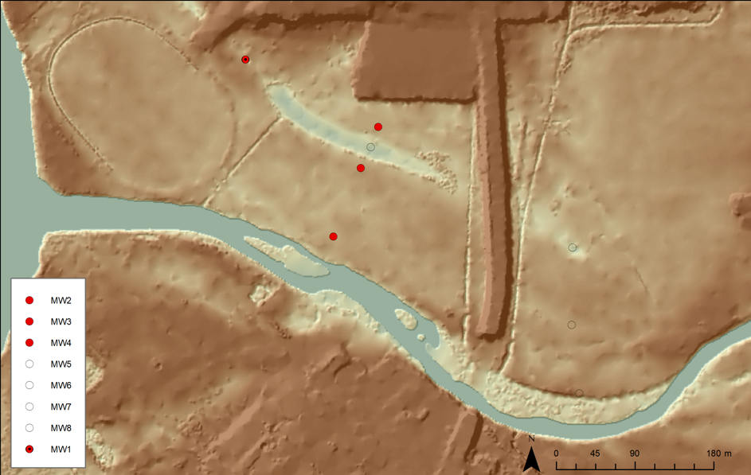

# Exercise 1B: Surface-Ground Water Interaction {#E4_1 -}

## Part 1: Desktop Catchment {#E4_12 -}

### Overview {#E4_2 -}

In this experiment, you will use data loggers to record streamflow in an experimental catchment during a rainfall event, and calculate the relative contributions of pre-event and event water to that streamflow. The real-world setting for the experiment is a gaining stream (Figure \@ref(fig:image04-1)). A question we often want to be able to answer is how much groundwater is contributing to flow in a river, and how much is water that came from recent rainfall. This is relevant for water resources planning so we can work out the discharge rate of an aquifer, or for water quality management. 

Groundwater usually has different chemical characteristics to storm runoff during a rainfall event and we can use this chemical signal as a tracer for groundwater contribution. In this experiment you will demonstrate how groundwater (pre-event water) contribution to river flow changes over the course of a storm event, relative to water that fell as rain during the storm event (event water). You will use the tracer dilution technique using salinity (measured as electrical conductivity, EC) as the groundwater tracer. The experimental set-up consists of a tray of soil, the ability to add rainfall (via a connection to the tap) and discharge outlets at the bottom of the catchment. During the experiment loggers will measure rainfall amount as well as streamflow and EC at the catchment outlet over time (Figure \@ref(fig:image04-2)).

<center>
```{r image04-1, echo=FALSE, fig.cap="Groundwater discharge to a gaining stream.", out.width = '60%'}

```
</center>

<center>
```{r image04-2, echo=FALSE, fig.cap="Experimental setup showing the catchment tray, rainfall, sprinklers and logger location.", out.width = '90%'}
knitr::include_graphics("images/surface_ground_water_interaction/picture2.png")
```
</center>

### Method {#E4_3 -}

#### Step 1 {#E4_4 -}

Set up your apparatus. There are loggers for rainfall, streamflow and EC that are connected to a computer. Follow the instructions provided VERY carefully to make sure that you record and save your data correctly. Do not proceed until you understand how the loggers work. Also make sure that all but one outlet in the bottom layer of drain outlets are blocked with rubber bungs or stickers before proceeding (Figure \@ref(fig:image04-3)).

#### Step 2 {#E4_5 -}

Create your “aquifer” by loading the bottom of your tray with some of the provided river sand mix. Smooth the top surface so that it is an even thickness across the catchment and then estimate the volume of this layer. The top of aquifer should sit below the top line of outlets as shown in Figure \@ref(fig:image04-3). 

Take a core to sample the soil, and compute the starting soil moisture (refer to the method here).

Now saturate the sand with saline water, making sure to note the EC of the saline solution. Remove any excess ponded water with a syringe before proceeding.

<center>
```{r image04-3, echo=FALSE, fig.cap="Saturated aquifer correctly set up within catchment model.", out.width = '90%'}

```
</center>

#### Step 3 {#E4_6 -}

Now overlay the saturated soil layer with a second layer of dry soil, being careful not to disturb the original layer. Shape the new upper layer into the shape of a catchment (concave) so that when the subsurface fills up there will be a stream flowing to the catchment outlet (Figure \@ref(fig:image04-4)). The middle outlet in the top layer should NOT be covered with soil, but the soil should be just below this outlet. You will see some capillary rise of your aquifer water into the vadose zone. Make sure the rainfall outlets are close to the catchment surface. Then turn the tubes at the bottom of the catchment so that they are directed into the PVC drain and you’re ready to go!

<center>
```{r image04-4, echo=FALSE, fig.cap="Unsaturated zone on to of aquifer. Topography should slope towards the middle and the catchment outlet.", out.height = '70%'}
knitr::include_graphics("images/surface_ground_water_interaction/picture4.png")
```
</center>

#### Step 4 {#E4_7 -}

When you are ready to run the experiment, prepare a stop-watch and turn on the logger software in the computer. Now you can turn the tap on to get the rainfall flowing – make sure it is a reasonable flow that is not too high or too low (i.e. it is clearly visible on the scale on the logging software, somewhere between 2.5 and 3). Leave the rain on for approximately 20 minutes until the catchment has filled up, stream flow has begun and the EC at the catchment outlet has clearly decreased (Figure \@ref(fig:image04-5)).

<center>
```{r image04-5, echo=FALSE, fig.cap="Streamflow at the catchment outlet.", out.height = '30%'}
knitr::include_graphics("images/surface_ground_water_interaction/picture5.png")
```
</center>

#### Step 5 {#E4_8 -}

Now you can turn the rain off, but make sure you **leave the loggers on**, we want to see what happens after the rain is finished. Run the experiment for another 20 minutes or until the streamflow has ceased if you have time. 

```{block2, hint04-1, type='rmdnote2'}
Make sure you save the experimental data as a .csv file.
```

#### Step 6 {#E4_9 -}

Analyse the data. Before you can do this you might need to clean the data – remove any outliners and identify where your experimental data start and stop. You have very high temporal resolution data, which might not be ideal for the sensitivity of your loggers. Consider calculating a running average to get smooth temporal trends. Once you are happy with your clean data set you can use the logged data to identify the properties of the storm event, including:

a) Time from rainfall onset to when runoff began to be recorded (mins),
b) Time to peak discharge (mins), 
c) Total rainfall volume (cm^3^),
d) Total runoff volume (cm^3^),
e) Average rainfall intensity (cm/min),
f) The runoff coefficient, $c$, for the ‘storm’ event.

#### Step 7 {#E4_10 -}

Interpret the data. What were the relative contributions of pre-event (baseflow) and event water? Now that you’ve familiarised yourself with the rainfall event, you can:

- Estimate the initial “aquifer” storage of saline water (cm^3^). Assume that the porosity of the dry soil is 0.25
- Calculate and plot the hydrograph (cm^3^/s): $Q_{\text{out}}(t) = Q_{\text{event}} + Q_{\text{pre-event}}$
- Using the tracer dilution method (see below) calculate the fraction of the hydrograph that is from baseflow. How does this change over time?
- Comment on attributes of the experimental setup that would have increased or decreased baseflow contribution. 
- How realistic is the experiment in terms of capturing the interaction of surface vs groundwater? Is the change in $Q_{\text{pre-event}}/Q_{\text{event}}$ over time what you would expect?

```{block2, hint04-7, type='rmdspecialbox2'}
We can estimate the groundwater contribution to the streamflow by looking at changes in EC.  If EC in groundwater is at a pre-event reference level, $S_{\text{pre-event}}$, EC in the rain $S_{\text{event}}$ is almost 0, then the level of dilution in EC in streamflow can be used to estimate the fraction of event and pre-event (groundwater baseflow) contributing to streamflow:

$S_{\text{tot}} * Q_{\text{tot}} =  S_{\text{event}} * Q_{\text{event}}   +   S_{\text{pre-event}} * Q_{\text{pre-event}}$

If $S_{\text{event}} = 0$, then:

$Q_{\text{pre-event}} = S_{\text{out}}*Q_{\text{out}} / S_{\text{pre-event}}$

$Q_{\text{event}} = Q_{\text{out}} - Q_{\text{pre-event}}$

```

### Submission {#E4_11 -}

```{block2, hint04-6, type='redbox2'}
**Submission:** Prepare a concise report summarising the experiment (~4 pages).  Include an Introduction, Methods, Results and Discussion section, using referencing where appropriate to give real-world context to the activity. 

```

## Part 2: Helena River Site Visit {#E4_13 -}

<center>
```{r image04-6, echo=FALSE, fig.cap="", out.width='95%'}
knitr::include_graphics("images/surface_ground_water_interaction/picture6.png")
```
</center>

### Background {#E4_14 -}

The degradation of freshwater systems by increasing salinity is a major challenge facing Western Australia. Salinisation of the Avon river, which enters the Upper Swan river at Walyunga National Park, arose due to poor land-management leading to secondary salinity in the inland wheatbelt catchments. Whilst secondary salinity is not an issue in the Swan Coastal Plain where our site visit is, the salt loads from the Avon in addition to rising sea levels and decreasing rainfall trend have been driving changes in the seasonal movement of marine waters, with increasing penetration of the salt wedge further inland from the ocean (Huang et al. 2018).

Salinisation of river systems can cause shifts in floodplain vegetation which arise because of river water interaction with the floodplain. Depending on the salinity increase and the salt tolerance of the floodplain tree species, this can cause shifts in community structure. One important species that has a natural range along the Swan river and its tributaries is the *Eucalyptus rudis*. This species has been reported to be in decline for over 15 years along the Swan river (Clay & Majer 2001), and more recently along one of the tributaries of the Swan river: the Guildford floodplains of the Helena river (Dundas 2011). It is currently unknown the exact role of water availability and salinity in the observed decline, and alternate hypothesis related to tree pathogens (e.g. Phytophthora) are also as drivers of decline are also under investigation.

*E. rudis* plays a vital role in the riparian ecosystem. Riparian woodland species are important filters that reduce nutrient transfers from the land into the river, which is a significant issue in the Swan river and its tributaries (excessive nutrients have historically resulted in noxious algal blooms). There is therefore a need to better understand what drives decline and if projected drying conditions for the region will make the pressures worse.

This site visit allows students to understand how hydrologic monitoring of surface and water systems can support our understanding and support investigations into the drivers of decline of *E. rudis* in relation to the changing hydrology regime at the Guildford floodplains along the Helena river. This site is part of a long-term research investigation being undertaken with the WA Department of Biodiversity, Conservation and Attractions (DBCA).  

During our visit, we will characterise the site and consider hydrologic pathways (surface and sub-surface), and collect data to assess water and salt distribution in this floodplain system. 

You will be shown around the site to explain the basic surface and groundwater processes occurring, and in groups you will:

- Identify the surface water flow regime.
- Identify the distressed and dead trees.
- Observe soils and their hydraulic properties.
- Undertake salinity data collection from groundwater wells (piezometers) and surface waters, and from soils within the tree root zone.
- Conceptualise the hydrologic processes influencing salt movement and accumulation across the site.

<center>
```{r image04-7, echo=FALSE, fig.cap="High-resolution LIDAR image of the surface topography of the Helena River study site in Guildford. The red-circles indicate groundwater observation wells.", out.width='90%'}

```
</center>

### Helena River Floodplain Field Visit Tasks: For those attending in-person {#E4_15 -}

During your site visit you will be instructed to follow the tasks below and record your data in the sheet available in the downloads section <i class="fa fa-download" aria-hidden="true"></i>. If in doubt, please ask for assistance.

#### On arrival {#E4_16 -} 

Firstly check-in with an instructor and get your bearings. 

- Explore the site, considering the surface water and groundwater pathways. 
- Be able to identify flow direction in the main waterways bounding the site (Swan River to the west and Helena River to the east).
- Be able to identify water accumulation areas within the site itself.
- Consider the horizontal and vertical movement pathways.
- Identify *Eucalyptus rudis* trees and their health in context of the landscape.

#### Task A – Helena River flow {#E4_17 -} 

Navigate to the Helena River, where it flows under the Bridge. Undertake a stream gauging measurement to determine the river flow. Refer to the Streamflow lab “Velocity-Area method”

#### Task B – Ponded surface water salinity {#E4_18 -}  

Measure at two contrasting locations surface water salinity, and record on the data collection sheet. 

Include the GPS locations. Take one from Helena or Swan river, and one from an internal site. We will collate data from students to make a class data summary. Use waders provided for deeper waters – use a stick/ruler to judge depth of water before taking steps and do not enter into fast-running water above knee height. 

#### Task C – Groundwater sampling {#E4_19 -} 

Visit one of the existing piezometer wells (consult tutor for locations, or refer to map). Note the Well Identification Number. Record results from the following tasks:

a) Record the depth from the water to the top of the casing. 
b) "Bail the well" with the bailer, and take a sample of the water for salinity determination (measure EC).

#### Task D – Soil salinity {#E4_20 -} 

Identify a transect and soil/groundwater sampling location (consult tutor for guidance). Take an exact GPS reading to log your site. Split the tasks below between your team mates:

a) Measure the soil salinity of a sample at the **surface**, and **20 cm below the surface**
b) Use the hand auger, drill to reach the water table ~ 50cm below the surface (this may vary depending on the exact site chosen). Carefully extract the soil, without the hole collapsing. 
Once settled (~5-10mins), take an EC reading of the water pooling in the bottom, and note the water level below the ground surface. Take caution the depth is accurate relative to the pre-disturbed surface.
c) Whilst the above is being done, in a nearby location, prepare a flat soil surface and undertake an infiltration assessment with the Decagon infiltrometer. Repeat 3 times, noting the infiltration volume for later entry into the Decagon spreadsheet. You will need to note the soil type, based on your observation. 

### Helena River Floodplain Field Visit Tasks: For those undertaking online {#E4_21 -} 

#### Task Z {#E4_22 -} 

For those not attending the site visit in person, your activity will be to learn about the site by reviewing prior analyses that have been undertaken and looking at historical data for the site.  You will additionally be able to see specific aspects of the site by reviewing the short videos made by participants who report on Tasks A-D.

### Submission {#E4_23 -} 
