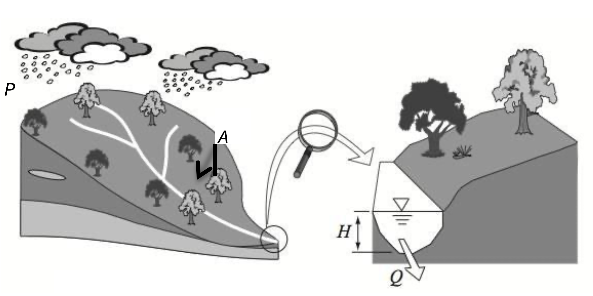
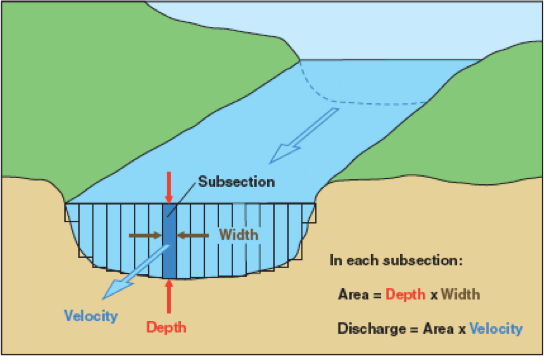
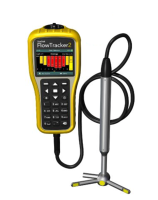

--- 
title: "Hydrology Workbook"
author: "Matt Hipsey, Sarah Bourke, Jason Beringer and Giles Knight"
date: "Last updated: `r Sys.Date()`"
site: bookdown::bookdown_site
documentclass: book
bibliography:  ["references/references.bib"]
biblio-style: apalike
link-citations: true
description: ""
---

# Introduction {-}

Module specific activities will be added sequentially throughout semester. From the table of contents you can see the weekly activities, and specific details for individual assessments. Please refer to LMS for information about the course schedule.

For more information contact your Unit Coordinator or tutor.

<!--chapter:end:index.Rmd-->

# (PART) Exercises {.unnumbered}

# Exercise 1A -- Spatial rainfall variability {.unnumbered}

## Introduction {#E1A_1 .unnumbered}

A fundamental of **hydrology** is working out how much rain turns into streamflow. But rain does not fall evenly over a catchment area and there are many factors that affect the extent to which the measured rainfall amount at one rain-gauge can be extended to the surrounding area:

-   the distance from the rain-gauge to the centre of the representative area,
-   the size of the area,
-   the topography,
-   the nature of the rainfall quantity (storm event, daily, monthly),
-   the characteristics of the local storm patterns (convective versus low intensity events).

Most hydrological analysis at the catchment scale requires knowledge of the areal distribution of precipitation in the form of an average depth (mm) of water for the entire catchment over a specified time period, using information from a set of unevenly placed rain-gauges spread around the area. In order to calculate the flow discharge produced by a large storm (convective type) in the catchment in, it is necessary to calculate the **average depth of rainfall** (**ADR**) over the catchment.

Three approaches are currently used for estimating the total rainfall:

<ol type="a">

<li>

an arithmetic average of gauged quantities,

</li>

<li>

the isohyetal method, and

</li>

<li>

the Thiessen polygon method.

</li>

</ol>

## Objective {#E1A_2 .unnumbered}

In this exercise you will compare these three different approaches for calculating the ADR and estimate the amount of runoff generated by a single rainfall event.

## Methods {#E1A_3 .unnumbered}

In this exercise you are required to calculate the average rainfall (ADR) over the entire catchment using:

<ol type="a">

<li>

the arithmetic mean (considering only stations within the catchment boundary),

</li>

<li>

the Thiessen polygon weighting system, and

</li>

<li>

the Isohyetal method. Rainfall data for each station in the catchment is provide in Table \@ref(tab:table1).

</li>

</ol>

You are then required to produce an estimate of **catchment runoff**, which we will assume is equal to the stream **discharge out of the catchment** ($Q$). Recall from lecture slides that a rough estimate of runoff may be estimated using the total rainfall over the catchment during a given period of time, and a **runoff coefficient**.

<center>

```{r image5, echo=FALSE, fig.cap="A depth of rain ($P$, mm/day) is falling over a catchment area ($A$, km^2^) to produce stream discharge ($Q$, m^3^/day).", out.width = '80%'}

```

</center>

#### Arithmetic Average {#E1A_4 .unnumbered}

The most basic measure of average rainfall depth is the arthimetic average, whereby you sum the observed rainfall at each rain gauge inside the catchment and divide by the number of gauges.

#### Theisson Polygon Method {#E1A_5 .unnumbered}

The average depth of rainfall (ADR) over the entire catchment can be calculated using:

<center>

\begin{equation}
\mathrm{ADR\ (mm)\ =\ }\frac{\sum{A_i\ast P_i}}{\sum A_i}
(\#eq:exercise1-1)
\end{equation}

</center>

Where $A_{i}$ is the polygon area (km^2^), $P_{i}$ is the rainfall (mm) corresponding to the $i$ polygon, and $\sum{A_{i}}$ is the catchment area (km^2^).

#### Isohyetal Method {#E1A_6 .unnumbered}

The average depth of rainfall over the entire catchment can be calculated using:

<center>

\begin{equation}
\mathrm{ADR\ (mm)\ =\ }\frac{\sum{A_i\ast P_i}}{\sum A_i}
(\#eq:exercise1-2)
\end{equation}

</center>

where in this method $A_{i}$ is the area between isohyets $P_{i}$ and $P_{i+1}$ (km^2^), $P_{i}$ is the average rainfall (mm) corresponding to the area $A_{i}$ between the isohyets, and $\sum{A_{i}}$ is the total catchment area (km^2^).

## Activity {#E1A_7 .unnumbered}

**Download the answer sheet for this exercise by clicking the download button in the tool bar** <i class="fa fa-download" aria-hidden="true"></i>.

You are given the measured data for each rainfall gauge in Table \@ref(tab:table2). Calculate the arithmetic mean and write this in your summary table (Table \@ref(tab:table1)). Next work out the ADR based on the other two methods.

<center>

```{r image1, echo=FALSE, fig.cap="Catchment map, station locations, and isohyetal map for a storm event. Isoheytal map corresponds to rainfall total over a 24hr period.", out.width = '80%'}
knitr::include_graphics("images/exercise1A/image2.jpg")
```

</center>

#### Thiessen Polygons: Sketch the polygons {#E1A_8 .unnumbered}

To construct the Thiessen polygons, first draw dashed straight lines between the gauges. Next, find the mid-points of each of these lines and draw another solid line, perpendicular to the dashed line. These solid lines drawn perpendicular to the dashed lines will meet to form irregular polygons

<center>

<video width="85%" height="85%" controls>

<source src="images/exercise1A/video2.mp4" type="video/mp4">

</video>

</center>

<br>

<center>

```{r image2, echo=FALSE, fig.cap="Gridded map for polygon construction and area estimates.", out.width = '80%'}
knitr::include_graphics("images/exercise1A/image3.jpg")
```

</center>

<br>

```{r table2, echo=FALSE, message=FALSE, warning=FALSE}
library(knitr)
library(kableExtra)
options(kableExtra.html.bsTable = F, knitr.kable.NA = '')
table2 <- read.csv("tables/exercise1A/table2.csv", check.names=FALSE)
kable(table2,"html", escape = F, align = rep('c'), caption = "Rainfall data for Thiessen polygon method. Use your answer sheet to sedit this table!",
      bootstrap_options = "hover") %>%
  kable_styling(table2, bootstrap_options = "hover", "striped", 
                full_width = F, position = "center",
                font_size = 12) %>%
  column_spec(1, width_min = "15em") %>%
  column_spec(2, width_min = "12em") %>%
  column_spec(3, width_min = "12em") %>%
  column_spec(4, width_min = "12em") %>%
  column_spec(5, width_min = "10em") %>%
  row_spec(1:11, background = 'white') %>%
  row_spec(12, background = 'lightgrey') %>%
  scroll_box(width = "100%",
             fixed_thead = FALSE) 
```

#### Contoured Rainfall (Isohyets) {#E1A_9 .unnumbered}

<center>

```{r image3, echo=FALSE, fig.cap="Isohyets on catchment with inter-isohyetal areas.", out.width = '71%'}
knitr::include_graphics("images/exercise1A/image4.png")
```

</center>

<br>

```{r table3, echo=FALSE, message=FALSE, warning=FALSE}
library(knitr)
library(kableExtra)
options(kableExtra.html.bsTable = F, knitr.kable.NA = '')
table3 <- read.csv("tables/exercise1A/table3.csv", check.names=FALSE)
kable(table3,"html", escape = F, align = rep('c'), caption = "Iso-hyetal method data.",
      bootstrap_options = "hover") %>%
  kable_styling(table2, bootstrap_options = "hover", "striped", 
                full_width = F, position = "center",
                font_size = 12) %>%
  column_spec(1, width_min = "15em") %>%
  column_spec(2, width_min = "12em") %>%
  column_spec(3, width_min = "12em") %>%
  column_spec(4, width_min = "12em") %>%
  column_spec(5, width_min = "10em") %>%
  row_spec(1:7, background = 'white') %>%
  row_spec(8, background = 'lightgrey') %>%
  scroll_box(width = "100%",
             fixed_thead = FALSE) 
```

#### Calculate Catchment Discharge {#E1A_10 .unnumbered}

Once we have computed ADR, we can now estimate the likely amount of runoff. Remember the relationship between rainfall and discharge as outlined in the supporting lecture. Hint: you'll need to choose an appropriate runoff coefficient, and calculate the stream discharge at the bottom of the catchment - remember to watch out for unit conversions!

```{r table1, echo=FALSE, message=FALSE, warning=FALSE}
library(knitr)
library(kableExtra)
options(kableExtra.html.bsTable = F, knitr.kable.NA = '')
table1 <- read.csv("tables/exercise1A/table1.csv", check.names=FALSE)
kable(table1,"html", escape = F, align = rep('c', 5), caption = "ADR and catchment discharge using three different rainfall averaging methods.",
      bootstrap_options = "hover") %>%
  kable_styling(table1, bootstrap_options = "hover", "striped", 
                full_width = F, position = "center",
                font_size = 12) %>%
  column_spec(1, width_min = "7em") %>%
  column_spec(2, width_min = "7em") %>%
  column_spec(3, width_min = "7em") %>%
  column_spec(4, width_min = "7em") %>%
  column_spec(5, width_min = "7em") %>%
  row_spec(1:3, background = 'white') %>%
  scroll_box(width = "100%",
             fixed_thead = FALSE) 
```

## Conclusions {#E1A_11 .unnumbered}

What conclusions can you draw from these results? You should always go back to your original objectives (or aims) and see what you have learnt from your analysis. Do this now and briefly summarise the aims of this exercise, your conclusions after doing this analysis, the limitations of your approach, and any recommendations.

-   The aim(s) of this exercise was: ...
-   After doing this exercise I have been able to conclude: ...
-   Limitations, assumptions and sources of error: ...
-   Based on this study I would recommend: ...

<!--chapter:end:exercise1A.Rmd-->

# Exercise 1B - Sourcing rainfall and flow data {-}

## Introduction {#E1B_1 -}

The previous exercise focused on estimating rainfall and runoff at catchment scales during a single (daily) storm event.  This focused on catchment scale rainfall and processes.  In this exercise we will learn how to access rain and flow data, and examine the nature of rainfall data and use some simple statistics in Excel to describe these data.  This will help you prepare for the Assignment 2A where you will examine at how rainfall may be changing over time, how it varies over space across Western Australia, and how it correlates with flow.  


## Objective {#E1B_2 -}

By the end of this activity, you should:

- Be able to source rainfall and flow data, understand the nature of that data and describe it using simple statistics in Excel.


**Download the activity sheet for this exercise by clicking the download button in the tool bar** <i class="fa fa-download" aria-hidden="true"></i>. 

## Getting Rainfall Data {#E1B_3 -}

1) Start by downloading the daily rainfall data for a chosen BOM site from the [Bureau of Meteorology](http://www.bom.gov.au/climate/data/) web site. Choose a site of interest in Western Australia.  Use the site ID to get the data as below. Download and extract the zipped file to get a CSV file that can be opened in Excel. 

<center>
<video width="100%" height="100%" controls>
  <source src="images/exercise1A/video1.mp4" type="video/mp4">
</video>
</center>

## Statistical Properties of Rainfall Data {#E1B_4 -}

2) Now, let’s plot the time series of DAILY rainfall. Clean up the plot as required and add to your activity sheet. Describe the main features of this data set. Consider: what is the most appropriate type of graph for rainfall data (bar, scatter, line)?

3) Calculate the annual SUM of rainfall. But note, we want to ensure that there are only whole years to calculate the sums or else the incomplete years will be in error (the sum will be artificially low due to missing data). Delete the rows of data for the last partial year (e.g., 2021) and any partial years at the start (the first and last year measured may change depending on the site you selected). To explore each year's data we will use a PIVOT table. Select the required data across multiple columns (year C to rainfall amount F). Then insert PIVOT table (select "Create a new tab"). Select Year and Rainfall amount as the FIELDS. Drag the Year FIELD into the ROWS box. Left click on the “Sum of Year” in the VALUES box and remove it. Plot the annual sums as a timeseries. You can also select "COUNT" to see how many entries are given for each. Years with more than 10% of days missing, are unreliable to include in our analysis so see if your station has any incomplete years. Clean up the plot with the sum of rainfall as required and add to your activity sheet. What are the main features of this annual data set? What variability can you see? 


4) Now we have a "clean" dataset, we want to explore some statistics. Use the Data Analysis add-in to calculate descriptive statistics (mean annual rainfall, max annual rainfall, min annual rainfall, Standard deviation of annual rainfall, Skewness) for the whole data (you can install by going to *Tools->Add-ins->Analysis ToolPack*).
Copy the results [here](https://docs.google.com/spreadsheets/d/1gFbXF9USMM8nQghy1P0cIThnNT3TFadwFy2RstU41PA/edit?usp=sharing) and complete Table \@ref(tab:table4) for your site (and others when they are done). Describe the values you got and what they mean. How “useful” are these statistics for your understanding of the system? What if any assumptions are there about these statistics? 

<!-- Old link: -->
<!-- https://docs.google.com/spreadsheets/d/10mHrNWEHoqWif96e7SwvowfQ7sMg_qMxFtw6POr7sG4/edit?usp=sharing -->

5) Next, let’s look at the distribution of the rainfall data. Do this by plotting a histogram of the rainfall data (you will need to decide on a reasonable bin size) and plotting the cumulative probability distribution (you can ask Excel to generate this automatically when it makes the histogram, or generate it manually – each data point represents a probability of 1/#data points). What do these plots tell you about the rainfall data? Are the data normally distributed? 

6) Plot the seasonal (monthly average) rainfall. Use a PIVOT table again. Insert PIVOT table (select OK to create a new tab). Select **Month** and **Rainfall** amount as the FIELDS; drag the Month FIELD into the ROWS box. Left click on the “Sum of Month” in the VALUES box and remove it. Plot the annual sums as a timeseries. Clean up the plot as required and submit on your answer sheet.
How would you describe the seasonal pattern of rainfall (hint look at the climate type)? What factors may influence it (hint, think about earth orbit)? 

<center>
```{r table4, echo=FALSE, message=FALSE, warning=FALSE}
library(knitr)
library(kableExtra)
options(kableExtra.html.bsTable = F, knitr.kable.NA = '')
table4 <- read.csv("tables/exercise1A/table4.csv", check.names=FALSE)
kable(table4,"html", escape = F, align = rep('c', 5), caption = "Bureau of Meteorology Automatic Weather Station data and station ID across WA and SWWA. Complete a row in the table for your site [here](https://docs.google.com/spreadsheets/d/1gFbXF9USMM8nQghy1P0cIThnNT3TFadwFy2RstU41PA/edit?usp=sharing).",
      bootstrap_options = "hover") %>%
  kable_styling(table1, bootstrap_options = "hover", "striped",
                full_width = F, position = "center",
                font_size = 12) %>%
  column_spec(1, width_min = "10em") %>%
  column_spec(2, width_min = "10em") %>%
  column_spec(3, width_min = "10em") %>%
  column_spec(4, width_min = "10em") %>%
  column_spec(5, width_min = "10em") %>%
  column_spec(6, width_min = "10em") %>%
  row_spec(1:25, background = 'white') %>%
  scroll_box(width = "100%", height = "515px",
             fixed_thead = FALSE)
```
</center>

## Getting Streamflow Data {#E1B_5 -}

7) In your assessment 2A we will need to examine the relationship between annual rainfall and annual streamflow (aka runoff) for a chosen catchment. Streamflow data is recently reported on the BOM website for some rivers, but the measurement of streamflow is a State Government responsibility. To get streamflow data, go the [Department of Water](http://wir.water.wa.gov.au/Pages/Water-Information-Reporting.aspx) web site. Use this WIR tool to locate a gauging station near your rainfall site. Add the site to your cart and submit a data request - check that the data is being delivered as a "package of pre-computed reports". You will then be emailed a zip file of the station's data. Ensure the station has 10-20 years of available data for this exercise.

<center>

<video width="85%" height="85%" controls>

<source src="images/exercise1A/video3.mp4" type="video/mp4">

</video>

</center>


8) Once you have the data, explore the CSV file received to see the nature of the data provided - i.e., river flow discharge rate. Can you use the techniques introduced above to summarise the data (e.g., create a PIVOT table)?


## Conclusions  {#E1B_6 -}

Now you know how to source some essential water data, and summarise it in an easy to use fashion. What else could we do to explore the data?

<!--chapter:end:exercise1B.Rmd-->

---
editor_options:
  markdown:
    wrap: 72
---

# Exercise 2 - Streamflow analysis {.unnumbered}

In this module we understand how to generate streamflow data, and then
how to use it charcaterise variability in stream discharge rates.

## Measuring Stream Velocity & Discharge {#E2_2 .unnumbered}

The process of measuring stream flow (volume rate of flow), or
discharge, is called stream gauging. There are numerous methods of
stream gauging, including direct methods, such as volumetric gauging,
and dilution methods, as well as indirect methods involving
stage-discharge relations, or rating curves. Since the velocity of a
stream varies with depth and width across a stream, it is important to
understand what it is you want to measure when choosing a stream gauging
method. If you are interested in stream surface velocity, a simple float
method would work well. This method involves throwing some buoyant,
highly visible object into the stream and measuring the time it takes to
float a known distance. If you are interested in obtaining a more
accurate stream discharge measurement, the velocity-area method is your
method of choice.

Stream flow (discharge) can be measured based on two fundamental
methods, which are each expanded upon below (refer to lecture 3 for
details). The first requires a direct measurement of velocity, whereas
the second is an approximation based on stream-bed slope and geometry.

### Flow Rate: Velocity-Area Method {#E2_3 .unnumbered}

Flow estimates in natural streams and artificial channels under steady
(no change in depth with time) and uniform (no change in depth with
space) conditions can be computed by the product of mean flow velocity
(integrated in depth and across the channel) and the cross-sectional
area of flow. The equation $Q = V * A$, were $V$ (m/s) is the mean
velocity and $A$ (m^2^) is the flow (or water) cross-sectional area is
used for this purpose. Large streams and rivers, a section control is
needed to generate the "rating curve" thus establishing a relationship
between water stage height ($H$) and flow discharge ($Q$). In this case,
both flow velocity measurements and cross-sectional areas are needed.

Discharge using the Velocity-Area method is measured by integrating the
area and velocity of each point across the stream. The channel or stream
is divided into sections based on where the velocity and stage height
measurements were taken in the cross-section of the stream/channel. The
flow velocity is measured using a current meter (i.e. propeller,
electromagnetic, ultrasonic, and Doppler).

The discharge is computed using:

<center>

```{=tex}
\begin{equation}
Q = \sum^{n}_{i=0} (V_{i} * \text{Area}_{i})
(\#eq:exercise2-1)
\end{equation}
```
</center>

where $n$ is the number of vertical for measuring velocities, $V_{i}$ is
the mean velocity value for vertical $i$ (m/s) and $\text{Area}_i$ is
the cross-sectional area around vertical $i$ (m^2^). The cross-sectional
area is best estimated by treating the sections as rectangles, trapezia
or triangles.

<center>

```{r image03-1, echo=FALSE, fig.cap="Current-meter discharge measurements are made by determining the discharge in each subsection of a channel cross section and summing the subsection discharges to obtain a total discharge.", out.width = '50%'}

```

</center>

To measure stream velocity we can utilise a "**swoffer**" -- a pole with
a propeller on the end with an electronic logger recording the
rotations. A current meter is so designed that its rotation speed varies
linearly with the stream velocity at the location of the instrument.

A more modern alternative is an "ADV" (Acoustic Doppler Velocimeter).
This relies on a method where it looks at the scatter of sound waves
rebounding of particles/bubbles in the water, and based on the "Doppler
effect" (recall the sound of a train changing pitch as it moves past
you), it can compute the water velocity.

<center>

```{r image03-2, echo=FALSE, fig.cap="An ADV - used to measure stream velocity.", out.width = '30%'}

```

</center>

<br>

**Activity:** Watch the videos below showing the principles of how to
measure the velocity of water. Then calculate the streamflow at the two
sites in Table. The "section" column tells you nominally where you are
across the x-section, the "width" column is the actual width of flow you
should use in your calculations. Each velocity and depth measurement was
made at the distance across the stream reported in the "distance"
column.

-   Does the wider stream section have more streamflow? Is this what you
    would have expected?

-   Site 1 is upstream of Site 2, did the flow increase or decrease
    downstream? What might have caused this change in flow?

<br>

<center>

::: {style="left: 0; width: 100%; height: 0; position: relative; padding-bottom: 56.25%;"}
<iframe style="border: 0; top: 0; left: 0; width: 100%; height: 100%; position: absolute;" src="https://www.youtube.com/embed/c1tQcxyRioQ" allowfullscreen scrolling="no" allow="encrypted-media; accelerometer; gyroscope; picture-in-picture">

</iframe>
:::

</center>

<br>

<center>

::: {style="left: 0; width: 100%; height: 0; position: relative; padding-bottom: 56.25%;"}
<iframe style="border: 0; top: 0; left: 0; width: 100%; height: 100%; position: absolute;" src="https://www.youtube.com/embed/_k1BTDjZfbU" allowfullscreen scrolling="no" allow="encrypted-media; accelerometer; gyroscope; picture-in-picture">

</iframe>
:::

</center>

<br>

<center>

+------+------------+---------+----------+-------+-------+-----------+
| Site | Total      | Section | Distance | Depth | Width | Velocity  |
|      | Width (m)  | (m)     | (m)      | (m)   | (m)   | (m/s)     |
+------+------------+---------+----------+-------+-------+-----------+
| Site | 3.8        | 0-0.5   | 0.5      | 0.29  | 0.75  | 0.044     |
| 01   |            |         |          |       |       |           |
+------+------------+---------+----------+-------+-------+-----------+
|      |            | 0.5-1   | 1        | 0.34  | 0.5   | 0.215     |
+------+------------+---------+----------+-------+-------+-----------+
|      |            | 1-1.5   | 1.5      | 0.26  | 0.5   | 0.227     |
+------+------------+---------+----------+-------+-------+-----------+
|      |            | 1.5-2   | 2        | 0.3   | 0.5   | 0.247     |
+------+------------+---------+----------+-------+-------+-----------+
|      |            | 2-2.5   | 2.5      | 0.25  | 0.5   | 0.232     |
+------+------------+---------+----------+-------+-------+-----------+
|      |            | 2.5-3   | 3        | 0.2   | 0.5   | 0.091     |
+------+------------+---------+----------+-------+-------+-----------+
|      |            | 3-3.8   | 3.5      | 0.11  | 0.55  | 0.06      |
+------+------------+---------+----------+-------+-------+-----------+
| Site | 3          | 0-0.5   | 0.5      | 0.33  | 0.75  | 0.445     |
| 02   |            |         |          |       |       |           |
+------+------------+---------+----------+-------+-------+-----------+
|      |            | 0.5-1   | 1        | 0.33  | 0.5   | 0.399     |
+------+------------+---------+----------+-------+-------+-----------+
|      |            | 1-1.5   | 1.5      | 0.35  | 0.5   | 0.277     |
+------+------------+---------+----------+-------+-------+-----------+
|      |            | 1.5-2   | 2        | 0.29  | 0.5   | 0.388     |
+------+------------+---------+----------+-------+-------+-----------+
|      |            | 2-3     | 2.5      | 0.23  | 0.75  | 0.424     |
+------+------------+---------+----------+-------+-------+-----------+

: Measured data for velocity-area method of calculating streamflow

</center>

<br>

### Flow Rate: Manning's Formula {#E2_4 .unnumbered}

Manning's formula for estimating streamflow (in m^3^s^-1^) from basic
channel geometry, slope and roughness is:

<center>

```{=tex}
\begin{equation}
Q = \frac{1}{n}(A\space{}R^{\frac{2}{3}}\space{}S^{\frac{1}{2}})
(\#eq:exercise2-2)
\end{equation}
```
</center>

Where: $A$ is the channel cross-sectional area (m^2^) ; $R$ is the
hydraulic radius given by $\frac{A}{P}$ ; $P$ is the wetted perimeter
(i.e. bed plus banks; m); $S$ is the channel slope (m/m); $n$ is
Manning's 'n' (which is an empirical roughness coefficient).

In practice, when you are in the field the bottom slope ($S$) will be
measured by using a differential GPS (DGPS). You also need to measure
the 'wetted perimeter' ($P$) of the channel and the cross sectional area
($A$). The roughness coefficient ($n$) should be assumed from the
literature, based on your observations or the stream and a table like
the one below, or [here](https://pubs.usgs.gov/wsp/2339/report.pdf), or
[here](https://www.agric.wa.gov.au/water-management/mannings-roughness-coefficient),
or
[here](https://www.brisbane.qld.gov.au/sites/default/files/ncd_appendixc_part3.pdf).

<center>

```{r image03-3, echo=FALSE, fig.cap="", out.width = '70%'}
knitr::include_graphics("images/surface_hydrology/picture3.png")
```

</center>

<br>

**Activity:** For this activity we will use some of the same measured
data that we used for the velocity-area method. Those measurements were
taken on Carey Brook, a tributary to the Donnelly River in south-west
Western Australia (near Pemberton). You have already calculated the
total area (sum the individual areas calculated in the velocity-area
method). Draw a scale diagram of your chosen cross-section to estimate
the wetted perimeter. Use the slope over the 5.2 km of Carey Bk between
the main highway (25 m AHD) and where it flows into the Donnelly River
(7 m AHD). Now you just need a roughness parameter, Manning's $n$, and
you can solve Equation \@ref(eq:exercise2-2).

-   How does this streamflow estimate compare to the answer you got
    using the velocity-area method above?

-   How sensitive is your answer to the value of Manning's $n$?

## Making Sense of Streamflow Data {#E2_5 .unnumbered}

The first step in any hydrologic data analysis project is to gather the
data and relevant background information on your catchment of interest.
In Western Australia the [WIR
website](http://wir.water.wa.gov.au/Pages/Water-Information-Reporting.aspx)
contains all of the data and information you need, and we will use this
in our future assignments. All states/countries have something similar;
the USA has one of the best examples through the [USGS NWIS
website](http://waterdata.usgs.gov/nwis).

If you click the site information button, enter your gage name or
number, and browse the available datasets for your river. For this
analysis, you will need daily discharge data, peak streamflow, and the
annual water data report. Other datasets may also be helpful for
understanding the hydrologic behavior of your river.

Hydrologic analyses are almost always conducted for "water years" not
calendar years. In the Northern Hemisphere. A water year begins on
October 1 and ends September 30 . In the Southern Hemisphere it Starts
May 1 and ends April 30, though this can be region specific.

### Daily Unit Discharge Hydrograph {#E2_6 .unnumbered}

<center>

```{r image03-5, echo=FALSE, fig.cap="[The Avon River, Western Australia](https://en.wikipedia.org/wiki/Avon_River_(Western_Australia))", out.width = '80%'}
knitr::include_graphics("images/surface_hydrology/picture5.jpeg")
```

</center>

Unit discharge is the total discharge of the river divided by the
watershed area. Thus, it has units of m^3^/s/km^2^. Unit discharge is
very useful for comparing the hydrologic behaviour of catchments of
different size (since discharge scales with area). Depending on your
data source you will need to download data and do appropriate
conversions in a spreadsheet.

A properly formatted unit discharge hydrograph has a descriptive title,
labelled axes, and a logarithmic y-axis. If you need help with
formatting the graph in Excel, please don't hesitate to ask for help!

**Activity:** Go to the [WIR web
link](http://wir.water.wa.gov.au/Pages/Water-Information-Reporting.aspx),
and download the continuous flow data for the Swan River "Walyunga"
gauge (616011). In Excel, explore the data. Create a hydrograph
comparing discharge between a wet year and a dry year (i.e. plot two
years on a common x-axis. Use "hydrologic years" rather than calendar
years. Label accordingly. Repeat the exercise but this time creating a
unit hydrograph - for this you will need to divide by the catchment
area; refer to the above information and check units are consistent.
This gauge is draining the Avon catchment

<center>

```{r image03-6, echo=FALSE, fig.cap="Navigate to the 'Walyunga' guage (616011)", out.width = '50%', out.height = '50%'}
knitr::include_graphics("images/surface_hydrology/picture6.png")
```

</center>

### Flow Duration Curves {#E2_7 .unnumbered}

#### What is it? {#E2_8 .unnumbered}

The flow duration curve is a plot that shows the percentage of time that
flow in a stream is likely to equal or exceed some specified value of
interest. For example, it can be used to show the percentage of time
river flow can be expected to exceed a design flow of some specified
value (e.g., 20 m^3^/s), or to show the discharge of the stream that
occurs or is exceeded some percent of the time (e.g., 80% of the time).

#### How is it calculated? {#E2_9 .unnumbered}

The basic time unit used in preparing a flow-duration curve will greatly
affect its appearance. For most studies, mean daily discharges are used.
These will give a steep curve. When the mean flow over a long period is
used (such as mean monthly flow), the resulting curve will be flatter
due to averaging of short-term peaks with intervening smaller flows
during a month. Extreme values are averaged out more and more, as the
time period gets larger (e.g., for a flow duration curve based on annual
flows at a long-record station).

**Step 1:** Sort (rank) average daily discharges for period of record
from the largest value to the smallest value, involving a total of $n$
values.

**Step 2:** Assign each discharge value a rank ($M$), starting with 1
for the largest daily discharge value.

**Step 3:** Calculate exceedence probability ($P$) as follows:

<center>

```{=tex}
\begin{equation}
P = 100 * [\frac{M}{n+1}]
(\#eq:exercise2-3)
\end{equation}
```
</center>

Where, $P$ = the probability that a given flow will be equaled or
exceeded (% of time), $M$ = the ranked position on the listing
(dimensionless), and $n$ = the number of events for period of record
(dimensionless).

**Activity:** Follow the above steps using the 616011 gauge data to
create your own flow duration curve.

#### What does this particular information tell you about your stream? {#E2_10 .unnumbered}

A flow duration curve characterizes the ability of the basin to provide
flows of various magnitudes. Information concerning the relative amount
of time that flows past a site are likely to equal or exceed a specified
value of interest is extremely useful for the design of structures on a
stream. For example, a structure can be designed to perform well within
some range of flows, such as flows that occur between 20 and 80% of the
time (or some other selected interval).

The shape of a flow-duration curve in its upper and lower regions is
particularly significant in evaluating the stream and basin
characteristics. The shape of the curve in the high-flow region
indicates the type of flood regime the basin is likely to have, whereas,
the shape of the low-flow region characterizes the ability of the basin
to sustain low flows during dry seasons. A very steep curve (high flows
for short periods) would be expected for rain-caused floods on small
watersheds. Snowmelt floods, which last for several days, or regulation
of floods with reservoir storage, will generally result in a much
flatter curve near the upper limit. In the low-flow region, an
intermittent stream would exhibit periods of no flow, whereas, a very
flat curve indicates that moderate flows are sustained throughout the
year due to natural or artificial streamflow regulation, or due to a
large groundwater capacity which sustains the base flow to the stream.

An example, properly formatted flow duration curve is shown below
(Figure \@ref(fig:image03-7)).

<center>

```{r image03-7, echo=FALSE, fig.cap="Aproperly formatted flow duration curve", out.width = '85%', out.height = '85%'}
knitr::include_graphics("images/surface_hydrology/picture7.png")
```

</center>

### Flood Frequency Analysis {#E2_11 .unnumbered}

#### What is it? {#E2_12 .unnumbered}

Flood frequency analyses are used to predict design floods for sites
along a river. The technique involves using observed annual peak flow
discharge data to calculate statistical information such as mean values,
standard deviations, skewness, and recurrence intervals. These
statistical data are then used to construct frequency distributions,
which are graphs and tables that tell the **likelihood** of various
discharges as a function of recurrence interval or exceedence
probability.

Flood frequency distributions can take on many forms according to the
equations used to carry out the statistical analyses. Four of the common
forms are: **Normal Distribution**; **Log-Normal Distribution**;
**Gumbel Distribution**; and **Log-Pearson Type III Distribution**. Each
distribution can be used to predict design floods; however, there are
advantages and disadvantages of each technique.

While the log Pearson Type III distribution is the recommended
technique, its application is a bit more complex than we are going to
undertake for this class. Instead, we will use the older Weibull
plotting position method.

Flood frequency information can be determined from knowledge of the peak
discharge (highest discharge) in any given year provided enough years of
information has been collected. This allows one to relate the expected
recurrence interval for a given discharge, and determine the probability
that a flood of a given discharge will occur in any given year. The
recurrence interval for a given discharge can be calculated by first
ranking the discharges.

**Activity:** In the Table below for "Big River", fill in the Rank
column. To do this, enter a 1 for the maximum discharge that has
occurred during the 20 years of available data. The second highest
discharge will be given a rank of 2, etc. with the lowest discharge
given a value of 20. <br>

<center>

```{r table03-1, echo=FALSE, message=FALSE, warning=FALSE}
library(knitr)
library(kableExtra)
options(kableExtra.html.bsTable = F, knitr.kable.NA = '')
table1 <- read.csv("tables/surface_hydrology/table1.csv", check.names=FALSE)
kable(table1,"html", escape = F, align = rep('c'), caption = "Complete the table for 'Big River'",
      bootstrap_options = "hover") %>%
  kable_styling(table1, bootstrap_options = "hover", "striped",
                full_width = F, position = "center",
                font_size = 12) %>%
  column_spec(1, width_min = "15em") %>%
  column_spec(2, width_min = "15em") %>%
  column_spec(3, width_min = "15em") %>%
  column_spec(4, width_min = "15em") %>%
  row_spec(1:20, background = 'white') %>%
  scroll_box(width = "100%", height = "515px",
             fixed_thead = FALSE)
```

</center>

<br> After you have filled in the Rank column, you can now calculate the
recurrence interval for each peak discharge. The recurrence interval,
$R$, is given by the Weibull Equation:

<center>

```{=tex}
\begin{equation}
R = \frac{n+1}{m}
(\#eq:exercise2-4)
\end{equation}
```
</center>

where $n$ is the number of years over which the data was collected (20
years in this case), and $m$ is the rank of each peak discharge. Use
this equation to calculate the recurrence interval for each peak
discharge.

Next, use the graph below (or Excel) to plot a graph of discharge (on
the y-axis) versus recurrence interval (on the x-axis). Note that the
x-axis must be a logarithmic scale. If drawig by hand you should try to
estimate as best you can where the data point will fall between the
lines on the graph. Once you have plotted the points use a ruler to draw
the best fit straight line through the data points (lay a ruler on the
graph and try to draw a line that most closely approximates all of the
data points). Do not draw lines that connect individual data points. If
you are plotting in Excel you will fit a linear trendline.

<center>

```{r image03-4, echo=FALSE, fig.cap="", out.width = '70%'}
knitr::include_graphics("images/surface_hydrology/picture4.png")
```

</center>

By extrapolating your line on the graph, determine the peak discharge
expected in a flood with a recurrence interval of 50 years and 100
years. These are the discharges expected in a 50 year flood and a 100
year flood.

The annual exceedence probability, $P_{e}$, is the probability that a
given discharge will occur in a given year. It is calculated as the
inverse of the recurrence interval, $R$:

<center>

```{=tex}
\begin{equation}
P_{e} = \frac{1}{R}
(\#eq:exercise2-5)
\end{equation}
```
</center>

Thus, the probability that a flood with a 10 year recurrence interval
will occur in any year is 1/10 = 0.1 or 10%. What are the probabilities
that a 50 year flood and a 100 year flood will occur in any given year?

**Extra activity:** Repeat the above flood frequency analysis using the
616011 Walyunga data set that you downloaded in Excel (Hint, use a pivot
table and the max option to get the annual maximum discharge).

<!--chapter:end:exercise2.Rmd-->

# Exercise 3A - Characterising soil moisture {#E3A_1 .unnumbered}

During this exercise you will measure some of the key properties for soil hydrology. To do this, you will collect soil from different locations of your choosing to analyse. You will then calculate soil moisture content, porosity and field capacity. Importantly, you will finish by thinking about the meaning of your results. Let's start by remembering some key terms:

<!-- This ```{block2, hint05-1, type='bluebox'} chunk below creates a blue info box when rendered. Edit the text as usual inside it (note: text won't appear rendered in the visual editor mode) -->

```{block2, hint3A-1, type='bluebox'}
**Porosity:** The porosity is the ratio of the volume of the voids to the total volume of the sample. So if you have a sample of 100 cm^3^ and 30 cm^3^ is void space (non-solid), then you have a porosity of 0.3 or 30%.

**Total Moisture Content:** is measured by calculating mass loss during oven drying of wet samples at 103-105˚C for 1-2hrs. You can also measure the air-dried moisture content (measured as loss of mass during air-drying at a temperature of around 40˚C.

**Saturated Water Content:** Where all pore space in the soil is occupied by water and no further absorption of rainfall is possible. This will be equal to the total porosity.

**Field capacity:** The water content remaining after water has drained out of the soil under gravity. Technically, this is the moisture content remaining in soil subjected to -0.033MPa (0.3Bar) pressure (i.e. slight vacuum) because capillary action, osmotic pressure and gravity are balanced at this point. In the landscape, the excess water has moved downwared through the soil to become groundwater recharge.

**Wilting Point:**  Plant roots can’t extract any more water (i.e. apply a suction stronger than -1.5 MPa) from this soil and begin to die. Permanent wilting point is the moisture content remaining in soil subjected to -1.50MPa (15 Bar) pressure (i.e. moderate vacuum). 

**Available Water Content:** This is the amount moisture available for plants to extract, and is caluclated from Field Capacity – Permanent Wilting Point. This water does not drain through to the watertable under gravity, and also is not held too tightly by the soil, so that plants are able access it for uptake through their roots.  
```

### Sample Collection {.unnumbered}

First, start by collecting your soil samples. After reading these instructions, be sure to make a list of everything you will need to take to the field so that you have everything you need.

Find three locations nearby to you where you can easily access surface soil to a depth of 10cm. Using a trowel, clear the ground surface and use a small "core" (e.g. measuring cup or inverted can) to collect your samples. At each site you should collect three replicate samples. You will probably want to wrap these in foil to keep them from falling apart and then place them in a zip-lock bag (sealed tight to stop the sample drying out) with the sample ID recorded in permanent marker ready for transport back to "the lab" (i.e. your kitchen). While you are in the field make sure you record the coordinates (or location) where you collected the samples.

You should also make a brief description of the soil - what colour is it (in real scientific studies we use colour charts to make sure colour descriptions are robust and repeatable). Would you describe your soil sample as sand? Or is it silty, making it feel with finer grains because of the finer grains. Sometimes it's difficult to tell just by touch whether a sample contains silt or clay because these are both fine-grained. To test for clay you can roll a sample in your palm, if it holds a cylindrical sausage shape then it contains clay. Does your sample seem to have a lot of dark brown organic matter, or not much?

For each sample use a kitchen balance to record the sample weight, making sure you correctly blank the balance to account for the sample container weight. Record the dimensions and volume of your samples. Then place them onto a tray that is suitable for going into the oven. Then place the tray into the oven for drying at \~105˚C. Leave in the oven until the sample is totally dry and then re-weigh (check after for 1-2 hours).

Now you can use your measured data to compute the soil moisture and porosity of each sample following the instructions below. Repeat for the three replicates of each soil and enter your sample details and your results into the online [Google sheet](https://docs.google.com/spreadsheets/d/1GgQBiI7hPVGUm3E9uXW8aHima0BIPgoXSg63Havb60o/edit#gid=0). Make sure to enter your data on the correct sheet for this teaching period.

<!-- <center> -->

<!-- ```{r image05-1, echo=FALSE, fig.cap="Equipment required for collecting soil samples.", out.width = '80%'} -->

<!-- knitr::include_graphics("images/exercise_3A/picture1.jpg") -->

<!-- ``` -->

<!-- </center> -->

<center>

{width="336"}

</center>

### Computing Soil Moisture and Soil Porosity {#E3A_2 .unnumbered}

Soil moisture (water content) and porosity (proportion of void space) are key parameters that describe the capacity of soils to store water. Let's calculate these parameters for each the the soil samples you collected.

**Soil moisture**: For each of your soils samples you should have measured the soil weight before and after drying in the oven. The mass-loss during oven drying represents the weight of water contained in that soil volume. (Note that clayey soils can retain considerable amounts of water when they are air-dry). Based on this water mass we can work out the gravimetric (by weight) and/or volumetric (by volume) water content of each soil sample. The volumetric water content (VWC, $\theta$, theta, unitless because it is a ratio), is calculated from the mass of wet and oven dried samples and taking into account the total sample volume using Eq (8). You can express this value as a % by multiplying your result from (8) by 100. Enter your results into the online table (via Google Sheets)

<center>

```{=tex}
\begin{equation}
\theta=\frac{V_w}{V_T}=\frac{\left(M_{\text{sample}}-M_{\text{dry}}\right)}{V_T\ \rho_w}
(\#eq:exercise5-1)
\end{equation}
```
</center>

**Soil Porosity**: Let's now calculate the bulk density of the soil, and therefore the porosity of the soil. Bulk density $\rho_b$ is the mass of dry soil per unit volume. You have already measured the dry volume of your soil, so to determine the bulk density you just need to work out the volume of your soil sample (if it was a column of core then volume = $\pi r^2 h$ where $r$ is radius and $h$ is height of soil in the sample). From the bulk density and particle density $\rho_p$ (2.65 g cm^-3^) you can then calculate the porosity $\phi=\ \left(1-\frac{\rho_b}{\rho_p}\right)$. This value will also be a ratio, and you can multiply it by 100 to calculate the porosity as a %.

Now that you know the porosity, you can estimate the water storage potential, $S_{\text{max}}$ of your sample by multiplying the soil volume by the porosity as shown in Eq (9). Add your results of these analyses to the online Google Sheet.

<center>

```{=tex}
\begin{equation}
S_{max}=\ \phi{\ V}_{soil}
(\#eq:exercise5-2)
\end{equation}
```
</center>

### Estimating Field Capacity {.unnumbered}

Let's now estimate the field capacity of our soils and see how that compares to porosity. To do this we need to wet our soils to field capacity by filling it with water (try placing it in a jug or bucket to wet the sample up and then letting the water drain out under gravity. You may need to secure the edges with foil (or similar) so that the core doesn't collapse as it soaks, but make sure to allow for water to drain out the bottom.

Once all the drips have stopped, weigh your sample and then oven dry it and re-weigh to work out the volumetric water content of the sample at field capacity using Eq (8).

### What did we learn? {.unnumbered}

-   Spatial heterogeneity is a substantial issue in subsurface hydrology. What is the variation between sample replicates? How does this compare to the mean of the measured values (i.e. is the variation large relative to the mean?). How much do the soil parameter estimates vary across the whole data set?

-   How did the volumetric water content in your soil compare to your estimate of the total porosity? Was the soil close to saturated, or very dry? Does this make sense in terms of where and when you collected it (time since rainfall, proximity to surface water or drainage).

-   Based on your measured S~*max*~, what would be the water storing capacity in the upper 2 m of soil over an area of 1 km^2^ ? Does this seem like a lot of water, or not much?

-   How does your estimate of field capacity compare to your estimate of the total porosity? Does this seem reasonable? What does this mean for plant water availability?

-   What are the sources of error in your parameter estimates? What could you improve if you had to do this again?

-   What haven't we measured that would also be useful to know about soils if we want to understand runoff and streamflow generation mechanisms?

<!--chapter:end:exercise3A.Rmd-->

# Exercise 3B - Visualising groundwater {#E3B_1 .unnumbered}

In this exercise you will investigate what controls the direction and rate of groundwater flow, and investigate groundwater storage and flow within a layered groundwater system.

Learning Objectives:

At the completion of this exercise students will be able to

-   calculate groundwater flow rates

-   describe the range of flow rates within natural groundwater systems and explain the key factors controlling these rates

-   identify patterns of groundwater flow and hydraulic head contours within layered groundwater systems

## Groundwater flow rates {#E3B_2 .unnumbered}

As a first step lets consider the flux law for groundwater flow. Groundwater flow is driven by the distribution of water pressure (hydraulic head, which has units of length) within the groundwater system. The flow of groundwater follows a flux law;

<center>

```{=tex}
\begin{equation}
q=\frac{Q}{A}=-K \frac{\Delta h}{\Delta l}                                                         (\#eq:E3Bequation1)
\end{equation}
```
</center>

Where $q$ is the specific discharge (or Darcy Flux) with units of L T^-1^, $Q$ is the volumetric flow rate (L^3^ T^-1^), $A$ is the cross-sectional area through which the water flow (L^2^), and $\frac{\Delta h}{ \Delta l}$ is the hydraulic gradient. This gradient is simply the change in water pressure ($h_1-h_2$) over a given distance (L/L, unitless). The key system property in this flux law is the hydraulic conductivity ($K$), which has units of L T^-1^. In natural groundwater systems the value of hydraulic conductivity can vary over 12 orders of magnitude. Even though this water flux $q$ has units of L T^-1^, it's not actually the velocity of the groundwater, because the water wasn't flowing through the whole area, just the pore space. To correct for this and calculate the average velocity we need to use the area of the pore space ($An$, where $n$ is porosity), instead of the total area. This gives us;

<center>

```{=tex}
\begin{equation}
\bar{v}=\ \frac{Q}{An}=-\frac{K}{n} \frac{\Delta h}{\Delta l}                                           (\#eq:E3Bequation2)
\end{equation}
```
</center>

Where $\bar{v}$ is the average linear velocity of the water flowing through the porous media.

Now that we know these simple equations let's look at some experimental data from simple "Darcy tubes" that allow us to measure the relationships between rates of groundwater flow, hydraulic gradients and the hydraulic conductivity of the porous media that it flows through. This is how the idea of a "hydraulic conductivity" was first defined, empirically, and it was only decades later that the physical basis for hydraulic conductivity and Darcy's Law was fully elucidated from first principles (see [Hubbert 1940](https://agupubs.onlinelibrary.wiley.com/doi/abs/10.1029/TR021i002p00648-1) for some light bedtime reading).

<center>

```{r E3Bimage1, echo=FALSE, fig.cap="a) Photo of simple Darcy Tube and b) diagram showing terms in Darcy’s Law Equation", out.width = '100%'}
knitr::include_graphics("images/exercise_3B/picture1.png")
```

</center>

Let's have a go at using this experimental setup to estimate the hydraulic conductivity of different sedimentary materials. To do this all we need to do is measure the flow rate through the tube for our chosen porous media. For each porous material, the slope determines the hydraulic gradient and we just need to measure the volume that flows out of the tube over a set time interval.

During this experiment;

-   the diameter of the tubes was 40 mm

-   the inlet at the top of the tube was 25 cm above the outlet at the bottom of the tube, and the lateral distance between the inlet and the outlet was 0.5 m

-   Over a period 24 hours 168 mL was collected from the tube filled with sand, 3.6 mL was collected from the tube filled with silty sand, and 814 mL of water was collected from the tube filled with gravel.

1.  Based on this information you can rearrange Eq (10) to calculate the hydraulic conductivity of each porous media. Are you results consistent with the range of values for similar porous media in the literature? Could you measure the hydraulic conductivity of a clay sample using this experimental setup? What could you do to improve this experiment?
2.  Given these hydraulic conductivities, what would the range of linear velocity we could expect in a groundwater system like the Gnangara Mound? Use the following watertable map (taken from Davidson and Yu 2008, [HG20](https://www.water.wa.gov.au/__data/assets/pdf_file/0015/5280/71802.pdf)) to estimate a hydraulic conductivity, and then calculate linear velocity using Eq (11). You will need to assume a porosity - look these up, or just use 0.25 (which is a good indicative value for back-of-the-envelope calculations in aquifer materials - why not in clays?). *Note that it's probably ok to assume a porosity value because the range of porosity is within one order of magnitude, whereas hydraulic conductivity will vary by multiple orders of magnitude, even within the same type of material, so this will be the larger source of uncertainty in your calculation.*
3.  How does your estimate of groundwater velocity compare to the streamflow rates you have been working with in previous Exercises? What is the implication for transport and storage of pollutants in the environment?

<center>

```{r E3Bimage2, echo=FALSE, fig.cap="Section of a map of the watertable across Perth", out.width = '100%'}
knitr::include_graphics("images/exercise_3B/picture4.png")
```

</center>

## Physical model of groundwater system {#E3B_3 .unnumbered}

In this part of the exercise we will look at a model of a layered groundwater system. Each layer has a different hydraulic conductivity, $K$, forming two aquifers and an aquitard. Within each layer there will also be variation in hydraulic conductivity. This spatial variation is called "heterogeneity", and it is an important feature of real groundwater systems.

Start by annotating the photo of this model (Figure \@ref(fig:E3Bimage2)) to show the following;

1)  Aquifers and aquitards

2)  Recharge and discharge zones

3)  Water levels in each of the wells

4)  The water table

5)  Hydraulic head boundaries

<center>

```{r E3Bimage3, echo=FALSE, fig.cap="Physical model of a layered groundwater system.", out.width = '80%'}
knitr::include_graphics("images/exercise_3B/picture2.png")
```

</center>

Now watch [this video](https://echo360.org.au/media/beef71b3-fdca-4a62-9a58-4ad9f0b7b58a/public) to see how water moves through the model when dye is injected to see the direction of groundwater flow. Does the flow direction vary spatially? Does the flow direction change over time?

Draw arrows on the following screen-shot to show the direction of groundwater flow within the model domain. We have learnt that the measure of potential for groundwater flow is "hydraulic head" and we also know that groundwater flows from high hydraulic head to low hydraulic head. In fact, groundwater flow will be perpendicular to the equipotentials (lines of equal hydraulic head). Based on your inferred flow paths, try now to add in the hydraulic head contours (or equipotentials).

*It might help for you to think about topographic contours on a landscape map - in this case you have elevation contours, and if you placed a ball at the top of a hill it would roll (or flow) from the higher elevation to the lower elevation. As a general rule, we also know that flow through high conductivity layers will be primarily horizontal, and flow through low conductivity layers will be primarily vertical.*

<center>

```{r E3Bimage4, echo=FALSE, fig.cap="Physical model of a layered groundwater system.", out.width = '80%'}
knitr::include_graphics("images/exercise_3B/picture3.png")
```

</center>

What can you learn from this physical model about groundwater systems? By using the physical model we have been able to see directly in the subsurface, but in the real world, the only information we have would be the wells.

-   If you only had the hydraulic head measurements in the wells what would you know about the groundwater system?

-   What else would you need to know about this system to calculate groundwater flow velocities (and therefore contaminant transport)?

-   How important is it that we understand the geology as well as having measurements of hydraulic heads?

-   What else might you measure in a real groundwater system to get a fuller picture of what is happening?

## Computer model of groundwater system {#E3B_4 .unnumbered}

We can also run a "digital twin" of the physical model that we have built in the lab. For this activity we will now use the ParFlow Sandtank model. This is a computer model simulating groundwater flow, and allows users to change aquifer configurations and explore the essential features of groundwater and contaminant flow.

<center>

<iframe title="vimeo-player" src="https://player.vimeo.com/video/398697315" width="100%" height="360" frameborder="0" allowfullscreen>

</iframe>

</center>

Once you have watched the introductory video lets take a look at running the model. Navigate to this model [website](https://pvw.kitware.com/sandtank/). You can learn how to customise the sandtank and run a simulation [here](https://www.hydroframe.org/sand-tank-user-manual). Have a go at manipulating the soil conditions and the hydraulic head sliders, and run simulations pumping or injecting groundwater. Can you reproduce our lab-based physical model?

<!--chapter:end:exercise3B.Rmd-->

# Exercise 4 - Groundwater and surface water interaction {#E4_1 .unnumbered}

### Learning Objectives {#E4_2 .unnumbered}

In this experiment, you will use data from a physical model of a catchment during a simulated rainfall event to calculate the relative contributions of pre-event and event water to that streamflow. The real-world setting for the experiment is a gaining stream (Figure \@ref(fig:E4image1)).

At the conclusion of this exercise students will have demonstrated an ability to:

-   analyse measured experimental data to characterize the key properties of a rainfall event.

-   quantify pre-event and event components of water in a storm hydrograph (hydrochemical baseflow separation).

-   discuss the significance of experimental results for managing water resources in the context of surface water - groundwater interaction.

### Background {.unnumbered}

A question we often want to be able to answer is how much groundwater is contributing to flow in a river, and how much is water that came from recent rainfall. This is relevant for water resources planning so we can work out the discharge rate of an aquifer, or for water quality management.

<center>

```{r E4image1, echo=FALSE, fig.cap="Groundwater discharge to a gaining stream.", out.width = '60%'}
knitr::include_graphics("images/exercise_4/picture1.png")
```

</center>

Groundwater usually has different chemical characteristics to storm runoff during a rainfall event and we can use this chemical signal as a tracer for groundwater contribution. In this experiment you will demonstrate how groundwater (pre-event water) contribution to river flow changes over the course of a storm event, relative to water that fell as rain during the storm event (event water). You will use the tracer dilution technique with salinity (measured as electrical conductivity, EC) as the groundwater tracer.

### Experimental Method {#E4_3 .unnumbered}

#### Set up of apparatus {#E4_4 .unnumbered}

The experimental set-up consists of a tray of soil, the ability to add rainfall (via a connection to the tap) and discharge outlets at the bottom of the catchment. During the experiment loggers are set up to measure the rainfall amount as well as streamflow and EC at the catchment outlet over time (Figure \@ref(fig:E4image2)).There are loggers for rainfall, streamflow and EC that are connected to a computer.

<center>

```{r E4image2, echo=FALSE, fig.cap="Experimental setup showing the catchment tray, rainfall, sprinklers and logger location.", out.width = '90%'}
knitr::include_graphics("images/exercise_4/picture2.png")
```

</center>

#### Create the aquifer {#E4_5 .unnumbered}

The first step was to create the "aquifer" by loading the bottom of the tray with river sand. The top surface was smoothed so that it was an even thickness across the catchment and then the volume of this layer was estmated. Importantly, the top of aquifer sits below the top line of outlets as shown in Figure \@ref(fig:E4image3). A core to sample of the soil was collected so that you can compute the starting soil moisture (refer to Exercise 3A for the methodology to do this). To create the pre-event groundwater, the sand was saturated with saline water (making sure to note the EC of the saline solution) and any excess ponded water removed with a syringe before proceeding.

<center>

```{r E4image3, echo=FALSE, fig.cap="Saturated aquifer correctly set up within catchment model.", out.width = '90%'}
knitr::include_graphics("images/exercise_4/picture3.png")
```

</center>

#### Create the unsaturated zone {#E4_6 .unnumbered}

This saturated aquifer layer was then overlain with a second layer of dry soil, being careful not to disturb the original layer. This upper layer was shaped into the form of a catchment (concave) so that when the subsurface fills up there was a stream flowing to the catchment outlet (Figure \@ref(fig:E4image4)). The middle outlet should not be covered with soil, but the soil should be just below this outlet (this is your riverbed). At this step you could see some capillary rise of aquifer water into the vadose zone.

<center>

```{r E4image4, echo=FALSE, fig.cap="Unsaturated zone on to of aquifer. Topography should slope towards the middle and the catchment outlet.", out.height = '70%'}
knitr::include_graphics("images/exercise_4/picture4.png")
```

</center>

#### Make it rain {#E4_7 .unnumbered}

The rainfall outlets were brought close to the catchment surface to avoid "raining" outside the catchment, and then the tubes at the bottom of the catchment were turned so that they were directed into the PVC drain so that outflow could be measured. And now the rain! The apparatus was left with the rain on for approximately 20 minutes until the catchment had filled up, stream flow had begun and the EC at the catchment outlet has clearly decreased (Figure \@ref(fig:E4image5)). To finish, the rain was turned off, but with the loggers still running for another 20 minutes, or until streamflow ceased, so we could measure what happens after the rain had stopped.

<center>

```{r E4image5, echo=FALSE, fig.cap="Streamflow at the catchment outlet.", out.height = '30%'}
knitr::include_graphics("images/exercise_4/picture5.png")
```

</center>

### Data Analysis {.unnumbered}

#### QA-QC of data {#E4_10 .unnumbered}

Download the data provided.

Before you can start your analysis you might need to clean the data -- remove any outliers and identify where your experimental data start and stop. You have very high temporal resolution data, which combines with the sensitivity of your loggers to give you a lot of noise. Consider calculating a running average (over 60 seconds or more) to get smooth temporal trends.

#### Characterizing the rainfall event {.unnumbered}

Once you are happy with your clean data set you can use the logged data to identify the properties of the storm event, including:

a)  Time from rainfall onset to when runoff began to be recorded (mins),
b)  Time to peak discharge (mins),
c)  Total rainfall volume (cm^3^),
d)  Total runoff volume (cm^3^),
e)  Average rainfall intensity (cm/min),
f)  The runoff coefficient, $c$, for the 'storm' event.

#### Separating pre-event and event water {.unnumbered}

Now let's calculate the contributions of pre-event (baseflow = groundwater) and event (rainfall and runoff) water. Because the groundwater was saline you can use the tracer dilution method (see the blue box below for details) to calculate the fraction of the hydrograph that is from baseflow. In other words, we want to calculate and plot a hydrograph showing each of the components of the water balance:

<center>

$Q_{\text{out}}(t) = Q_{\text{event}} + Q_{\text{pre-event}}$

</center>

where $Q_{\text{out}}$ (cm^3^/s) is the volumetric flow rate measured at the outlet of the catchment, $Q_{\text{event}}$ (cm^3^/s) is the volumetric flow rate of event water (representing rainfall and runoff) and $Q_{\text{pre-event}}$ is the volumetric flow rate of pre-event water (representing groundwater).

```{block2, hint04-7, type='bluebox'}
If there is a difference in the salinity of groundwater and rainfall-runoff then we can estimate the groundwater contribution to the streamflow by looking at changes in salinity at the catchment outlet (measured as electrical conductivity, or EC). 

To do this we assume that the EC in groundwater is at a pre-event reference level, $S_{\text{pre-event}}$, and EC in the rain $S_{\text{event}}$ is effectively 0.  The level of dilution in EC in streamflow can then be used to estimate the fraction of pre-event (groundwater baseflow) and event (rainfall-runoff) water contributing to total streamflow.

The salt mass balance tells us that the total salt mass coming out of the catchment via the stream must equal the sum of pre-event and event components: 
<center>
$S_{\text{out}} * Q_{\text{out}} =  S_{\text{event}} * Q_{\text{event}}   +   S_{\text{pre-event}} * Q_{\text{pre-event}}$
</center>

And because the rainfall and runoff didn't have any salt added, $S_{\text{event}} = 0$

So that we can cancel the "event" term and rearrange to solve for the pre-event component of volumetric flow: 
<center>
$Q_{\text{pre-event}} = S_{\text{out}}*Q_{\text{out}} / S_{\text{pre-event}}$
</center>

And once this pre-event component is known, we can calculate the event component of volumetric flow from rearranging the water balance to give:
<center>
$Q_{\text{event}} = Q_{\text{out}} - Q_{\text{pre-event}}$
</center>

```

### Interpretation and conclusions {.unnumbered}

-   How do the relative amounts of pre-event and event water change over time? Is the change in $Q_{\text{pre-event}}/Q_{\text{event}}$ over time what you would expect?

-   How could attributes of the experimental setup have increased or decreased the baseflow contribution?

-   How would the results have changed if we ran the experiment again, starting with a wetted-up unsaturated zone?

-   How realistic is the experiment in terms of capturing the interaction of surface water and groundwater?

-   What are the significance of these results for water resource management?

<!--chapter:end:exercise4.Rmd-->

# Exercise 5 - Simple lake model {#E5_1 .unnumbered}

## Introduction {#E5_2 .unnumbered}

In this assignment you will look at simple iterative schemes for solving differential equations as a means of modelling environmental systems. The most straightforward numerical approaches involve repetition or iteration of a calculation to evaluate how the system changes through time or space.

In this assignment we will look at a simple "bucket" storage model of how a lake level fluctuates through time. This is a modified version of an exercise from @wainwright2002environmental (see p38). Similar types of models have been used for paleo-environmental reconstructions [@bradley1999paleoclimatology] and in hillslope hydrology [@dunin1976infiltration], where the bucket represents the ability of soil to hold water. This type of approach can also be used to simulate solute concentrations, which is particularly useful for quantifying exchanges between surface water and groundwater [@cook2013estimating].

## Defining the system {#E5_3 .unnumbered}

In this first part of the assignment you will use a simple "bucket" storage model to simulate changes in lake water level through time. The depth of the lake increases due to rainfall and inflows and decreases due to evaporation and seepage (Figure \@ref(fig:E5image1)). There is also a maximum level to which the lake can be filled, $h_{\text{max}}$ (m), above which water will overflow from the lake, such that $0\le h\le h_{\text{max}}$. This simple system is described by the equation;

```{=tex}
\begin{equation}
\frac{dh}{dt}= r+i-e-kh
(\#eq:E5equation1)
\end{equation}
```
where $r$ is the rate of rainfall (m yr^-1^), $i$ is the rate of water inflow from rivers and runoff (m yr^-1^), $e$ is the rate of evaporation from the lake (m yr^-1^), and $kh$ is the seepage rate from the base of the lake (infiltration to the underlying aquifer), which is assumed to be a linear function of the depth of water in the lake, $h$ (m). This seepage is controlled by the coefficient $k$ (yr^-1^), which describes the permeability of the lake bed. Before proceeding, satisfy yourself that you understand this equation and that each term in this equation has the same units, as required.

<center>

```{r E5image1, echo=FALSE, fig.cap="Conceptual model of lake water balance.", out.width = '70%'}
knitr::include_graphics("images/exercise_5/picture1.png")
```

</center>

Surface waters can be either gaining (groundwater discharge to streams and lakes), losing (recharge of aquifers by streams and lakes), or through-flow systems [@winter1998ground]. Based on the information you have, what type of lake (gaining, losing or through-flow) is the system shown in Figure \@ref(fig:E5image1)? What other data might you want to measure to confirm this?

## Simulating the system {#E5_4 .unnumbered}

Equation \@ref(eq:E5equation1) is a differential equation, describing the rate of change of water level over time. We know that $\frac{dh}{dt}$ is technically the instantaneous rate of change of lake water level. But calculus tells us that we can approximate $\frac{dh}{dt}$ by calculating the change in water level over small increments of time, with the most accurate approximation using the smallest increments of time.

So we have an equation for the rate of change in lake water level (Equation \@ref(eq:E5equation1)). But how do we calculate the lake level as a function of time, $h(t)$? That is, how do we solve this differential equation to calculate $h$ for any given time? To do this we will use an iterative approach. Start with an initial lake level, $h_{i}$, and then calculate the change in lake level over each small increment of time (in this case $dt = 1$ year is fine), using the rates for each process. The water level at the next time-step is then calculated by summing the initial level and the calculated change; $h_{i+1} = h_{i} + dh$. Would this step of going from $\frac{dh}{dt}$ to $h(t)$ be considered as differentiation or integration?.

<center>

```{r E5image2, echo=FALSE, fig.cap="Simulated lake level under three different model scenarios (A, B and C).", out.width = '70%'}
knitr::include_graphics("images/exercise_5/picture2.png")
```

</center>

<br>

<center>

```{r E6table1, echo=FALSE, message=FALSE, warning=FALSE}
library(knitr)
library(kableExtra)
options(kableExtra.html.bsTable = F, knitr.kable.NA = '')
table1 <- read.csv("tables/exercise_5/table1.csv", check.names=FALSE)
kable(table1,"html", escape = F, align = rep('c', 5), caption = "Model parameters for lake level simulations shown in Figure 2.",
      bootstrap_options = "hover") %>%
  kable_styling(table1, bootstrap_options = "hover", "striped",
                full_width = F, position = "center",
                font_size = 16) %>%
   column_spec(1, width_min = "10em") %>%
   column_spec(2, width_min = "10em") %>%
   column_spec(3, width_min = "10em") %>%
   column_spec(4, width_min = "10em") %>%
   column_spec(5, width_min = "10em")
```

</center>

## Transient simulation {#E5_5 .unnumbered}

In the above simulations all model parameters are constant throughout the time period of the simulation, so that the results tell us what the "steady state" water level in the lake would be given those inputs and outputs. Let's now see what happens if we have a time-varying (i.e. transient) input, we can call this Model D.

Let's say that rainfall varies on decadal timescales, with wet ($r$ = 1.5 m yr^-1^) and dry ($r$ = 0.5 m yr^-1^) phases that alternate every 25 years. Start with a wet period and simulate water levels over 200 years using this transient rainfall distribution. Plot this new scenario on a chart along with the basecase. How do they compare? Does the lake ever overflow in this transient scenario?

If the lake is approximately circular, with a diameter of 50 m, what is the surface area of the lake? (hint: assume that the sides are steep so that lake surface area is independent of water level height). Based on this surface area, calculate the total volumes of seepage from the lakebed under these two scenarios (the basecase [Model A] and the transient model [Model D]). How do they compare, what is the effect of the transient rainfall input on the total volume of seepage? What does this tell you about the value of transient simulations vs steady state simulations?

## Rates of change {#E5_6 .unnumbered}

Now let's look at the rate of change in lake level under each of these modelling scenarios. Plot $\frac{dh}{dt}$ vs time for each model (hint: remember that this is just the change in water level over time). How does this plot of $\frac{dh}{dt}$ vs time relate to Figure \@ref(fig:E5image2)? How long does it take for each model to reach "steady state"? How would the time it takes to reach steady state change if we used a different initial water level in our simulations?

Now have a go at making your own rainfall boundary condition. You may choose to base it on a probability distribution, or a have it randomly varying through time. Plot both lake water level and $\frac{dh}{dt}$ vs time for your chosen rainfall distribution. How does this change your results?

## References {.unnumbered}

Bradley, Raymond S. 1999. *Paleoclimatology: Reconstructing Climates of the Quaternary*. Elsevier.

Cook, Peter G. 2013. "Estimating Groundwater Discharge to Rivers from River Chemistry Surveys."*Hydrological Processes* 27 (25): 3694--3707.

Dunin, Frank X. 1976. "Infiltration: Its Simulation for Field Conditions."

Wainwright, John, and Mark Mulligan. 2002. *Environmental Modelling: Finding Simplicity in Complexity*. Wiley Online Library.

Winter, Thomas C, Judson William Harvey, O Lehn Franke, and William M Alley. 1998. *Ground Water and Surface Water: A Single Resource*. Vol. 1139. US geological Survey.

<!--chapter:end:exercise5.Rmd-->

# Exercise 6 - Managed aquifer recharge {#E6_1 .unnumbered}

## Objectives {#E6_2 .unnumbered}

In this exercise students will consolidate their understanding of managed aquifer recharge, and the role it plays in securing water resources in a changing climate. At the end of this exercise students will be able to:

-   Describe the processes involved in managed aquifer recharge
-   Identify the key benefits and limitations of managed aquifer recharge

## What is managed aquifer recharge {#E6_3 .unnumbered}

The term managed aquifer recharge refers to the any process by which people intentionally add water to aquifers so that it can be stored in the subsurface. Managed aquifer recharge provides a mechanism to short-circuit the water cycle, so that we don't need to wait thousands of years for water to re-enter the groundwater system. We aren't doing anything that wouldn't happen naturally, we are just making it happen faster (or preferentially) so that we can offset some of the impacts of groundwater withdrawals and climate change. The following diagrams summarizes the key processes that can be associated with managed aquifer recharge - *make sure you understand all these processes before proceeding*.

<center>

```{r image6-1, echo=FALSE, fig.cap="Processes related to managed aquifer recharge (after @dillon2019sixty).", out.width='80%'}
knitr::include_graphics("images/exercise_6/picture1.png")
```

</center>

## How do we get the water into the aquifer? {#E6_4 .unnumbered}

The addition of water to the subsurface can be facilitated by infiltration from the surface (through water spreading, infiltration basins or galleries), or by injecting the water into specially designed injection wells. Let's think about the pros and cons of each of these approaches. Consider the resources required, associated costs, and potential limitations of each of these two options to *complete Table \@ref(tab:table6-1) below*.

```{r table6-1, echo=FALSE, message=FALSE, warning=FALSE}
library(knitr)
library(kableExtra)
options(kableExtra.html.bsTable = F, knitr.kable.NA = '')
table1 <- read.csv("tables/exercise_6/table1.csv", check.names=FALSE)
kable(table1,"html", escape = F, align = rep('c', 5), caption = "Pros and cons of surface infiltration vs injection wells for managed aquifer recharge.",
      bootstrap_options = "hover") %>%
  kable_styling(table1, bootstrap_options = "hover", "striped", 
                full_width = F, position = "center",
                font_size = 12) %>%
  column_spec(1, width_min = "20em") %>%
  column_spec(2, width_min = "20em") %>%
  column_spec(3, width_min = "20em") %>%
  row_spec(1:2, background = 'white') %>%
  scroll_box(width = "100%",
             fixed_thead = FALSE) 
```

## What are the benefits of managed aquifer recharge? {#E6_5 .unnumbered}

Managed aquifer recharge provides another tool for water resource managers to secure water resources for people and the environment. Subsurface water storage has minimal impact on existing landholders (as compared to dams) and can provide an important mechanism to minimize evaporative losses, and outflows of freshwater to the ocean. By implementing a managed aquifer recharge scheme using water that would otherwise be going out to sea, water resource managers are able to provide an additional water source that is not dependant on rainfall. Sometimes water that has been intentionally added to the aquifer will be used within years or decades by people for potable water or irrigation, or by flora and fauna that depend on groundwater. But even just adding this extra water to the groundwater system can provide protection against risks like 1) seawater intrusion, 2) surface water depletion, or 3) acidification (oxidation of acid sulphate soils), which can be exacerbated by changing climate and groundwater withdrawals. *Choose one of these risks and draw a diagram to show how managed aquifer recharge might be used to reduce the risk*.

## What are the potential risks of MAR? {#E6_6 .unnumbered}

The major risk of managed aquifer recharge is about water quality -- but maybe not in the way you would think. Sometimes people think of drinking poo-water, and think "icky, no way". But actually, with the groundwater replenishment scheme here in Perth, the risk is that we are adding very clean oxic water to groundwater that anoxic and contains dissolved solids. The mixing of oxic and anoxic waters results in chemical reactions, and lots of scientific research has been undertaken to determine the likely products of these reactions and that they will not negatively impact our groundwater resources. The injection of groundwater is also not close to the location of drinking water abstraction, so that the water that is added to the groundwater system will remain in the aquifer for a very long time. Time spent in the subsurface can be particularly useful for reducing viral loads or bacteria (but this usually only requires weeks or months, not thousands of years!).

In Australia managed aquifer recharge schemes are covered by a national guideline that describes how the potential risks should be determined and managed. There are also policies in Western Australia that address potential impacts to the environment, other water users and human health. *Read the section on Governance of MAR in @dillon2019sixty (page 20) to learn about how MAR is managed in other countries*.

## Where is managed aquifer recharge happening {#E6_7 .unnumbered}

Managed aquifer recharge is taking place all over the world, ranging from small local-scale schemes to large regional-scale schemes that cost millions of dollars to implement. Enhanced aquifer recharge has actually been happening for decades (leaky water pipes are one example), but the term managed aquifer recharge has been used more recently to describe the intentional additions of water to groundwater systems that are becoming increasingly common as a strategy for water resource management. The following chart from @dillon2019sixty shows the development of managed aquifer recharge since 1965 in a range of countries.

-   Which countries were early adopters?
-   Which countries are the current leaders?
-   What proportion of global groundwater use these countries account for (Refer to Table 2 of @dillon2019sixty)?

<center>

```{r image6-2, echo=FALSE, fig.cap="", out.width='65%'}
knitr::include_graphics("images/exercise_6/picture2.png")
```

</center>

## What do you think about MAR? {#E6_8 .unnumbered}

Hopefully this exercise, and the learning materials in the module on Managed Aquifer Recharge, have helped you learn more about this process, and the relative risks and benefits.

-   What did you know about MAR before this unit?
-   What have you learned that you didn't know before?
-   Has this module changed your thinking on MAR?

<!--chapter:end:exercise6.Rmd-->

# Exercise 7 - Assessing environmental flow impacts {#E7_1 -}

## Objectives {#E7_2 -}

Use scenario assessment to identify the impacts of water diversion on a coastal lake system.
Become familiar with basic spreadsheet commands in Excel by conducting an environmental flow analysis and building a simple impact model.

## What are environmental flows? {#E7_3 -}

Lakes, rivers and estuaries are adapted to receive water based on the natural hydrological condition, but often water is required upstream for other purposes. An environmental flow is water that is provided to the environment to maintain its health and natural diversity

> In simple terms: Provision of water to satisfy environmental requirements for ‘healthy’ (natural) function.
<br>

<center>
<div style="left: 0; width: 100%; height: 0; position: relative; padding-bottom: 56.25%;">
<iframe
style="border: 0; top: 0; left: 0; width: 90%; height: 90%; position: absolute;"
src="https://www.youtube.com/embed/BLeA1l0IH3w"
allowfullscreen scrolling="no"
allow="encrypted-media; accelerometer; gyroscope; picture-in-picture">
</iframe>
</div>
</center>


> Environmental flows are a form of river/wetland restoration. They are sometimes referred to as "e-flows".

<br>

In the Murray-Darling Basin ([MDB](https://www.mdba.gov.au/importance-murray-darling-basin)), a water market was established that allows for irrigation entitlements to be "traded"; e-water must be bought from the "water holder" (in this case that is the Commonwealth Environmental Water Holder, [CEWH](http://www.environment.gov.au/water/cewo)).


## A - Classifying e-flow benefits case study : MDB {#E7_4 -}

After viewing the 6 videos on LMS related to the Murray-Darling Basin water management issues, you can reflect on the nature of the environmental, economic and social interactions that have characterised the basin. Could you describe the historical events that led to the issues as described, management responses, and the perceived policy failures?

The overall management plan for the MDB uses a thing called Sustainable Diversion Limits (SDL's) where managers identify what is able to be taken from the river, and in converse, what the river needs to function normally.

In any river system, water and flows are needed in rivers to maintain:

-   Physical integrity of the river channel and floodplains (e.g., movement of sediment and maintenance of habitat)
-   Species and biological communities
-   Ecological processes (eg. nutrient, carbon, energy flow)
-   Ecosystem services:
    -   Flood attenuation
    -   Water purification
    -   Fish production

When we talk about river flows, from an eco-hydrology point of view, we can categorise them as having specific flow "components".

-   **Extreme low flows** - reduced connectivity and limited species migration
-   **Low flows / base flows** - maintain adequate habitat; drinking water for terrestrial animals;
and soil moisture for plants
-   **High flow pulses** - Support feeding and spawning activities of fish
-   **Small floods** (2 – 10yr ARI) - enable migration to flood plains, wetlands, and other habitats that act as breeding grounds and provide resources to many species. Drive reproduction processes of riparian plants
-   **Large floods** (>10yr ARI) – Can change the path of the river, form new habitat, and move sediment and plant matter, connect remote environments

When allocating water we try to maintain a "realistic" flow hydrograph based on historical (reference) data. But how do we measure the success or failure? Buying e-water costs a lot of money and is a politically charged issue. So we need to know we are getting it right!

Ideally we use a "flow-response" model - a measure of what ecological benefit we will get from a certain flow regime. But this is easier said than done, and measuring benefits is an important area of research.

So we need to use indicators – “measures of response”. This can include things like:

-   Vegetation
-   Water Quality (WQ)
-   Biodiversity – e.g., fish / macroinvertebrate trophic index

We then monitor/assess indicators and adjust environmental flow management regime ... in an ideal world. The Murray-Darling Basin Authority (MDBA) has a program called "FLOW MER" - Measuring Evaluation Research to do just this.


<center>

```{r image7-0, echo=FALSE, fig.cap="Focus study sites where environmental water delivery is assessed in the MDB. Visit: https://flow-mer.org.au", out.width='100%'}
knitr::include_graphics("images/exercise_7/mer.png")
```
</center>


Take some time now to choose a selected MDBA focus site accessible from the above link. For your allocated/chosen focus region:

-   Identify its location and key "values"
-   Read the background and description of the approach to assessment of benefits

Review and be able to answer the following questions:
-   What are the expected stresses to be caused if natural water-flow regimes are lost?
-   List the current type of work being undertaken to assess how e-water is affecting the
region
-   Describe the key findings / key learnings of the assessment that was undertaken at that site


After reviewing the overview of the environmental flow monitoring focus areas, complete a table categorising the general benefits of environmental water delivery, and for each category give examples.

<center>

```{r image7-2, echo=FALSE, fig.cap="Example table to audit the variety of benefits reported across the different sites. Get the word template by clicking the download button in the tool bar.", out.width='100%'}
knitr::include_graphics("images/exercise_7/benefits.png")
```
</center>


## B - Flow diversion case study : Robe Lakes {#E7_5 -}


<center>

```{r map7-1, fig.cap="Explore the case study area with this interactive map.", out.width='100%', out.height='350px', echo=FALSE, message=FALSE, warning=FALSE}
library(leaflet)
library(magrittr)
leaflet::leaflet() %>%
  leaflet::setView(lat = -37.170055016065895, lng = 139.78148241493437, zoom = 15) %>%
  leaflet::addProviderTiles(providers$Esri.WorldImagery)
```
</center>

We can further plan for e-water requirements to a critical system using scenario modelling, and as outlined above, the concept of "flow-response". In this case we look at an example in South Australia where an assessment for water diversion is being undertaken, and we seek to look at what impact this might have on the salinity of a coastal lake. In other words, if we change the flow regime, what will the response be. In this case, salinity is an environmental indicator of ecological requirements.

Specifically in this example, we assess the impact of diverting water from "Drain L", thereby reducing water to the Robe Lakes. Before we assess our diversion scenario, we must first analyse the historical flow data, to understand the historical flow regime.

<center>
```{r image7-3, echo=FALSE, fig.cap="Drain L inflows (yellow arrow) will be diverted (blue arrow).", out.width='100%'}
knitr::include_graphics("images/exercise_7/picture1.jpeg")
```
</center>


### Module resources {#E7_6 .unnumbered}

Download the Excel spreadsheet for this module by clicking the download button in the tool bar <i class="fa fa-download" aria-hidden="true"></i>.

### Categorising flow data {#E7_7 .unnumbered}

You are given a time-series of daily river flow and need to assess how different diversion scenarios impact the freshwater flow delivery to a down stream estuary.

1) For this flow time-series, calculate the **volume of daily flow** within the following bands
0-40; 40-80; 80-120; 120-200; 200-400; 400-1000; >1000

```{block2, hint7-1, type='rmdtip2'}
Use a nested `IF()` statement in adjacent columns to partition flows
<center>
{width=100%}
</center>
```

<center>
<video width="100%" height="100%" controls>
  <source src="images/exercise_7/video1.mp4" type="video/mp4">
</video>
</center>


2) For this flow time-series, calculate the **number of days** of daily flow within the above bands and work out **annual average number of days**

```{block2, hint7-2, type='rmdtip2'}
Use `COUNT()` to get the number of entries in the column
```

3) Calculate the **annual amount of flow** in total and in each band

You may do the annual averaging manually or the pivot table method. For the pivot table method: Insert a new column B, Label it Year.
Type the year number into the first cell, make sure it is formatted as a number.

<center>
<video width="100%" height="80%" controls>
  <source src="images/exercise_7/video2.mp4" type="video/mp4">
</video>
</center>

Click two times on the little square in the corner of the box.  This will fill down the page.
Repeat this at each year change and you will have the year only information which you can then use to summarise data.  As the original date has day numbers and decimal time each one is unique so you end up with a record for each day.  This way you get a record for each year.

```{block2, hint7-3, type='rmdtip2'}
Use `YEAR()` to speed this step up
```

Highlight all the data.  It must have headings for each column or it won’t work.
Go to “Insert” then “Pivot Table”. Click OK as you want the default settings.
Then you just fiddle until you get what you want. The following is an example:

<center>
<video width="90%" height="90%" controls>
  <source src="images/exercise_7/video3.mp4" type="video/mp4">
</video>
</center>

4) **Sort the years** from highest to lowest total annual flow:
    a. Add a new column next to the flows indexing the years sequentially (i.e. 1, 2, 3...)
    b. Add a new column next to the indices calculating the probability of meeting the annual flow: $P(Yri) =  \frac{i}{\text{number of years}+1}$

<center>
  <video width="100%" height="100%" controls>
    <source src="images/exercise_7/video4.mp4" type="video/mp4">
  </video>
</center>
|            c. Scatter plot the flow vs probability curve


```{block2, hint7-4, type='rmdtip2'}
Sum each year
```

### Flow diversion scenarios {#E7_8 .unnumbered}

5) Assess the amount of water available for **flow diversion for two scenarios** by adding a new time-series column for each option:
    a. Water below 50 ML/day and above 550 ML/day is NOT diverted
    b. Water below 150 ML/day and above 1000 ML/day is NOT diverted

```{block2, hint7-5, type='rmdtip2'}
Construct a nested `IF()` that solves the following:
<center>
{width=100%}
</center>
```

6) Add two new columns for each of the above to work out **cumulative amount** (running total) of diverted water
    a. $\text{Cumulated Volume} = \text{Previous Cumulated Volume}+\text{Today's Diverted Discharge}$

### Assessing impacts on lake salinity {#E7_9 .unnumbered}

7) Create a scatter plot of historical salinity (as EC) collected from the site marked in the map (+) vs daily discharge from the drain (see sheet: Estuary – Salinity).
8) Fit a trendline to the data and display equation and R^2^ – this is a statistical model.
9) In a new time-series column in the previous sheet, use the statistical model from above to predict a salinity time-series for the above station in the estuary under the two diversion scenarios compared to the base case.


## Conclusions {#E7_10 -}

In this exercise, we have explored the complexities of allocating water to the environment in a contested situation (i.e., where there are competing "customers" for the water resource).  In particular, we can sumamrise **environmental flows**:

-   appreciate that there is a potential conflict between e-flow vs irrigation allocation
-   e-flow allocation is a river restoration and maintenance tool
-   the array of benefits from e-water need to quantified and maybe site specific
-   there is a need for identifying "Sustainable Diversion Limits" based on assessment of historical flow requirements.

<!--chapter:end:exercise7.Rmd-->

# Exercise 8 - Exploring future climate data projections {#E8_1 .unnumbered}


Understanding what our future climate might look like can be confusing. There are many models, emissions scenarios, time-windows of interest, and variables that we need to understand. Traditionally the output from Global Climate Models (GCM’s) is also very complicated and requires sophisticated data analysis scripts to load and process the spatio-temporal data to something able to be used in impact assessments. In this exercsie we aim to use the [CCIA](https://www.climatechangeinaustralia.gov.au/en/projections-tools/summary-data-explorer/) data tool, which provides a user-friendly interface that allows users to extract and interpret data in a simple way. 

## Objectives {#E8_2 .unnumbered}

To be able to source essential information on future climate conditions for a chosen area in Australia, and appreciate ways to compare future climate projects and communicate uncertainty.

## Making a simple summary plot with the CCIA tool {#E8_3 .unnumbered}

Goto the “**Summary Data Explorer**” tab.

1. Click on a region on the map.
2. In the pop-up, select the variable of interest to view the seasonal bar-plot. 
3. Download the plot and under-pinning data by clicking on links.
Have a look at the seasonal changes in temperature, evapotranspiration and rainfall. What do you notice?  For rainfall, are some seasons more impacted than others? Is the range predicted by models smaller or bigger than the projected change? 
Make a summary paragraph – something that is concise and understandable but also informative – explaining the nature of climate change at your selected location.


## Threshold exceedance {#E8_8 .unnumbered}

Now let's consider how the frequency of crossing thresholds changes. Whilst the occurance of an "extreme" event (e.g. drought or flood) is rare, the rate their frequency of occurance may change can be disproportionally large compared to, say, the change in the mean (Refer to slide 3 of Lecture 8).

Goto the “**Thresholds Calculator**” tab.

In the Configure Data section:

1. You can select a VARIABLE from the drop-down list – start with MAX TEMPERATURE
2. Select a THRESHOLD LEVEL from the drop-down list – select 35 C
3. Select a MODEL from the drop-down list
4. Select an EMISSIONS SCENARIO from the drop-down list – start with RCP8.5
5. Select a TIME PERIOD from the four choices in the drop-down list – use 2050
6. Select a SEASON from the drop-down list – use ANNUAL
7. Click REDRAW MAP to display the results (there will be a short delay). A map of the gridded results and locations (grey dots) displays and the Select Locality selector becomes active.
8. Choose a location on the map or select from the Select Locality drop-down (if desired) to bring up a table comparing historic with future information.
9. In the pop-up box showing the results from all models, note the AWAP (historical) value (eg 17 days). Now copy the results from the models and paste into a column in an excel spreadsheet. Label the column in Excel with the RCP level.
10. Repeat Step 4-9 for the other RCP values. Once you have a table of data, make a nice graph.
11. You can repeat the above for specific seasons and variables. 


## Spatial gradients in climate trends: {#E8_9 .unnumbered}

We can also access the direct outputs from the model gird (at the land surface level), giving us an appreciation of the spatial variability and "patchiness".

Goto the “**Map Explorer**” tab.

1. Think about Assessment 3 part C. Then:

In the Configure Data section:

2. Now select 2050 TIME PERIOD, and set the VARIABLE to Rainfall. Select a MODEL (e.g., ACCESS). 
3. For Both RCP4.5 and RCP8.5 draw a map of south-west WA, and re-do this for each season. For each map, note down an approximate  rainfall % change for the region around Perth. 
4. Note the “pixel” size – these results are from a GCM. What sort fo pixel size does your chosen model use? How could we get results at a higher resolution?
5. Consider your Assessment 3 CC scenario, and the data in the SWSY report. How do these results compare?


## Climate trajectories: {#E8_10 .unnumbered}


Goto the **Time Series Explorer** section.


1. Follow the instructions to set the time-series graph details, in order to prepare a future trajectory of temperature and (winter) rainfall for a chosen region and RCP. Is there a crtiical year where anomolous conditions start?


## Climate Futures Tool: {#E8_11 .unnumbered}


By now you appreciate that climate change cannot always be summarised by applying a simple factor or multiplier. The CCIA Climate Futures Tool allows projections to be classified by the combined changes in two variables, with the data usually presented in an easy to understand colour-coded matrix.


Importantly this approach is a way of dealing with uncertainty – the more models that agree with a certain level of “change” the more likely that is to occur. That doesn’t mean the less common outcomes are wrong, but on the balance of probability, the more models that agree suggests the likelihood of that outcome is higher.

For a region of your choice, work through using the **Climate Futures Tool**; following the instructions provided to prepare a summary matrix such as the one below. 


<center>

```{r image8-1, echo=FALSE, fig.cap="Example output matrix summarising the frequency of model predictions of a certain outcome. Where models agree the liklihood of that outcome is high.", out.width='80%'}
knitr::include_graphics("images/exercise_8/ccia.png")
```

</center>


## Conclusions {#E8_12 .unnumbered}

The activity (**a**) helps us appreciate the complexity in trying to anticipate what the future might hold for a certain region of interest, and 
(**b**) gives you an (Australian) example of where you can easily get data on Climate Change information.


<!--chapter:end:exercise8.Rmd-->

# (PART) Assessments {.unnumbered}

# Assessment 2 - Data Analysis {.unnumbered}

This assessment consists of two parts. Part A focusses on rainfall and streamflow data, and you will complete this during week 1 and 2 of the unit. Part B extends our focus to the subsurface, linking surface water and groundwater hydrology.

# Part A - Rainfall and streamflow data analysis {.unnumbered}

In this assessment we will explore the nature of rainfall and runoff data. Rainfall is influenced by a number of processes that operate on different space and time scales (see Figure \@ref(fig:A2Aimage1)). We first examine these during this exercise and then we explore how different modes of climate variability affect patterns in annual rainfall. Lastly, we look to see if we can find a relationship between rainfall and streamflow (assumed equal to runoff). To achieve this, we use a large number of weather stations across WA to quantify the variability of rainfall in space and time.

In this assignment you will work to explore data from an individual site. You will then share with class members the results from your site so we can build a more complete picture. We will be sharing our data using an online spreadsheet. Please make sure that you upload your data as soon as possible so that others can include it in their analysis.

<center>

```{r A2Aimage1, echo=FALSE, fig.cap="A guide to the timescales applicable to weather, climate variability and climate change [Pacific Climate Futures](www.pacificclimatefutures.net).", out.width = '80%'}
knitr::include_graphics("images/assessment_2A/image1.png")
```

</center>

## Objectives {#A2A_1 .unnumbered}

By the end of this assignment, you should:

-   Understand how and why rainfall may be changing over time and use statistics and regression to test this hypothesis.
-   Know how different modes of climate variability such as IOD and ENSO can affect annual rainfall.
-   Be able to elucidate the nature of the relationship between rainfall and streamflow.

## Temporal trends in rainfall {#A2A_2 .unnumbered}

Prior to starting this work, make sure you have completed the [Exercise 1B](#E1B_1) activity.

1)  For your chosen site, calculate the trend in rainfall for the **last 5 years.** Either copy and paste the annual totals from the PIVOT table (include the year and amount columns) or calculate the manually. Select the last 5 years of data and in DATA ANALYSIS start a REGRESSION. Input the data range for x (the independant variable) and y (the dependant variable). Select "**Line Fit Plots**". What did you find and what were you expecting? Is this long enough for a reliable trend? Is the relationship really linear -- discuss? (You can do this same analysis by adding a trend-line to the data, as described in 2. below).

2)  Now, calculate the trend in rainfall for **all** years available at the site. You can calculate that annual total rainfall using a PIVOT table (include the year and amount columns) or by calculating them manually using SUM. Select the all years of data and INSERT a SCATTER plot. Add a linear trend line and "**display the equation**" on the chart. The slope of the equation of the line tells you the trend. Add the Pearson correlation coefficient (r^2^) value as well to see how well the line fits the data (1 is a perfect fit, 0 is no fit). Add the information for your site into Table \@ref(tab:A2Atable1) and the [online spreadsheet](https://docs.google.com/spreadsheets/d/1gFbXF9USMM8nQghy1P0cIThnNT3TFadwFy2RstU41PA/edit?usp=sharing)).

<center>

```{r A2Atable1, echo=FALSE, message=FALSE, warning=FALSE}
library(knitr)
library(kableExtra)
options(kableExtra.html.bsTable = F, knitr.kable.NA = '')
table1 <- read.csv("tables/assessment_2A/table1.csv", check.names=FALSE)
kable(table1,"html", escape = F, align = rep('c', 5), caption = "Bureau of Meteorology Automatic Weather Station data and station ID across WA and SWWA. Complete the table for each site.",
      bootstrap_options = "hover") %>%
  kable_styling(table1, bootstrap_options = "hover", "striped",
                full_width = F, position = "center",
                font_size = 12) %>%
  column_spec(1, width_min = "9em") %>%
  column_spec(2, width_min = "9em") %>%
  column_spec(3, width_min = "9em") %>%
  column_spec(4, width_min = "9em") %>%
  column_spec(5, width_min = "9em") %>%
  column_spec(6, width_min = "9em") %>%
  row_spec(1:25, background = 'white') %>%
  scroll_box(width = "100%", height = "515px",
             fixed_thead = FALSE)
```

</center>

<br>

3)  Looking at the plot of rainfall over time at your site, what hypothesis can we make about changes in rainfall amount over time? Using the full temporal dataset (all years), perform a REGRESSION analysis like you did in the first question. These results will inclue a t-statistic (t Stat) and P-value, enter them also into Table \@ref(tab:A2Atable1). The null hypothesis is the the rainfall did NOT change over time. If the P-value is smaller than alpha = 0.05 then we can REJECT the null hypothesis (which means that the rainfall amount has changed significantly over time). You can also reject the null hypothesis if the t-statistic is less than -2.101 or greater than 2.101 (based on a normal distribution). Describe the results and conclusions of this analysis.

4)  Inspect the results of everyone's analysis for Table \@ref(tab:A2Atable1) [Google Sheets version](https://docs.google.com/spreadsheets/d/1gFbXF9USMM8nQghy1P0cIThnNT3TFadwFy2RstU41PA/edit?usp=sharing). Which station(s) have a statistically significant slope. Are there statistically significant changes in rainfall? Are they consistent across WA? What may be causing the changes?

## Spatial patterns in rainfall {#A2A_3 .unnumbered}

5)  Take the information in Table \@ref(tab:table4) ([Google Sheets version](https://docs.google.com/spreadsheets/d/1gFbXF9USMM8nQghy1P0cIThnNT3TFadwFy2RstU41PA/edit?usp=sharing)) and record the values onto a map of Western Australia. Now think about the spatial patterns rather than the temporal ones (i.e climate modes). What spatial patterns might you expect and what do you notice? What may be causing these spatial patterns?

<center>

```{r A2Aimage2, echo=FALSE, fig.cap="", out.width = '90%'}
knitr::include_graphics("images/assessment_2A/image2.png")
```

</center>

## Interannual variability in rainfall {#A2A_4 .unnumbered}

Here we determine how rainfall correlates with known modes of climate variability (i.e. Indian Ocean Dipole (IOD) and El Nino Southern Oscillation (ENSO).

Other indicators of temporal variability (look for cyclic patterns). Does rainfall correlate with known modes of climate variability (i.e. IOD and ENSO using the Southern Oscillation Index (SOI). SOI is calculated as follows.

<center>

```{=tex}
\begin{equation}
\text{SOI} = 10 \frac{P_{\text{diff}} - P_{\text{diffav}}}{SD(P_{\text{diff}})}
(\#eq:A2Aequation1)
\end{equation}
```
</center>

Where:

-   $P_{\text{diff}}$ = (average Tahiti MSLP for the month) - (average Darwin MSLP for the month)
-   $P_{\text{diffav}}$ = long term average of $P_{\text{diff}}$ for the month in question, and
-   $SD(P_{\text{diff}})$ = long term standard deciation of $P_{\text{diff}}$ for the month in question.

IOD is calculated by anomalous Sea Surface Temperature gradient between the western equatorial Indian Ocean (50E-70E and 10S-10N) and the south eastern equatorial Indian Ocean (90E-110E and 10S-0N) in units of degrees Kelvin.

We will use the extremely useful [Climate Explorer](https://climexp.knmi.nl/start.cgi?id=someone@somewhere) for the next section. First you will need to register so you can save data series. Access the rainfall from the previous site that you used in the previous section. Click on "**Monthly Station Data**" (right hand menu), select "precipitation" from the "GHCN-M (all)" column, search for your station (e.g. type BROOME in the "Select stations" section), and then press "Get stations". If the selection works you will see relevant stations listed, and then click "**get data**". You will then see graphs and options for further integrating the data. Make a name to save the data (the default should be fine). Click "**Add to list**".

<center>

<video width="85%" height="85%" controls>

<source src="images/assessment_2A/video1.mp4" type="video/mp4">

</video>

</center>

Now get the first climate index for the IOD called the DMI. Go to "**Monthly climate indices**" and then select DMI. Note any trend and variability in the index.

To correlate the index and rainfall select "**Correlate with other time series**". And tick your previously saved rainfall timeseries and then press "**Correlate**" and copy the results into Table \@ref(tab:A2Atable2) and the appropriate tab in the [online spreadsheet](https://docs.google.com/spreadsheets/d/1gFbXF9USMM8nQghy1P0cIThnNT3TFadwFy2RstU41PA/edit?usp=sharing).

<center>

<video width="85%" height="85%" controls>

<source src="images/assessment_2A/video2.mp4" type="video/mp4">

</video>

</center>

<br>

<center>

```{r A2Atable2, echo=FALSE, message=FALSE, warning=FALSE}
library(knitr)
library(kableExtra)
options(kableExtra.html.bsTable = F, knitr.kable.NA = '')
A2Atable2 <- read.csv("tables/assessment_2A/table2.csv", check.names=FALSE)
kable(A2Atable2,"html", escape = F, align = rep('c', 5), caption = "Rainfall and climate indices (DMI for IOD and SOI for ENSO) correlations.",
      bootstrap_options = "hover") %>%
  kable_styling(table1, bootstrap_options = "hover", "striped",
                full_width = F, position = "center",
                font_size = 12) %>%
  column_spec(1, width_min = "12em") %>%
  column_spec(2, width_min = "12em") %>%
  column_spec(3, width_min = "12em") %>%
  column_spec(4, width_min = "12em") %>%
  column_spec(5, width_min = "12em") %>%
  row_spec(1:12, background = 'white') %>%
  scroll_box(width = "100%",
             fixed_thead = FALSE)
```

</center>

<br>

6)  Highlight any months that have a significant p-value (\<0.05). What relationships do you see between rainfall and climate mode and why? Do they correlate in specific seasons? How strong are these correlations really? How are they consistent or different across WA?

We can do the same exercise except using gridded data (climate data divided into say 0.5 degree spacing using reanalysis information) to investigate the whole of Australia. Click on "**Monthly observations**" and go to **Precipitation CRU TS 0.5**.

<center>

<video width="85%" height="85%" controls>

<source src="images/assessment_2A/video3.mp4" type="video/mp4">

</video>

</center>

We then want to correlate each grid cell on the earth with our climate index (SOI and DMI) to see how the correlations very spatially. Click on "Correlate with a time series" and choose either SOI or DMI. Then click correlate at the bottom and wait (the calculations are being done online and the graph returned for viewing). Do the same for both SOI and DMI.

7)  For DMI which month had the highest (negative) correlation (copy that plot to your results). What areas of Australia have significant correlations and what time of year? For SOI which month had the highest (positive) correlation (copy that plot to your results). What areas of Australia have significant correlations and what time of year? Does this match with your own rainfall station correlations?

## Relationship between rainfall and runoff {#A2A_5 .unnumbered}

Now lets examine the relationship between annual rainfall and annual streamflow (also called discharge by surface hydrologists). Go to the [Department of Water](http://wir.water.wa.gov.au/Pages/Water-Information-Reporting.aspx) web site and download the streamflow data closest to your rainfall stations to examine this relationship (Refer to the [Exercise 1B](#E1B_1) activity for details on how to source the data - make sure the site has streamflow data by checking the data availability and the request the report for water levels and flow - continuous to get the flow data).

8)  Plot a scatter plot of annual streamflow (y-axis) and annual rainfall (x-axis). Add a trendline to the chart. What are the relationships between rainfall and streamflow? Are they linear or non-linear and why? Add the data for your site to the [online spreadsheet](https://docs.google.com/spreadsheets/d/1gFbXF9USMM8nQghy1P0cIThnNT3TFadwFy2RstU41PA/edit?usp=sharing) so we can look at the whole data set - are there consistent relationships across WA? If not, explain the variation.

## Submission {#A2A_6 .unnumbered}

Your submission for this assessment is a summary report outlining the results of the analysis and questions posed in questions 1-8, above. This should include the figures and tables you created, summarising the data from your chosen site and the broader class data-set.

Your report should have a title and the information should be grouped into numbered headings and sub-headings, like a scientific journal article. Start with an introduction, then you will have 4 data sections: 1) temporal trends in rainfall, 2) spatial patterns in rainfall, 3) interannual variability in rainfall and 4) relationships between rainfall and runoff. Finally, you should write a conclusion that summarizes the main findings and links back to the objectives you stated in your introduction.

Make sure that all the text in your figures is legible. For charts, all axes should be clearly labeled and units given where appropriate. Make sure to include appropriate captions to describe your tables and figures, and cite these in the text (Figure captions go below the figure. Table captions go above the table).

You will be assessed according to the rubric provided on LMS. Be sure to submit your report via the Turnitin Link on LMS by the due date and time. Late submissions will attract penalties in line with UWA policy.

<!--chapter:end:assessment2A.Rmd-->

---
editor_options: 
  markdown: 
    wrap: 72
---

# Part B - Groundwater and surface water interaction: A case study on the Helena River {#A2B-1 .unnumbered}

### Learning Objectives {#A2B-2 .unnumbered}

This assessment will require students to understand how hydrologic
monitoring of can inform the conceptual models of ecosystems that
underpin solutions to management challenges. The data set that you will
work on is part of a long-term research investigation being undertaken
with the WA Department of Biodiversity, Conservation and Attractions
(DBCA) and UWA. The goal of this research is to understand the drivers
of decline of *E. rudis* in relation to the changing hydrology regime at
the Guildford floodplains along the Helena river.

At the completion of this assessment students will have demonstrated
their ability to:

-   analyse and interpret measured hydrological data

-   develop a conceptual hydrological model

-   effectively communicate their understanding of a hydrological system
    through a written report

### Background {#A2B-3 .unnumbered}

The degradation of freshwater systems by increasing salinity is a major
challenge facing Western Australia. Salinisation of the Avon river,
which enters the Upper Swan river at Walyunga National Park, arose due
to poor land-management leading to secondary salinity in the inland
wheatbelt catchments. Whilst secondary salinity is not an issue in the
Swan Coastal Plain where our study site is, the salt loads from the Avon
in addition to rising sea levels and decreasing rainfall trend have been
driving changes in the seasonal movement of marine waters, with
increasing penetration of the salt wedge further inland from the ocean
(Huang et al. 2018).

The City of Swan has identified our focus site on the Helena River near
Guildford as an area of concern due to the decline of Eucalyptus rudis.
*E. rudis* plays a vital role in the riparian ecosystem. Riparian
woodland species are important filters that reduce nutrient transfers
from the land into the river, which is a significant issue in the Swan
river and its tributaries (excessive nutrients have historically
resulted in noxious algal blooms). There is therefore a need to better
understand what drives decline and if projected drying conditions for
the region will make the pressures worse.

<center>

```{r image04-6, echo=FALSE, fig.cap="", out.width='85%'}
knitr::include_graphics("images/assessment_2B/picture6.png")
```

</center>

Salinisation of river systems can cause shifts in floodplain vegetation
which arise because of river water interaction with the floodplain.
Depending on the salinity increase and the salt tolerance of the
floodplain tree species, this can cause shifts in community structure.
*Eucalyptus rudis* is important species that has a natural range along
the Swan river and its tributaries. This species has been reported to be
in decline for over 15 years along the Swan river (Clay & Majer 2001),
and more recently along one of the tributaries of the Swan river: the
Guildford floodplains of the Helena river (Dundas 2011). It is currently
unknown the exact role of water availability and salinity in the
observed decline, and alternate hypothesis related to tree pathogens
(e.g. Phytophthora) are also as drivers of decline are also under
investigation.

### Helena River Study Site {#A2B-4 .unnumbered}

Start by watching [this
video](https://echo360.org.au/media/a8e04685-0067-42ec-8524-4d97602a2e0e/public)
recorded by Matt Hipsey to give you an introduction to the Helena River
site. You can see the key features of the site marked on this aerial
photo.

<center>

```{r image04-13, echo=FALSE, fig.cap="", out.width='65%'}
knitr::include_graphics("images/assessment_2B/picture16.png")
```

</center>

The natural surface drainage of the site has been altered by artificial
surface drainage channels.

<center>

```{r image04-9, echo=FALSE, fig.cap="",out.width='45%', out.height='25%', fig.show='hold'}
knitr::include_graphics(c("images/assessment_2B/picture10.png",
                          "images/assessment_2B/picture12.png"))
```

</center>

A series of monitoring wells have previously been installed at the site.
The following [LIDAR](https://en.wikipedia.org/wiki/Lidar) image shows
the surface topography, with the locations of groundwater wells also
indicated.

<center>

```{r image04-23, echo=FALSE, fig.cap="High-resolution LIDAR image of the surface topography of the Helena River study site in Guildford. The red-circles indicate groundwater observation wells.", out.width='85%'}
knitr::include_graphics("images/assessment_2B/picture7.png")
```

</center>

These groundwater monitoring wells are holes that have been drilled into
the ground and lined with PVC pipes that has slots at the bottom to let
the water in. All you can see from the land surface is the top of the
PVC casing sticking up with a cap and sometimes a lock on it. If you
want to use these wells for a scientific purpose you need to know the
construction details. Firstly, where is the well (GPS coordinates) and
what are the dimensions (depth and diameter) of the well? The well
dimensions will determine the equipment you need to sample it. Secondly,
across what depth range (and more importantly, elevation) is the screen
interval (the area where slots are present)? This is the actual
elevation of your groundwatre pressure measurement; it's important that
you know this so that you can compare your measurement with existing
data. Once you get to a well, the first thing to do is measure the depth
to water - from this measurement you can work out the elevation of the
watertable, and also how much water is sitting in the well (standing
water). If you want to sample for salinity or hydrochemical properties,
then as a rule of thumb you need to remove 3-times this volume of
standing water from the well before you take the sample to ensure the
sample is representative of the aquifer.

<center>

```{r image04-12, echo=FALSE, fig.cap="", out.width='45%', out.height='25%', fig.show='hold'}
knitr::include_graphics(c(
                          "images/assessment_2B/picture14.png",
                          "images/assessment_2B/picture15.png"))
```

</center>

### Your task {#A2B-5 .unnumbered}

During this assessment you will use existing data to delineate the
hydrologic pathways (surface and sub-surface) that determine the
distribution of water and salt in this floodplain system. You will use
this information to develop a hydrological conceptual model of this
site. Your assessment report should describe the context of the
investigation and summarise your findings and observations as suitable
for a reader such as the City of Swan Environmental Management team.

After your analysis you should be able to:

-   Identify the distressed and dead trees at the site
-   Identify the surface water flow regime - where and when does surface
    water pond or flow
-   Articulate the key features of the groundwater system - water level
    trends, groundwater flow directions, and surface water - groundwater
    interaction areas
-   Assess the distribution of salinity in groundwater wells
    (piezometers) and surface water
-   Conceptualise the hydrologic processes influencing salt movement and
    accumulation across the site
-   Articulate possible links between this conceptualization and
    declining health of *E. Rudis*

The data you need for the assessment is in the file [Helena Data
Combined.xlsx]

### Literature review {#A2B-6 .unnumbered}

Start by reading this report by UWA researchers to learn more about the
history of scientific studies at this site and recent findings:

<center>

```{r image04-14, echo=FALSE, fig.cap="", out.width='55%'}
knitr::include_graphics("images/assessment_2B/picture17.png")
```

</center>

### Mapping vegetation change {#A2B-7 .unnumbered}

There are now a range of spatial data products that have been generated
from aerial imagery and remote sensing methods that we can use to help
understand hydrological processes. One of these products is Nearmap,
which allows us to access aerial imagery to investigate the changes in
vegetation (and surface water distribution) over time.

Nearmap can be accessed at: <http://maps.au.nearmap.com> (login via UWA
library Onesearch - see this
[webpage](https://guides.library.uwa.edu.au/c.php?g=569441&p=3958857)
for details). Once you have successfully logged into Nearmap you can
find the study site by searching for Guildford and then identifying the
confluence of the Helena and Swan Rivers.

<center>

```{r image04-7, echo=FALSE, fig.cap="In Nearmap you can search for Guildford (green marker) to help you locate the study site at the confluence of the Helena and Swan Rivers (Blue shded area)", out.width='90%'}
knitr::include_graphics("images/assessment_2B/picture23.png")
```

</center>

Zoom in so that you can see the vegetation canopy clearly and then use
the time bar at the top to look at changes over time (play button will
scroll through all available images, clock icon will split the screen so
you can compare two different dates.

-   What seasonal changes can you see in the images?

-   How has the vegetation changed between the oldest and the most
    recent images (compare similar times of year)?

-   As you scroll through time does there seem to be a period of more
    rapid decline? Are there any periods of recovery?

You can also see the distribution of surface water on the Nearmap
imagery - compare what you see with the following mapping of surface
water inundation at the site.

<center>

```{r image04-11, echo=FALSE, fig.cap="Example inundation pattern. Which way is the water flowing?", out.width='65%'}
knitr::include_graphics("images/assessment_2B/picture13.png")
```

</center>

### Mapping salinity (EC) in QGIS {#A2B-8 .unnumbered}

Surface water samples from across the site have previously been
collected and analysed for electrical conductivity (EC), which is a
measure of salinity. Let's create a map to visualise the spatial
variation in salinity across the study site. The following instructions
take you through the steps to do this in QGIS, which can be downloaded
[here](https://qgis.org/en/site/). If you are proficient in ArcGIS you
can use that instead to create your map.

1)  Let's start by importing our EC point data. Go to *Layer -\> Add
    Layer -\> Add Delimited Text Layer*.

2)  Under *File name* navigate to a csv file of the EC data

    -   Make sure under *File Format* 'CSV' is selected
    -   Under *Geometry Definition* set the *X field* to the Easting
        column of you EC data and the *Y field* to the Northing column
    -   Set the *Geometry CRS* to "EPSG:32750 - WGS84/UTM zone 50S"
    -   Click *Add*

<center>

```{r image04-16, echo=FALSE, fig.cap="Importing your EC data.", out.width='100%'}
knitr::include_graphics("images/assessment_2B/picture19.png")
```

</center>

```{block2, hint04-3, type='rmdnote2'}
Make sure your data takes this form in Excel. Save it as a CSV:
<center>
{width=45%}
</center>
```

You'll now see the point data added to your screen, however, we have no
spatial context - let's add a basemap.

3)  Go to the QuickMapServices (QMS) button in the toolbar and
    browse/search for a basemap that you think would be appropriate
    (e.g. search "satellite" and browse the different satellite basemap
    providers).

4)  Add one to the map.

<center>

```{r image04-17, echo=FALSE, fig.cap="The QMS buttons in the QGIS toolbar.", out.width='50%'}
knitr::include_graphics("images/assessment_2B/picture20.png")
```

</center>

```{block2, hint04-2, type='rmdnote2'}
If you do not have the QMS button in your toolbar go *Plugins -> Manage and Install Plugins* and search ‘QuickMapServices’ to install it.
```

Now we have a basemap and our points - let's change the symbology of the
points to better communicate the variation in EC.

5)  Right click on the point data in the layer window and go *Properties
    -\> Symbology*.
6)  Set the symbol type to *Graduated* and specifying the values to
    graduate by as our EC column.
7)  Now set the *Method* to *Size*, and the *Mode* to *Natural Breaks
    (Jenks)*, click *Classify*.

<center>

```{r image04-18, echo=FALSE, fig.cap="Changing the symbology of our point data.", out.width='100%'}
knitr::include_graphics("images/assessment_2B/picture21.png")
```

</center>

Now when you click *Apply* the point size is weighted to the EC. You can
further refine your symbology by changing the point colours and size -
think about how best to communicate variation in EC.

8)  Finally, create a map output by clicking the *New Layout* button in
    the toolbar. If you aren't familiar with creating maps in QGIS work
    with one of your classmates who is, or read through the second half
    of this
    [tutorial](https://www.polarmicrobes.org/tutorial-on-qgis-how-to-make-a-map/).

<center>

```{r image04-15, echo=FALSE, fig.cap="Example map from your QGIS output.", out.width='100%'}
knitr::include_graphics("images/assessment_2B/picture18.jpg")
```

</center>

### Time-series data for assessing groundwater levels and salinity {#A2B-9 .unnumbered}

You are provided with a spreadsheet that summarise the timeseries data
collected by various agencies (e.g., UWA and DWER (via
[WIR](http://wir.water.wa.gov.au/Pages/Water-Information-Reporting.aspx))).
This files includes numerous sheets with the following data notes :

-   Weather: There was a "Baro" dataset, which is a UWA logger measuring
    atmospheric pressure, in kPa. We measure this as the water levels in
    the piezometers may vary due to atmospheric pressure fluctuations.
    For your report you do not need to present this, just bear in mind
    it was used to "correct" the piezometer water level data. The
    rainfall provided is from the nearby [DPIRD
    South-Perth](https://weather.agric.wa.gov.au) weather station.

-   GW Levels: This includes the UWA piezometer level data (converted
    into mAHD) for the main wells: HW1, HW2, and HW3. Bore 7 is also
    included which is denoted as Jeremy on the map.

-   GW Salinity: This has the UWA salinity measurements from inside the
    Piezometers. These data are in mS/cm.

-   Helena River: River Corrected data is the water level of Helena
    River under the nearby Traffic Bridge. So you can think of this as
    the water level at the river-end of the piezometer transect. "Poison
    Lease" (upstream in Helena River to the east of our site). It also
    has the discharge (Q) at this site, based on a rating curve.

-   Swan River: This has WIR data from the station MSB data as above,
    including the daily min and mix, showing the tidal amplitude of the
    Swan River over time. The "Vitox" Salinity data is from the WIR
    website for the nearby location which is just to the west of our
    site (on the other side of Kings Meadow Oval). This data indicates
    the river/estuary salinity and would be very similar to the salinity
    of the surface water in Helena River near our site also. Note its
    seasonality, compared to the groundwater.

Remember, when working with groundwater data you need to be careful to
distinguish between groundwater levels that are reported as a depth to
water (from the ground level or top of casing) as opposed to groundwater
levels the Australian Height Datum (AHD). If there are measured values
of depth to water you need to convert these to elevations in m AHD so
they can be compared with the prior data and WIR data. To do this we
need to know the ground level elevation at the measurement point, in
mAHD (or the elevation of the top of casing, if this was the origin for
the measurement).

Raw data is often not perfect, so think of some ways to presnet the
data. For example, you could make a PIVOT table to look at monthly
values. When interpreting the data we would like to highlight
seasonality, and also relative differences between sites. Importantly,
is there a way to bring togteher the different data into a single plot
to help our interpretation of the what is happening at the system.

### Conceptualising Surface-Groundwater interaction {.unnumbered}

Now that you have an understanding of the previous studies at the site,
and have plotted the existing data, the next step is to develop your
conceptual model of surface water - groundwater interaction. When trying
to make sense of all this data from different locations and time periods
some guiding questions can help focus your analyses:

-   How does salinity vary across the surface water sites? How does this
    relate to sources of water (Helena River, Stormwater from nearby
    suburbs, Swan estuary, Rain)

-   How does water level and salinity vary in the groundwater based on
    distance from the river? Are levels in the aquifer higher or lower
    than the (mean) river level? What about salinity?

-   Do these patterns in groundwater salinity change seasonally?

-   Which flow pathways drive the changes we see? Is water moving
    vertically or laterally? Consider how water levels in the
    piezometers vary relative to surface water. Think here Darcy's Law
    and Hydraulic gradient.

-   Are is the unsaturated zone (vadose zone) adequate for the tree
    roots? i.e., is the water table depth deep enough to contain
    non-salty soil moisture for them, or must they rely on water from
    salty groundwater? Look here at areas in nearmap where tree loss has
    occurred.

-   What are the salinity tolerances reported for E. rudis, based on
    lab/field trials? And how does our data compare to sort of data
    (historical and our class data).

### Submission {.unnumbered}

::: {.redbox2}
Your report should include:

Introduction [1 page maximum]

-   Background and context -- why are we interested in this site?

-   Map of site -- where specifically are we looking at?

-   Scope of the investigation -- what is this report about?

Assessment methodology [1 page : be concise!]

-   Desktop assessment, historical data sources -- external data/info we
    referred to

-   Data analysis approach, as relevant -- any processing or "higher"
    analysis we did to the data

Results and findings [3 pages max]

-   Map of surface water salinity

-   Time-series graphs of water levels, flows and salinities (or EC)

-   Conceptual model of surface and groundwater flow and salt pathways;
    consider all information in this, including past data and reports
    and nearmap imagery. Consider how summer may be different to winter!

Discussion and conclusions [\<1 page]

-   Interpretation of the above data in light of the observed
    tree-decline locations

-   Suggestions for improved monitoring and further investigations;
    dot-points OK here.

Your report will be assessed according to the marking rubric on LMS.
Submissions not received by the due date will attract a late penalty.
:::

### References {.unnumbered}

Clay, R., Majer, J. (2001). Flooded Gum (Eucalyptus rudis) Decline in
the Perth Metropolitan Area: A Preliminary Assessment.

Hipsey, M.R., Alilou, H., Bourke, S., Bunting, C., Busch, B.D., Job, M.,
Whitwell, C., and Zhai, S., (2020). Understanding and predicting
riparian decline: Ecohydrology and hydro-climatological change in the
Upper Swan estuary. The University of Western Australia, Perth,
Australia. 51pp.

### Optional: Site visit to Helena River floodplain {#A2B-10 .unnumbered}

If you are in Perth you can visit the study site just outside of the
Guildford town center. Arrive at the carpark near King's Meadow Oval,
and get your bearings

<center>

```{r image04-8, echo=FALSE, fig.cap="", out.width='65%'}
knitr::include_graphics("images/assessment_2B/picture8.png")
```

</center>

-   Explore the site, considering the surface water pathways.
-   Can you identify flow direction in the main waterways bounding the
    site (Swan River to the west and Helena River to the south-east).
-   Can you identify water accumulation areas within the site itself.
-   Consider the horizontal and vertical movement pathways of this
    water.
-   Identify *Eucalyptus rudis* trees and their health in context of the
    landscape.

<center>

```{r image04-10, echo=FALSE, fig.cap="",out.width='45%', out.height='25%', fig.show='hold'}
knitr::include_graphics(c("images/assessment_2B/picture9.png",
                          "images/assessment_2B/picture11.png"))
```

</center>

<!--chapter:end:assessment2B.Rmd-->

# Assessment 3 - Modelling catchment response to climate change {#A3A_1 .unnumbered}

## Objectives {#A3A_2 .unnumbered}

The aim of this assignment is to develop your thinking about how we can conceptualise environmental systems in times of change, how different “components” of the environment link together, and to understand approaches to predict changes to the environment brought about by climate change. We look at simple example of a catchment-lake system, but the methods and logic introduced are relevant for how assessments are undertaken to assess how climate change impacts real-world systems.

We will develop the assessment through three main sessions focused on:

-   A. Catchment streamflow prediction

-   B. Lake dynamics

-   C. Assessing climate change impacts


## A. Catchment Model {#A3A_3 .unnumbered}

Consider a river basin with **3 sub-catchments**, each with **a different dominant land use and slightly different climate**.

The daily runoff from each sub-catchment, $Q_i$ (m^3^/day), can be simply approximated based on the daily rainfall ($R$), where $c$ is the daily runoff efficiency and $R^{crit}$ is the initial loss threshold ($m$, this is the amount of rainfall that does not make it to the stream):

<center>

\begin{equation}
Q_{i}^{t} = \left\{\begin{matrix} 0,\ \ &R_{i}^{t}\le R_{i}^{crit}
\\ c_{i}(R_{i}^{t}-R_{i}^{crit})A_{i},\ \ &R_{i}^{t}> R_{i}^{crit}
\end{matrix}\right.
(\#eq:equationA3A1)
\end{equation}

</center>

The “$t$” super- script refers to a “time-step”, usually referring to a single day. The “$i$” subscript in the above refers to the catchment index; in other words, $i=1$ refers to sub-catchment 1.

The total flow ($Q_{tot}$, m^3^/day) is calculated by summing the individual sub catchments, however there is an assumed lag time of 1 day for sub-catchment 2 and 2 days lag time for sub-catchment 3:

<center>

\begin{equation}
Q_{tot}^{t} = \color{#9BBB59}{Q_{1}^{t}} + \color{#0070C0}{Q_{2}^{t-1}} + \color{#F79646}{Q_{3}^{t-2}}
(\#eq:equationA3A2)
\end{equation}

</center>

The time-lag of one day ($t-1$) and two days ($t-2$), is a way to simply account for the time it takes for water in sub-catchment 2 and 3 to reach to overall catchment outlet, a process we call streamflow routing.


### Module Resources {#A3A_4 .unnumbered}

Download the Excel spreadsheet for this exercise by clicking the download button in the tool bar <i class="fa fa-download" aria-hidden="true"></i>.


### Building the model {#A3A_5 .unnumbered}

1)  Draw by hand the conceptual model of this system.
2)  Confirm what the indices are referring to in the above equations ($t$, $i$).
3)  Build the above model in Excel, to predict the individual sub-catchment flows and river basin total flow. Assume basic information as outlined in Table \@ref(tab:tableA3A1) below and the supplied rainfall data for the 3 sub-catchments. Input a guessed value for $c$ within the range indicated for now.

<center>

```{r tableA3A1, echo=FALSE, message=FALSE, warning=FALSE}
library(knitr)
library(kableExtra)
library(hablar)
library(dplyr)
#options(knitr.kable.NA = '')
tableA3A1 <- read.csv("tables/assessment_3A/table1.csv", check.names=FALSE)
kable(tableA3A1, format = "html", escape = F, align = "c", caption = "Parameters for the individual catchments.") %>%
  kable_styling(full_width = F, position = "center") %>%
  #column_spec(1, width_min = "5em") %>%
  #column_spec(2, width_min = "15em") %>%
  #column_spec(3, width_min = "13em") %>%
  #row_spec(1:12, background = '#ffffff00') %>%
  scroll_box(width = "100%", height = "445px",
             fixed_thead = FALSE)
```

</center>

### Calibrating the model {#A3A_6 .unnumbered}

Now we have the model running, let's make sure the predicted flows are realistic. Previously we assumed a value of $c$ for each sub-catchment, but what is the best value for each sub-catchment that would give the most accurate prediction?

4)  Manually adjust the runoff coefficient values ($c$) for each sub-catchment (see possible ranges in table above) until the model best matches the observed data. This process is called "calibration".

```{block2, hint7_1, type='rmdtip2'}
The goal of model calibration is to minimise error between the predictions and available observations. We can check this by using a regression plot of the  total observed runoff and the model total runoff, checking to get the highest R^2^ value, and ensuring the magnitudes are comparable.
```

5)  Plotting the time-series of daily flows is“crowded” and it’s hard to see differences. In this case we therefore do what is called a “cumulative mass-curve”. For this we cumulate the daily flow and plot over time – so it keeps increasing. This is the cumulative mass of water (usually presented in m3) delivered by the catchment. Create a "stacked area plot" of the cumulative flow from each sub-catchment.


### Land-use change scenario {#A3A_7 .unnumbered}

Lets assess a land-use change scenario, and see how urbanisation may affect runoff amounts.

5)  If the total urban area in each sub-catchment expands to 50% ($F_{urban}=0.5$), how would this affect the overall amount of water discharged?

```{block2, hint7_2, type='rmdtip2'}
To assess this we must change the runoff coefficient, $c$, to reflect the increased imperviousness brought about by urbanisation. We will need to assume a $c$ value for urban land, $c_{urban}$,, and then we need to average this and the calibrated version from step (4) to come up with the new value: $c_{new} = (c_{old} + c_{urban})/2$. The $R^{crit}$ value for each sub-catchment should also be redued by 25%.
```

To compare scenarios we could plot time-series of streamflows with multiple series on a single plot. As above, we can more easily compare scenarios using the cumulative mass plot, as they will start to diverge and the differences will stand out more clearly.

6)  Prepare a cumulative time-series of water from the orginal calibrated model, and the urban land-use change scenario. Quantify the difference between the two in terms of annual water volume for each catchment.


## B. Lake system model {#A3A_8 .unnumbered}

The catchment we have simulated above discharges its water into a lake system located at the low point of the landscape. This includes two main lakes which are situated in sequence. Aside from the catchment river inflow, the lakes receive and lose water from various hydrological pathways The lakes can fill up and overflow, above a certain critical lake height, and overflow water from the initial lake flows to the downstream lake.

<center>

```{r A3image1, echo=FALSE, fig.cap="Two-lake system", out.width = '80%'}
knitr::include_graphics("images/assessment_3/yellagonga.jpg")
```
</center>

Given the position of upper lake in the landscape it is likely to be a through-flow lake, so we also include terms for groundwater outflow, connecting the two lakes. We'll assume that groundwater inflow is determined by the regional groundwater gradient which is relatvely stable so that we can use a constant value. For groundwater outflow, we can use the same approach as we used in Exercise 5, where infiltration was a function of water level in the lake.

Bearing this in mind, the water balance equation describing the change in lake storage ($S$, $m^3$) of the upper lake is:

<center>

\begin{equation}
\frac{dS_{upper}}{dt}= Q_{tot} +\underbrace{   (R - E -kh_{upper} ) A_{upper} }_{\text{upper lake fluxes}} - Q_{out_{upper}}
(\#eq:equationA3A5)
\end{equation}
\begin{equation}
\frac{dS_{lower}}{dt}= Q_{out_{upper}} + \underbrace{ kh_{upper} A_{upper} }_{\text{gw from upper -> lower}} + \underbrace{  (R - E - kh_{lower}) A_{lower} }_{\text{lower lake fluxes}} - Q_{out_{lower}}
(\#eq:equationA3A6)
\end{equation}

</center>

wher $R$ is the precipitation ($m/day$) falling on the relevant lake (precipitation rate x lake area, $A$), $Q_{tot}$ is the inflow (discharge) rate from the catchment ($m^3/day$), $Q_{out_{upper}}$ is the overflow from the upper to the lower lake, $E$ is the evaporation rate ($m/day$) and the $khA$ terms reflect the groundwater seepage associated with each of the lakes.


<center>

```{r A3image2, echo=FALSE, fig.cap="Model parameters for lake system water level simulation", out.width = '80%'}
knitr::include_graphics("images/assessment_3/lake_pars.png")
```
</center>


With these we can model the water storage in the two lakes. Start with the template spreadsheet provided. You can use the daily rain and evaporation (data provided) to drive this model, but you will need to ensure you have consistent units across terms (i.e. all rates are /d, not a mix of /d and /y, and note that volumes are different from lengths!).

We will assume that the sides of the lakes are steep so that lake surface area is independent of water level height. Therefore, water level is related to the storage volume in the lake according to:


<center>

\begin{equation}
h_{upper}=\frac{S_{upper}}{A_{lower}}    \text{    &    }     h_{lower}=\frac{S_{lower}}{A_{lower}}
(\#eq:equationA3A7)
\end{equation}

</center>

To start the simulation we must use an initial lake water level, as provided in the details below (Table 4), to get the starting lake storage, $S^{t=0}$ or $S^{0}$.

The outflow (overflow) of each lake only occurs when the lake water level exceeds the maximum depth, which are denoted $h^{max}_{upper}$ and $h^{max}_{lower}$. In general, for either lake:

<center>

\begin{equation}
Q_{out}=
\left\{\begin{matrix} 0,\ \ &h^{t}\le h^{max}
\\ (h^{t*}-h^{max})A,\ \ &h^{t}\gt h^{max}
\end{matrix}\right.
(\#eq:equationA3A8)
\end{equation}

</center>

where $h^{t*}$ is the estimate of what the daily water level would be prior to computing $Q_{out}$ (i.e., an interim value). Note that when applying this, and $IF$ statement can be used to compute the equation above.

The rate of potential evaporation, $E_{p_{annual}}$ $(m/yr)$, at the chosen location varies seasonally - more in summer and less in winter. It is rare to measure evaporation so instead we can rely on the annual rate of potential evaporation, and spread it over a year using a sine wave. The sine wave, is tailored to ensure the peak is in summer and the trough is in winter, and that the sum of the daily evaporation rates adds to the annual total:

<center>

\begin{equation}
E_{daily}= sin() E_{p_{annual}}
(\#eq:equationA3A9)
\end{equation}

</center>

This is depicted visually in Figure \@ref(fig:ass3-fig2), which is incorporated in the provided data sheet with typical parameters for Perth conditions.

<center>
```{r ass3-fig2, fig.cap="Potential evaporation rate sine wave function used to capture seasonal variation in lake evaporation.", echo=FALSE, message=FALSE, warning=FALSE, out.width='80%',out.height='50%'}
library(ggplot2)
library(lubridate)
library(plotly)
library(dplyr)
evap <- read.csv("tables/assessment_3A/evap.csv")
evap$Date <- as.Date(evap$Date)
plot <- ggplot(data=evap, aes(x=Date, y=Evaporation)) +
  geom_line(colour= "#3182bd", size = 1.2) + xlab("Time (years)") + ylab("Potential evaporation (m day<sup>-1</sup>)") +
              theme_bw()
ggplotly(plot) %>%
  config(displaylogo = FALSE)
```
</center>


### Building the model {#A3A_9 .unnumbered}
Now we have established the background, start building the model by following these steps:

7) Sketch the described system, setting the context and using the notation above.
8) Write out the above two equations using “difference” notation (i.e., $S^{t+1}_{lower} = S^t_{lower} + R^t...$ ).
9) Open the LakeModel spreadsheet and finish the columns for the Upper Lake, using the below
settings in Table 2 (change the red numbers to match Table 4).
10) Plot the Upper Lake storage and water depth over time. Now also plot the water fluxes.
11) Once this lake looks good, implement the columns needed for resolving the Lower Lake, based on Eq 19 above.


### Assessing the model {#A3A_10 .unnumbered}
12) Change the settings (model parameters) to see the sensitivity to leakage ($k$) and maximum lake depth ($h_{max}$).
13) Would increasing or decreasing the surface area of Lower Lake help stabilise the water level?
14) Use the model to demonstrate an alternate scenario of lake management – how would this change the lake water levels?
15) How realistic is this model and what changes could you make if you were asked to improve it?


## C. Climate change impact assessment {#A3A_11 .unnumbered}

In the final exercise of this assignment, we continue modelling calculations that we have developed previously with one addition: we use your models to predict the effects of a changing climate. Lake water quality has been highlighted as being sensitive to climate change (Trolle et al., 2011). Within Western Australia, a significant decline in rainfall has been observed (e.g., https://water.wa.gov.au/planning-for-the-future/allocation-plans/managing-water-in-a-changing-climate/climate-change-impacts-on-the-south-west)

Read the document ‘_Climate analyses for south-west Western Australia_’ (CSIRO, 2010) to learn about the projected climate changes for the coming decades, the various scenarios proposed and the different models that are synthesised in the report. For example, look at Sections 4.5.1 Rainfall Change and 4.5.2 Areal Potential Evaporation show predicted rainfall and evaporation changes for the year ~2030.

Use your judgement to select seasonal and annual trend changes, for example, one model may predict a 2% decrease in spring rainfall and a 3% increase in evaporation for the area around Perth. Alter your climate forcing data so that it reflects one of the climate models forecast. Recalculate the water balance for 2030 to 2033 with your new rainfall and evaporation forcing. This is essentially a new scenario of your model.

When describing the methods for this climate change assessment, explain the methods you used to obtain the climate change trend from the CSIRO report, and then the approach to alter the climate forcing in the model.

When describing the results of the climate change impacts, explain what the differences were between the base case and the projected scenarios. Create a set of figures that show the differences between the base case scenario and any future scenarios for key catchment and lake results.

When interpreting the results, consider:

• how your results match the rest of the climate literature that you have researched,

• positive or negative changes for future lake ecosystems in 2033,

• the benefits of regional and global climate models,

• the relative merits of simple bucket models and complex general circulation models,

• any other effects of increased temperature that are not captured in this model,

• how the model could be improved, and the next steps that future modellers could carry out.


## Submission {#A2A_12 .unnumbered}

::: {.redbox2}
Your submission is a single report based building on all three exercises, parts A, B and C listed above.

If you did not complete any of the individual exercises, you should still write the report, based on whatever you were able to complete.
Use the questions in the exercise as a guide to the ideas that should be included in your discussion. There is no page limit, but it should be around eight pages.

There are two main focuses for the report:

• _the scientific aspects associated with catchment and lake assessment_, and

• _the technical and practical aspects of numerical modelling_.

The structure of the report should be as follows:

**Introduction** :
Include just the background information that is necessary to understand your aim. This should relate to assessment of land-use change and climate change.
Introduce all three exercises together in a nicely connected way within the one introduction Include an aim, and a hypothesis if you can
Include conceptual diagrams if they help explain the background

**Methods** :
Explain what you did, so that someone else could repeat it
Separate the three exercises, within this one Methods section, using sub-sections for the catchment, lake and climate aspects
Use the past tense, and a passive voice Show the model equations
Show all parameters used, including sources for parameters or estimates found in the literature
Include conceptual diagrams to help explain the methods

**Results** :
Report the numbers, trends or other findings you calculated.
Include figures if they help you explain the results, for example, time series.
Separate the three exercises, within this one Results section.
Remember to label all of your axes with the correct units, provide a legend only if necessary, and add a caption underneath the figure. Don’t add a title on a figure (use a caption).

**Discussion** :
Assess the ability of the model to capture this system. You may wish to consider -
- The suitability of the conceptual model (is it flawed or robust?)
- The model equations
- The software used
- The uncertainty of the parameters
- How managers could use this to help adapt to a changing climate

Give a general conclusion of the three exercises
Connect your results to your aims
Connect your results to the rest of your background reading.

**References** :
Follow the unit style and use a consistent format throughout.

:::


### Optional: Add phosphorus concentrations to the model{#A3A_13 .unnumbered}


For each sub-catchment, the phosphorus concentration, $P_{i}$ (g/m^3^), depends on how much flow there is (e.g. more flow = more fertilizer leaching) by assuming a simple power law fitted to the flow-concentration relationship computed for each land-use ($P$\~$\alpha Q \beta$). This is averaged over the different land use fractions (denoted with the small $p$ index), using the land-use fraction $F_p$:

<center>

\begin{equation}
P_{i}^{t} = \sum_{p=4}^{N_{p}} F_{p}\left (\color{#FF0000}{\alpha_{p} \left (\frac{Q_{i}^{t}}{A_{i}}  \right )^{\beta_{p}}+P_{0}}  \right )
(\#eq:equationA3A3)
\end{equation}

</center>

```{block2, hintA3A_1, type='rmdnote2'}
$\color{#FF0000}{\alpha_{p} \left (\frac{Q_{i}^{t}}{A_{i}}  \right )^{\beta_{p}}+P_{0}}$ is the flow dependent concentration of the *p*-th land use type.
```

Where alpha ($\alpha$) and beta ($\beta$) are variables that govern the stream $P_i$ concentration (g/m^3^) as a function of area-averaged flow rate ($Q/A$) and they depend on the dominant land use ($p$). $N_p$ is the number of land use classes being considered (4) and $P_0$ is the background concentration (g/m^3^) for that sub-catchment (i.e. the value of PO~4~ when flow tends to 0).

The total $P$ export load is $P_{load}$ (g/day) and is the sum of the different sub catchment outputs (remember *load = flow x concentration*) with the assumed lag time:

<center>

\begin{equation}
P_{load}^{t} = \color{#9BBB59}{P_{1}^{t} Q_{1}^{t}} + \color{#0070C0}{P_{2}^{t-1} Q_{2}^{t-1}} + \color{#F79646}{P_{3}^{t-2} Q_{3}^{t-2}}
(\#eq:equationA3A4)
\end{equation}

</center>

<center>

<video width="80%" height="80%" controls>

<source src="images/assessment_3A/video1.mp4" type="video/mp4">

</video>

</center>

Now let's work out the land-use specific stream $P$ concentrations:

5)  Predict the sub catchment river $P$ concentrations and total river basin $P$ export load. The best way to do this is first predict the $P$ concentration of each land-use class ($F_p$) in each sub catchment each as a column (i.e. Dairy $P$ concentration, Wheat $P$ concentration and so on), and then sum the 4 columns for $P_i$.

<center>

```{r tableA3A2, echo=FALSE, message=FALSE, warning=FALSE}
library(knitr)
library(kableExtra)
library(hablar)
library(dplyr)
#options(knitr.kable.NA = '')
tableA3A2 <- read.csv("tables/assessment_3A/table2.csv", check.names=FALSE)
kable(tableA3A2, format = "html", escape = F, align = "c", caption = "Phosphate parameters.") %>%
  kable_styling(full_width = F, position = "center") %>%
  column_spec(1, width_min = "25em") %>%
  column_spec(2, width_min = "11em") %>%
  column_spec(3, width_min = "11em") %>%
  #row_spec(1:12, background = '#ffffff00') %>%
  scroll_box(width = "100%", height = "235px",
             fixed_thead = FALSE)
```

</center>

```{block2, hint7_5, type='rmdtip2'}
See how dairy has the highest alpha? This means it produces the most $P$ of all 4 classes.
```


7) If the irrigated dairy industry were made to contain their flows (i.e. prevent high $P$ concentrations going to the stream), how would this affect the overall concentration in the water at the river basin outlet? They have to keep the total subcatchment $P$ concentration below 0.065 g m^3^.

```{block2, hint7_3, type='rmdtip2'}
Use an IF statement.
```

<!--chapter:end:assessment3.Rmd-->

\backmatter

`r if (knitr::is_html_output()) '
# References {-}
'`

<!--chapter:end:references.Rmd-->

