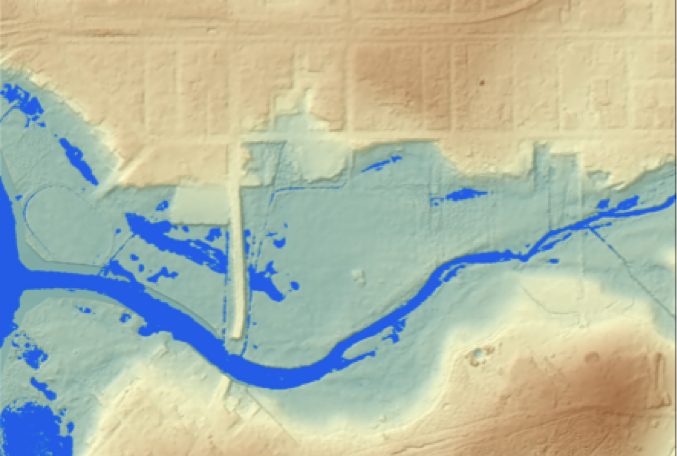

---
editor_options:
  markdown:
    wrap: 72
---

# Week 6 - Helena River data analysis {#A2B .unnumbered}

### Learning Objectives {#A2B_1 .unnumbered}

The practical activity for this week is designed to consolidate our knowledge of groundwater and surface water interactions, in the context of the Helena River site data-set (refer to [Exercise 5](#F1_1)).

This assessment will require students to understand how hydrologic
monitoring of can inform the conceptual models of ecosystems that
underpin solutions to management challenges. The data set that you will
work on is part of a long-term research investigation being undertaken
with the WA Department of Biodiversity, Conservation and Attractions
(DBCA) and UWA. The goal of this research is to understand the drivers
of decline of *E. rudis* in relation to the changing hydrology regime at
the Guildford floodplains along the Helena river.

At the completion of this assessment students will have demonstrated
their ability to:

-   analyse and interpret measured hydrological data

-   develop a conceptual hydrological model

-   effectively communicate their understanding of a hydrological system
    through a written report

### Background {#A2B_2 .unnumbered}

The degradation of freshwater systems by increasing salinity is a major
challenge facing Western Australia. Salinisation of the Avon river,
which enters the Upper Swan river at Walyunga National Park, arose due
to poor land-management leading to secondary salinity in the inland
wheatbelt catchments. Whilst secondary salinity is not an issue in the
Swan Coastal Plain where our study site is, the salt loads from the Avon
in addition to rising sea levels and decreasing rainfall trend have been
driving changes in the seasonal movement of marine waters, with
increasing penetration of the salt wedge further inland from the ocean
(Huang et al. 2018).

The City of Swan has identified our focus site on the Helena River near
Guildford as an area of concern due to the decline of Eucalyptus rudis.
*E. rudis* plays a vital role in the riparian ecosystem. Riparian
woodland species are important filters that reduce nutrient transfers
from the land into the river, which is a significant issue in the Swan
river and its tributaries (excessive nutrients have historically
resulted in noxious algal blooms). There is therefore a need to better
understand what drives decline and if projected drying conditions for
the region will make the pressures worse.

<center>
```{r A2Bimage1, echo=FALSE, fig.cap="", out.width='85%'}
knitr::include_graphics("images/assessment2B/image1.png")
```
</center>

Salinisation of river systems can cause shifts in floodplain vegetation
which arise because of river water interaction with the floodplain.
Depending on the salinity increase and the salt tolerance of the
floodplain tree species, this can cause shifts in community structure.
*Eucalyptus rudis* is important species that has a natural range along
the Swan river and its tributaries. This species has been reported to be
in decline for over 15 years along the Swan river (Clay & Majer 2001),
and more recently along one of the tributaries of the Swan river: the
Guildford floodplains of the Helena river (Dundas 2011). It is currently
unknown the exact role of water availability and salinity in the
observed decline, and alternate hypothesis related to tree pathogens
(e.g. Phytophthora) are also as drivers of decline are also under
investigation.

### Helena River Study Site {#A2B_3 .unnumbered}

Start by watching [this
video](https://echo360.org.au/media/a8e04685-0067-42ec-8524-4d97602a2e0e/public)
recorded by Matt Hipsey to give you an introduction to the Helena River
site. You can see the key features of the site marked on this aerial
photo.

<center>
```{r A2Bimage2, echo=FALSE, fig.cap="", out.width='65%'}
knitr::include_graphics("images/assessment2B/image2.png")
```
</center>

The natural surface drainage of the site has been altered by artificial
surface drainage channels.

<center>
```{r A2Bimage3, echo=FALSE, fig.cap="",out.width='45%', out.height='25%', fig.show='hold'}
knitr::include_graphics(c("images/assessment2B/image3_1.png",
                          "images/assessment2B/image3_2.png"))
```
</center>

A series of monitoring wells have previously been installed at the site.
The following [LIDAR](https://en.wikipedia.org/wiki/Lidar) image shows
the surface topography, with the locations of groundwater wells also
indicated.

<center>
```{r A2Bimage4, echo=FALSE, fig.cap="High-resolution LIDAR image of the surface topography of the Helena River study site in Guildford. The red-circles indicate groundwater observation wells.", out.width='85%'}
knitr::include_graphics("images/assessment2B/image4.png")
```
</center>

These groundwater monitoring wells are holes that have been drilled into
the ground and lined with PVC pipes that has slots at the bottom to let
the water in. All you can see from the land surface is the top of the
PVC casing sticking up with a cap and sometimes a lock on it. If you
want to use these wells for a scientific purpose you need to know the
construction details. Firstly, where is the well (GPS coordinates) and
what are the dimensions (depth and diameter) of the well? The well
dimensions will determine the equipment you need to sample it. Secondly,
across what depth range (and more importantly, elevation) is the screen
interval (the area where slots are present)? This is the actual
elevation of your groundwatre pressure measurement; it's important that
you know this so that you can compare your measurement with existing
data. Once you get to a well, the first thing to do is measure the depth
to water - from this measurement you can work out the elevation of the
watertable, and also how much water is sitting in the well (standing
water). If you want to sample for salinity or hydrochemical properties,
then as a rule of thumb you need to remove 3-times this volume of
standing water from the well before you take the sample to ensure the
sample is representative of the aquifer.

<center>
```{r A2Bimage5, echo=FALSE, fig.cap="", out.width='45%', out.height='25%', fig.show='hold'}
knitr::include_graphics(c(
                          "images/assessment2B/image5_1.png",
                          "images/assessment2B/image5_2.png"))
```
</center>

### Your task {#A2B_4 .unnumbered}

During this assessment you will use existing data to delineate the
hydrologic pathways (surface and sub-surface) that determine the
distribution of water and salt in this floodplain system. You will use
this information to develop a hydrological conceptual model of this
site. Your assessment report should describe the context of the
investigation and summarise your findings and observations as suitable
for a reader such as the City of Swan Environmental Management team.

After your analysis you should be able to:

-   Identify the distressed and dead trees at the site
-   Identify the surface water flow regime - where and when does surface
    water pond or flow
-   Articulate the key features of the groundwater system - water level
    trends, groundwater flow directions, and surface water - groundwater
    interaction areas
-   Assess the distribution of salinity in groundwater wells
    (piezometers) and surface water
-   Conceptualise the hydrologic processes influencing salt movement and
    accumulation across the site
-   Articulate possible links between this conceptualization and
    declining health of *E. Rudis*

The data you need for the assessment is in the file *Helena Data Combined.xlsx*

### 1. Literature review {#A2B_5 .unnumbered}

Start by reading this report by UWA researchers to learn more about the
history of scientific studies at this site and recent findings:

<center>
```{r A2Bimage6, echo=FALSE, fig.cap="", out.width='55%'}
knitr::include_graphics("images/assessment2B/image6.png")
```
</center>

### 2. Mapping vegetation change {#A2B_6 .unnumbered}

There are now a range of spatial data products that have been generated
from aerial imagery and remote sensing methods that we can use to help
understand hydrological processes. One of these products is Nearmap,
which allows us to access aerial imagery to investigate the changes in
vegetation (and surface water distribution) over time.

Nearmap can be accessed at: <http://maps.au.nearmap.com> (login via UWA
library Onesearch - see this
[webpage](https://guides.library.uwa.edu.au/c.php?g=569441&p=3958857)
for details). Once you have successfully logged into Nearmap you can
find the study site by searching for Guildford and then identifying the
confluence of the Helena and Swan Rivers.

<center>
```{r A2Bimage7, echo=FALSE, fig.cap="In Nearmap you can search for Guildford (green marker) to help you locate the study site at the confluence of the Helena and Swan Rivers (Blue shded area)", out.width='90%'}
knitr::include_graphics("images/assessment2B/image7.png")
```
</center>

Zoom in so that you can see the vegetation canopy clearly and then use
the time bar at the top to look at changes over time (play button will
scroll through all available images, clock icon will split the screen so
you can compare two different dates.

-   What seasonal changes can you see in the images?

-   How has the vegetation changed between the oldest and the most
    recent images (compare similar times of year)?

-   As you scroll through time does there seem to be a period of more
    rapid decline? Are there any periods of recovery?

You can also see the distribution of surface water on the Nearmap
imagery - compare what you see with the following mapping of surface
water inundation at the site.

<center>
```{r A2Bimage8, echo=FALSE, fig.cap="Example inundation pattern. Which way is the water flowing?", out.width='65%'}

```
</center>

### 3. Mapping salinity (EC) in QGIS {#A2B_7 .unnumbered}

Surface water samples from across the site have previously been
collected and analysed for electrical conductivity (EC), which is a
measure of salinity. Let's create a map to visualise the spatial
variation in salinity across the study site. The following instructions
take you through the steps to do this in QGIS, which can be downloaded
[here](https://qgis.org/en/site/). If you are proficient in ArcGIS you
can use that instead to create your map.

1)  Let's start by importing our EC point data. Go to *Layer -\> Add
    Layer -\> Add Delimited Text Layer*.

2)  Under *File name* navigate to a csv file of the EC data

    -   Make sure under *File Format* 'CSV' is selected
    -   Under *Geometry Definition* set the *X field* to the Easting
        column of you EC data and the *Y field* to the Northing column
    -   Set the *Geometry CRS* to "EPSG:32750 - WGS84/UTM zone 50S"
    -   Click *Add*

<center>
```{r A2Bimage9, echo=FALSE, fig.cap="Importing your EC data.", out.width='100%'}

```
</center>

```{block2, A2Bhint1, type='rmdnote2'}
Make sure your data takes this form in Excel. Save it as a CSV:
<center>
{width=45%}
</center>
```

You'll now see the point data added to your screen, however, we have no
spatial context - let's add a basemap.

3)  Go to the QuickMapServices (QMS) button in the toolbar and
    browse/search for a basemap that you think would be appropriate
    (e.g. search "satellite" and browse the different satellite basemap
    providers).

4)  Add one to the map.

<center>
```{r A2Bimage10, echo=FALSE, fig.cap="The QMS buttons in the QGIS toolbar.", out.width='50%'}
knitr::include_graphics("images/assessment2B/image10.png")
```
</center>

```{block2, A2Bhint2, type='rmdnote2'}
If you do not have the QMS button in your toolbar go *Plugins -> Manage and Install Plugins* and search ‘QuickMapServices’ to install it.
```

Now we have a basemap and our points - let's change the symbology of the
points to better communicate the variation in EC.

5)  Right click on the point data in the layer window and go *Properties
    -\> Symbology*.
6)  Set the symbol type to *Graduated* and specifying the values to
    graduate by as our EC column.
7)  Now set the *Method* to *Size*, and the *Mode* to *Natural Breaks
    (Jenks)*, click *Classify*.

<center>
```{r A2Bimage11, echo=FALSE, fig.cap="Changing the symbology of our point data.", out.width='100%'}
knitr::include_graphics("images/assessment2B/image11.png")
```
</center>

Now when you click *Apply* the point size is weighted to the EC. You can
further refine your symbology by changing the point colours and size -
think about how best to communicate variation in EC.

8)  Finally, create a map output by clicking the *New Layout* button in
    the toolbar. If you aren't familiar with creating maps in QGIS work
    with one of your classmates who is, or read through the second half
    of this
    [tutorial](https://www.polarmicrobes.org/tutorial-on-qgis-how-to-make-a-map/).

<center>
```{r A2Bimage12, echo=FALSE, fig.cap="Example map from your QGIS output.", out.width='100%'}
knitr::include_graphics("images/assessment2B/image12.jpg")
```
</center>

### 4. Time-series data for assessing groundwater levels and salinity {#A2B_8 .unnumbered}

You are provided with a spreadsheet that summarise the timeseries data
collected by various agencies (e.g., UWA and DWER (via
[WIR](http://wir.water.wa.gov.au/Pages/Water-Information-Reporting.aspx))).
This files includes numerous sheets with the following data notes :

-   **Weather**: There was a "Baro" dataset, which is a UWA logger measuring
    atmospheric pressure, in kPa. We measure this as the water levels in
    the piezometers may vary due to atmospheric pressure fluctuations.
    For your report you do not need to present this, just bear in mind
    it was used to "correct" the piezometer water level data. The
    rainfall provided is from the nearby [DPIRD
    South-Perth](https://weather.agric.wa.gov.au) weather station.

-   **GW Levels**: This includes the UWA piezometer level data (converted
    into mAHD) for the main wells: HW1, HW2, and HW3. Bore 7 is also
    included which is denoted as Jeremy on the map.

-   **GW Salinity**: This has the UWA salinity measurements from inside the
    Piezometers. These data are in mS/cm.

-   **Helena River**: River Corrected data is the water level of Helena
    River under the nearby Traffic Bridge. So you can think of this as
    the water level at the river-end of the piezometer transect. "Poison
    Lease" (upstream in Helena River to the east of our site). It also
    has the discharge (Q) at this site, based on a rating curve.

-   **Swan River**: This has WIR data from the station MSB data as above,
    including the daily min and mix, showing the tidal amplitude of the
    Swan River over time. The "*Vitox*" Salinity data is from the WIR
    website for the nearby location which is just to the west of our
    site (on the other side of Kings Meadow Oval). This data indicates
    the river/estuary salinity and would be very similar to the salinity
    of the surface water in Helena River near our site also. Note its
    seasonality, compared to the groundwater.

Remember, when working with groundwater data you need to be careful to
distinguish between groundwater levels that are reported as a depth to
water (from the ground level or top of casing) as opposed to groundwater
levels the Australian Height Datum (AHD). If there are measured values
of depth to water you need to convert these to elevations in m AHD so
they can be compared with the prior data and WIR data. To do this we
need to know the ground level elevation at the measurement point, in
mAHD (or the elevation of the top of casing, if this was the origin for
the measurement).

Raw data is often not perfect, so think of some ways to presnet the
data. For example, you could make a PIVOT table to look at monthly
values. When interpreting the data we would like to highlight
seasonality, and also relative differences between sites. Importantly,
is there a way to bring togteher the different data into a single plot
to help our interpretation of the what is happening at the system.

### 5. Conceptualising Surface-Groundwater interaction {#A2B_9 .unnumbered}

Now that you have an understanding of the previous studies at the site,
and have plotted the existing data, the next step is to develop your
conceptual model of surface water - groundwater interaction. When trying
to make sense of all this data from different locations and time periods
some guiding questions can help focus your analyses:

-   How does salinity vary across the surface water sites? How does this
    relate to sources of water (Helena River, Stormwater from nearby
    suburbs, Swan estuary, Rain)

-   How does water level and salinity vary in the groundwater based on
    distance from the river? Are levels in the aquifer higher or lower
    than the (mean) river level? What about salinity?

-   Do these patterns in groundwater salinity change seasonally?

-   Which flow pathways drive the changes we see? Is water moving
    vertically or laterally? Consider how water levels in the
    piezometers vary relative to surface water. Think here Darcy's Law
    and Hydraulic gradient.

-   Are is the unsaturated zone (vadose zone) adequate for the tree
    roots? i.e., is the water table depth deep enough to contain
    non-salty soil moisture for them, or must they rely on water from
    salty groundwater? Look here at areas in nearmap where tree loss has
    occurred.

-   What are the salinity tolerances reported for E. rudis, based on
    lab/field trials? And how does our data compare to sort of data
    (historical and our class data).

### Submission {#A2B_10 .unnumbered}

::: {.redbox2}
Your report should include:

Introduction [1 page maximum]

-   Background and context -- why are we interested in this site?

-   Map of site -- where specifically are we looking at?

-   Scope of the investigation -- what is this report about?

Assessment methodology [1 page : be concise!]

-   Desktop assessment, data sources (historical and present) -- UWA and external data/info that has been
    referred to. A table can be convenient to summarise, or a structured list.

-   Data analysis approach, as relevant -- any processing or "higher"
    analysis that was done to the data to make the assessment possible.

Results and findings [~3 pages]

-   Map of surface water salinity

-   Time-series graphs of climate, water levels, flows and salinities (or EC)

-   Transect of water level and salinity data across the site

-   Conceptual model of surface and groundwater flow and salt pathways;
    consider all information in this, including past data and reports
    and nearmap imagery. Consider how summer may be different to winter!

Discussion and conclusions [\<1 page]

-   Interpretation of the data presented in light of the observed
    tree-decline locations

-   Suggestions for improved monitoring and further investigations;
    dot-points OK here.

Your report will be assessed according to the marking rubric on LMS.
Submissions not received by the due date will attract a late penalty.
:::

### References {.unnumbered}

Clay, R., Majer, J. (2001). Flooded Gum (Eucalyptus rudis) Decline in
the Perth Metropolitan Area: A Preliminary Assessment.

Hipsey, M.R., Alilou, H., Bourke, S., Bunting, C., Busch, B.D., Job, M.,
Whitwell, C., and Zhai, S., (2020). Understanding and predicting
riparian decline: Ecohydrology and hydro-climatological change in the
Upper Swan estuary. The University of Western Australia, Perth,
Australia. 51pp.

