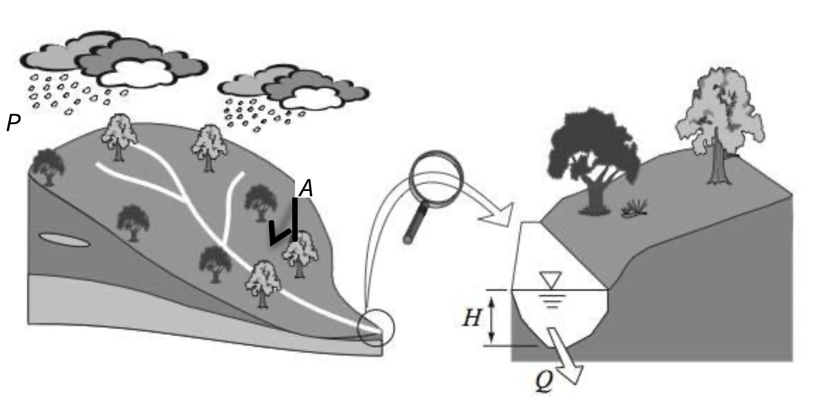

# (PART) EXERCISES {.unnumbered}

# Exercise 1 -- Spatial rainfall variability {#E1A .unnumbered}

## Introduction {#E1A_1 .unnumbered}

A fundamental of **hydrology** is working out how much rain turns into streamflow. But rain does not fall evenly over a catchment area and there are many factors that affect the extent to which the measured rainfall amount at one rain-gauge can be extended to the surrounding area:

-   the distance from the rain-gauge to the centre of the representative area,
-   the size of the area,
-   the topography,
-   the nature of the rainfall quantity (storm event, daily, monthly),
-   the characteristics of the local storm patterns (convective versus low intensity events).

Most hydrological analysis at the catchment scale requires knowledge of the areal distribution of precipitation in the form of an average depth (mm) of water for the entire catchment over a specified time period, using information from a set of unevenly placed rain-gauges spread around the area. In order to calculate the flow discharge produced by a large storm (convective type) in the catchment in, it is necessary to calculate the **average depth of rainfall** (**ADR**) over the catchment.

Three approaches are currently used for estimating the total rainfall:

<ol type="a">
<li>
an arithmetic average of gauged quantities,
</li>
<li>
the isohyetal method, and
</li>
<li>
the Thiessen polygon method.
</li>
</ol>

## Objective {#E1A_2 .unnumbered}

In this exercise you will compare these three different approaches for calculating the ADR and estimate the amount of runoff generated by a single rainfall event.

## Methods {#E1A_3 .unnumbered}

In this exercise you are required to calculate the average rainfall (ADR) over the entire catchment using:

<ol type="a">
<li>
the arithmetic mean (considering only stations within the catchment boundary),
</li>
<li>
the Thiessen polygon weighting system, and
</li>
<li>
the Isohyetal method. Rainfall data for each station in the catchment is provided in Table \@ref(tab:E1Atable1).
</li>
</ol>

You are then required to produce an estimate of **catchment runoff**, which we will assume is equal to the stream **discharge out of the catchment** ($Q$). Recall from lecture slides that a rough estimate of runoff may be estimated using the total rainfall over the catchment during a given period of time, and a **runoff coefficient**.

<center>
```{r E1Aimage1, echo=FALSE, fig.cap="A depth of rain ($P$, mm/day) is falling over a catchment area ($A$, km^2^) to produce stream discharge ($Q$, m^3^/day).", out.width = '80%'}

```
</center>

#### Arithmetic Average {#E1A_4 .unnumbered}

The most basic measure of average rainfall depth is the arthimetic average, whereby you sum the observed rainfall at each rain gauge inside the catchment and divide by the number of gauges.

#### Theisson Polygon Method {#E1A_5 .unnumbered}

The average depth of rainfall (ADR) over the entire catchment can be calculated using:

<center>
\begin{equation}
\mathrm{ADR\ (mm)\ =\ }\frac{\sum{A_i\ast P_i}}{\sum A_i}
(\#eq:E1Aequation1)
\end{equation}
</center>

Where $A_{i}$ is the polygon area (km^2^), $P_{i}$ is the rainfall (mm) corresponding to the $i$ polygon, and $\sum{A_{i}}$ is the catchment area (km^2^).

#### Isohyetal Method {#E1A_6 .unnumbered}

The average depth of rainfall over the entire catchment can be calculated using:

<center>
\begin{equation}
\mathrm{ADR\ (mm)\ =\ }\frac{\sum{A_i\ast P_i}}{\sum A_i}
(\#eq:E1Aequation2)
\end{equation}
</center>

where in this method $A_{i}$ is the area between isohyets $P_{i}$ and $P_{i+1}$ (km^2^), $P_{i}$ is the average rainfall (mm) corresponding to the area $A_{i}$ between the isohyets, and $\sum{A_{i}}$ is the total catchment area (km^2^).

## Activity {#E1A_7 .unnumbered}

**Download the answer sheet for this exercise by clicking the download button in the tool bar** <i class="fa fa-download" aria-hidden="true"></i>.

You are given the measured data for each rainfall gauge in Table \@ref(tab:E1Atable1). Calculate the arithmetic mean and write this in your summary table (Table \@ref(tab:E1Atable3)). Next work out the ADR based on the other two methods.

<center>
```{r E1Aimage2, echo=FALSE, fig.cap="Catchment map, station locations, and isohyetal map for a storm event. Isoheytal map corresponds to rainfall total over a 24hr period.", out.width = '80%'}
knitr::include_graphics("images/exercise1A/image2.jpg")
```
</center>

#### Thiessen Polygons: Sketch the polygons {#E1A_8 .unnumbered}

To construct the Thiessen polygons, first draw dashed straight lines between the gauges. Next, find the mid-points of each of these lines and draw another solid line, perpendicular to the dashed line. These solid lines drawn perpendicular to the dashed lines will meet to form irregular polygons

<center>
<video width="85%" height="85%" controls>
<source src="images/exercise1A/video2.mp4" type="video/mp4">
</video>
</center>

<br>

<center>
```{r E1Aimage3, echo=FALSE, fig.cap="Gridded map for polygon construction and area estimates.", out.width = '80%'}
knitr::include_graphics("images/exercise1A/image3.jpg")
```
</center>

<br>

```{r E1Atable1, echo=FALSE, message=FALSE, warning=FALSE}
library(knitr)
library(kableExtra)
options(kableExtra.html.bsTable = F, knitr.kable.NA = '')
E1Atable1 <- read.csv("tables/exercise1A/table1.csv", check.names=FALSE)
kable(E1Atable1,"html", escape = F, align = rep('c'), caption = "Rainfall data for Thiessen polygon method. Use your answer sheet to edit this table!",
      bootstrap_options = "hover") %>%
  kable_styling(E1Atable1, bootstrap_options = "hover", "striped", 
                full_width = F, position = "center",
                font_size = 12) %>%
  column_spec(1, width_min = "15em") %>%
  column_spec(2, width_min = "12em") %>%
  column_spec(3, width_min = "12em") %>%
  column_spec(4, width_min = "12em") %>%
  column_spec(5, width_min = "10em") %>%
  row_spec(1:11, background = 'white') %>%
  row_spec(12, background = 'lightgrey') %>%
  scroll_box(width = "100%",
             fixed_thead = FALSE) 
```

#### Contoured Rainfall (Isohyets) {#E1A_9 .unnumbered}

<center>
```{r E1Aimage4, echo=FALSE, fig.cap="Isohyets on catchment with inter-isohyetal areas.", out.width = '71%'}
knitr::include_graphics("images/exercise1A/image4.png")
```
</center>

<br>

```{r E1Atable2, echo=FALSE, message=FALSE, warning=FALSE}
library(knitr)
library(kableExtra)
options(kableExtra.html.bsTable = F, knitr.kable.NA = '')
E1Atable2 <- read.csv("tables/exercise1A/table2.csv", check.names=FALSE)
kable(E1Atable2,"html", escape = F, align = rep('c'), caption = "Iso-hyetal method data.",
      bootstrap_options = "hover") %>%
  kable_styling(E1Atable2, bootstrap_options = "hover", "striped", 
                full_width = F, position = "center",
                font_size = 12) %>%
  column_spec(1, width_min = "15em") %>%
  column_spec(2, width_min = "12em") %>%
  column_spec(3, width_min = "12em") %>%
  column_spec(4, width_min = "12em") %>%
  column_spec(5, width_min = "10em") %>%
  row_spec(1:7, background = 'white') %>%
  row_spec(8, background = 'lightgrey') %>%
  scroll_box(width = "100%",
             fixed_thead = FALSE) 
```

#### Calculate Catchment Discharge {#E1A_10 .unnumbered}

Once we have computed ADR, we can now estimate the likely amount of runoff. Remember the relationship between rainfall and discharge as outlined in the supporting lecture. Hint: you'll need to choose an appropriate runoff coefficient, and calculate the stream discharge at the bottom of the catchment - remember to watch out for unit conversions!

```{r E1Atable3, echo=FALSE, message=FALSE, warning=FALSE}
library(knitr)
library(kableExtra)
options(kableExtra.html.bsTable = F, knitr.kable.NA = '')
E1Atable3 <- read.csv("tables/exercise1A/table3.csv", check.names=FALSE)
kable(E1Atable3,"html", escape = F, align = rep('c', 5), caption = "ADR and catchment discharge using three different rainfall averaging methods.",
      bootstrap_options = "hover") %>%
  kable_styling(E1Atable3, bootstrap_options = "hover", "striped", 
                full_width = F, position = "center",
                font_size = 12) %>%
  column_spec(1, width_min = "7em") %>%
  column_spec(2, width_min = "7em") %>%
  column_spec(3, width_min = "7em") %>%
  column_spec(4, width_min = "7em") %>%
  column_spec(5, width_min = "7em") %>%
  row_spec(1:3, background = 'white') %>%
  scroll_box(width = "100%",
             fixed_thead = FALSE) 
```

## Conclusions {#E1A_11 .unnumbered}

What conclusions can you draw from these results? You should always go back to your original objectives (or aims) and see what you have learnt from your analysis. Do this now and briefly summarise the aims of this exercise, your conclusions after doing this analysis, the limitations of your approach, and any recommendations.

-   The aim(s) of this exercise was: ...
-   After doing this exercise I have been able to conclude: ...
-   Limitations, assumptions and sources of error: ...
-   Based on this study I would recommend: ...
