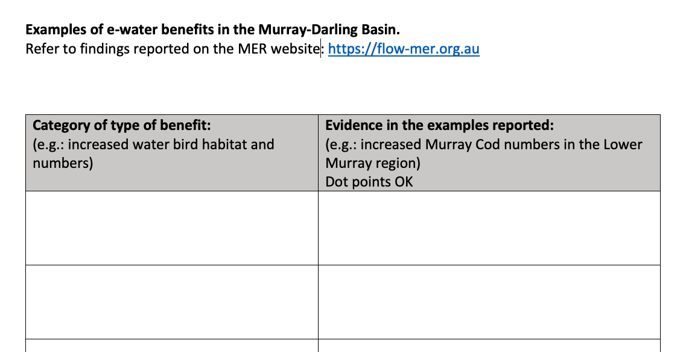

# Exercise 10 - Assessing environmental flow impacts {#E10 -}

## Objectives {#E7_1 -}

Use scenario assessment to identify the impacts of water diversion on a coastal lake system.
Become familiar with basic spreadsheet commands in Excel by conducting an environmental flow analysis and building a simple impact model.

## What are environmental flows? {#E7_2 -}

Lakes, rivers and estuaries are adapted to receive water based on the natural hydrological condition, but often water is required upstream for other purposes. An environmental flow is water that is provided to the environment to maintain its health and natural diversity

> In simple terms: Provision of water to satisfy environmental requirements for ‘healthy’ (natural) function.
<br>


<div style="left: 0; width: 100%; height: 0; position: relative; padding-bottom: 56.25%;">
<center>
<iframe
style="border: 0; top: 0; left: 0; width: 90%; height: 90%; position: absolute;"
src="https://www.youtube.com/embed/BLeA1l0IH3w"
allowfullscreen scrolling="no"
allow="encrypted-media; accelerometer; gyroscope; picture-in-picture">
</iframe>
</center>
</div>


> Environmental flows are a form of river/wetland restoration. They are sometimes referred to as "e-flows".

<br>

In the Murray-Darling Basin ([MDB](https://www.mdba.gov.au/importance-murray-darling-basin)), a water market was established that allows for irrigation entitlements to be "traded"; e-water must be bought from the "water holder" (in this case that is the Commonwealth Environmental Water Holder, [CEWH](http://www.environment.gov.au/water/cewo)).

## Classifying e-flow benefits case study : MDB {#E7_3 -}

After viewing the 6 videos on LMS related to the Murray-Darling Basin water management issues, you can reflect on the nature of the environmental, economic and social interactions that have characterised the basin. Could you describe the historical events that led to the issues as described, management responses, and the perceived policy failures?

The overall management plan for the MDB uses a thing called Sustainable Diversion Limits (SDL's) where managers identify what is able to be taken from the river, and in converse, what the river needs to function normally.

In any river system, water and flows are needed in rivers to maintain:

-   Physical integrity of the river channel and floodplains (e.g., movement of sediment and maintenance of habitat)
-   Species and biological communities
-   Ecological processes (eg. nutrient, carbon, energy flow)
-   Ecosystem services:
    -   Flood attenuation
    -   Water purification
    -   Fish production

When we talk about river flows, from an eco-hydrology point of view, we can categorise them as having specific flow "components".

-   **Extreme low flows** - reduced connectivity and limited species migration
-   **Low flows / base flows** - maintain adequate habitat; drinking water for terrestrial animals;
and soil moisture for plants
-   **High flow pulses** - Support feeding and spawning activities of fish
-   **Small floods** (2 – 10yr ARI) - enable migration to flood plains, wetlands, and other habitats that act as breeding grounds and provide resources to many species. Drive reproduction processes of riparian plants
-   **Large floods** (>10yr ARI) – Can change the path of the river, form new habitat, and move sediment and plant matter, connect remote environments

When allocating water we try to maintain a "realistic" flow hydrograph based on historical (reference) data. But how do we measure the success or failure? Buying e-water costs a lot of money and is a politically charged issue. So we need to know we are getting it right!

Ideally we use a "flow-response" model - a measure of what ecological benefit we will get from a certain flow regime. But this is easier said than done, and measuring benefits is an important area of research.

So we need to use indicators – “measures of response”. This can include things like:

-   Vegetation
-   Water Quality (WQ)
-   Biodiversity – e.g., fish / macroinvertebrate trophic index

We then monitor/assess indicators and adjust environmental flow management regime ... in an ideal world. The Murray-Darling Basin Authority (MDBA) has a program called "FLOW MER" - Measuring Evaluation Research to do just this.

<center>=
```{r E7image1, echo=FALSE, fig.cap="Focus study sites where environmental water delivery is assessed in the MDB. Visit: https://flow-mer.org.au", out.width='100%'}
knitr::include_graphics("images/exercise7/image1.png")
```
</center>

Take some time now to choose a selected MDBA focus site accessible from the above link. For your allocated/chosen focus region:

-   Identify its location and key "values"
-   Read the background and description of the approach to assessment of benefits

Review and be able to answer the following questions:
-   What are the expected stresses to be caused if natural water-flow regimes are lost?
-   List the current type of work being undertaken to assess how e-water is affecting the
region
-   Describe the key findings / key learnings of the assessment that was undertaken at that site


After reviewing the overview of the environmental flow monitoring focus areas, complete a table categorising the general benefits of environmental water delivery, and for each category give examples.

<center>

```{r E7image2, echo=FALSE, fig.cap="Example table to audit the variety of benefits reported across the different sites. Get the word template by clicking the download button in the tool bar.", out.width='100%'}

```
</center>

## Conclusions {#E7_9 -}

In this exercise, we have explored the complexities of allocating water to the environment in a contested situation (i.e., where there are competing "customers" for the water resource).  In particular, we can sumamrise **environmental flows**:

-   appreciate that there is a potential conflict between e-flow vs irrigation allocation
-   e-flow allocation is a river restoration and maintenance tool
-   the array of benefits from e-water need to quantified and maybe site specific
-   there is a need for identifying "Sustainable Diversion Limits" based on assessment of historical flow requirements.
