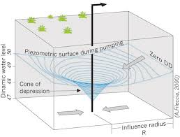
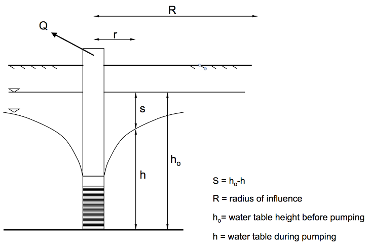
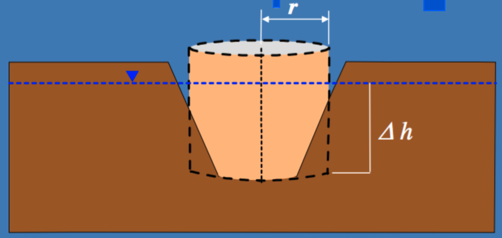

# Exercise 12 -- Mine dewatering {#E12 .unnumbered}

The aim of this session is to better familiarise ourselves with some common issues associated with groundwater management – including the case of water pump tests and de-watering which is common in the Australian mining industry.

Within the lectures we have learnt about groundwater flow and aquifers. And we have previously seen a laboratory scale model of groundwater to understand Darcy flow. In this exercise, we consider how to compute the conditions of an aquifer, based on pump test data, and then we adapt a related approach to describe an open-cut mine de-watering application.

## 1.	Pump test calculation exercise {-}

Pump tests are undertaken to test the ability of an aquifer to supply water. When we pump water it causes a *cone of depression* in the aquifer sutrface, best illustarted in the below diagram:

<center>
```{r E12image0, echo=FALSE, fig.cap="Three dimensional view of water tabel elevation around a well", out.width='60%'}

```
</center>

Depending on the rate of response of groundwater levels ($h$) near the pumping well (at a distance $r$ from the well), one can estimate the transmission properties of the aquifer including the hydraulic conductivity, $K$. The below exercise demonstrates how to calculate this using the Thiem equation. 

The below diagram shows this relevant information.

<center>
```{r E12image1, echo=FALSE, fig.cap="Schematic of the draw-down cone around an aquifer that is being pumped", out.width='100%'}

```
</center>

<br>
For an unconfined aquifer, we adapt Darcy's equation to consider the flow, $Q$, going through the well. For example:

\begin{equation}
Q = -KA \frac{dh}{dr} \\
Q = -K (2 \pi r h)  \frac{dh}{dr}
(\#eq:E12eq1)
\end{equation}

whereby, $A$ is the surface area ($m^2$) of the cylinder over which the flow is occurring, and $dh/dr$ is the slope of the water table towards the well (aka, the hydraulic gradient; $m/m$).

With some assumptions and rearrangement this can be adapted to give the Thiem equation:

\begin{equation}
h_0^2 - h^2 = \frac{Q}{\pi K} \: ln \left[\frac{r}{R}\right]
(\#eq:E12eq2)
\end{equation}

noting, this is for an unconfined aquifer, with the water table at height $h_0$ before pumping. A slightly different version is used for a confined (artesian) aquifer system, which has a aquifer depth of $d$:

\begin{equation}
h-h_0 = \frac{Q}{2 \pi T} \: ln \left[\frac{r}{R}\right]
(\#eq:E12eq3)
\end{equation}

where transmissivity, $T$, is defined as aquifer conductivity x depth: $T = Kd$ (in this case $d \sim  h_0$).


### Exercise: {-}

A hydrologist is undertaking a pump test of an *unconfined* aquifer. After pumping the aquifer for some time at a constant rate of 100 m^3^/day, the water level draw-down at a distance of 150m from the pumping well is 1.5m. The total radius of influence of the well is 800m, and the depth of water in the aquifer is estimated to be 10m deep before pumping started. 

What is the hydraulic conductivity, $K$, of the aquifer material? 


## 2. Mine de-watering application {-}

Now we have an idea about how a field based measurement of water table change in response to a fixed pumping rate -this can teach us something about the aquifer conditions. This is useful to do before a site is being actively developed. For example, to help us estimate how much water can be allocated to on-ground operations, and assigning how much can be pumped out in a sustainable way.

But another application is the context of mine "de-watering" - this is essentially where water must be extracted to enable below-ground operations to occur.  

As a first approximation, we can apply the Theim equation assuming the mine-pit is like a "big-well" - see below figure.

<center>
```{r E12image2, echo=FALSE, fig.cap="Schematic of a mining excavation, with a radius, r, and depth of extraction.", out.width='80%'}

```
</center>


### Exercise: {-}

A surface ore deposit in the Pimbara region of MiningLand is scheduled for development. The ore deposit is roughly 1km wide and circular. Miners wish to dig and extract the material down to 25m from the surface, but the water table is sitting at 15m below the land surface and so during the mining activity a de-watering operation is necessary.  

The mean aquifer depth is estimated to be 50m. For operational reasons, at a distance of 400m from the centre of the operation the water table needs to be reduced below the bottom of the excavation. Environmental regulators have indicated that the dewatering operation may not impact water tables beyond 1500m from the centre of the deposit. 

- i.	Sketch the problem (similar to exercise 1) and annotate with relevant information. 

- ii.	As a rough approximation, we can employ the Theim equation to consider the draw-down caused by a groundwater pump, pumping at a steady rate $Q$, for this problem:

If we assume a hydraulic conductivity of the region is around 0.5 m/day, and other information as indicated in the question, what is the average rate of discharge, $Q$,  that needs to be pumped to pull the groundwater down low enough for mining to occur? 

- iii.	Once mining has ceased and de-watering has ceased, the pit is predicted to refill with ground water, but the environmental regulator is placing strict guidelines on the mine operator to ensure the newly formed lake is safe. Outline an environmental monitoring program that you would propose in order to collect necessary data, giving rationale for the chosen measurements.


## Conclusions {-}

In this exercise, we have explored the basics of "pump-tests" and "de-watering" - both routinely undertaken by mining companies to complete mining activities, particularly open-cut mining. You should be able to:

-   conceptualise how water moves towards an actively pumping well.
-   apply the Theim equation to get a simple quantitative estimate of aquifer conductivity.
-   estimate pumping rates required to successfully de-water.
-   recommend monitoring strategies to track the impacts of pumping (before an after) on water quality and water quantiity.


