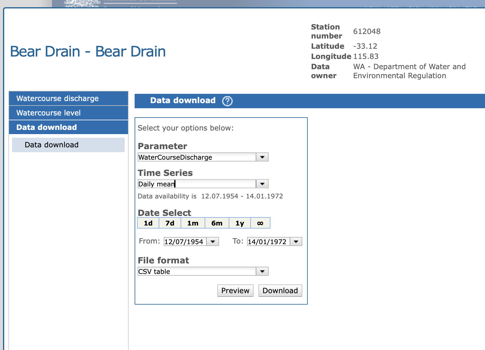

# Exercise 3 -- Drivers of streamflow  {#E3 .unnumbered}

The amount of water moving through a stream is a product of the interactions between climate, catchment geomorphological properties (slope, soils, etc) and vegetation. Importantly, in Western Australia, streamflow is also contributed to from both surface water runoff, and from groundwater discharge. In this exercise we will look at streamflow data from a river nearby to your site of interest, and then determine the strength of the relationship between annual rainfall and annual streamflow.


```{block2, noteM1-3, type='rmdnote2'}
Please note that this exercise is a continuation of the work in Exercise 2. Before attempting this exercise you must first source the relevant rainfall data as described within Question 3 of that exercise.
```


## Getting streamflow data {#E1B_5 -}

**12)** As part of your analysis, we also will examine the relationship between annual rainfall and annual streamflow (aka runoff) for a chosen catchment. Streamflow data is recently reported on the BOM website for some rivers, but the measurement of streamflow is a State Government responsibility. To get streamflow data, go the [Department of Water](http://wir.water.wa.gov.au/Pages/Water-Information-Reporting.aspx) web site. Use this WIR tool to locate a gauging station near your rainfall site. Add the site to your cart and submit a data request - check that the data is being delivered as a "package of pre-computed reports". You will then be emailed a zip file of the station's data. Ensure the station has 10-20 years of available data for this exercise.

<center>
<video width="85%" height="85%" controls>
<source src="images/exercise1B/video1.mp4" type="video/mp4">
</video>
</center>

<br>
```{block2, noteM1-8, type='rmdnote2'}
**UPDATE 4 AUG 2025**
For the last few weeks the WIR data for WA has not been available. A mirror of this data is available via the BOM water data portal - which sumamrises streamflow data also for Australia (State Governments provide their data to BOM - its the same data, but different portal). You can access this one here: [BOM water data portal](http://www.bom.gov.au/waterdata/). 

When using this website, select the parameter as "Water Course Discharge", and then search for a site in a catchment near to your rainfall station. As mentioned above, ensure that the station you select has 10-20 years of available data, that overlaps with the rainfall station data. When downloading select "daily mean", so that in Excel you can "SUM" the daily data to get annual total.

<center>
  
</center>

```


## Processing streamflow data {#E1B_60 -}

**13)** Once you have the data, explore the CSV file received to see the nature of the data provided - i.e., river flow discharge rate. Use the techniques introduced above to summarise the data (e.g., create a PIVOT table) in order to get annual streamflow volumes. Plot the data and compute the annual mean. 

## Relationship between rainfall and streamflow {#A2A_5 .unnumbered}

Now lets examine the relationship between annual rainfall and annual streamflow (also called discharge by surface hydrologists). Make sure the site you have chosen has streamflow data by checking the data availability and the request the report for **water levels and flow - continuous** to get the flow data). *(If WIR website is not working for this download, see note above)*. Please note you will need to SUM the daily mean of data to get an annual total - check the units to be sure the uits make sense.

**14)** Plot a scatter plot of **annual** streamflow (y-axis) and annual rainfall (x-axis). Add a trendline to the chart. What are the relationships between rainfall and streamflow? Are they linear or non-linear and why? Add the data for your site to the shared class spreadsheet, so we can look at the whole data set - are there consistent relationships across WA? 


# Exercise 4 -- Data synthesis  {#E4a .unnumbered}

In the past two exercises we have processed rainfall data and streamflow data. This last exercise is to  explore the shared data-set that spans sites across Western Australia, and to synthesise how this looks, in order to prepare our data analysis report.

```{block2, noteM1-4, type='rmdnote2'}
Please note that this exercise is a continuation of the work in Exercise 2 and 3. Before attempting this exercise you must first complete the steps/questions in those from 1 to 14.
```


Our overarching goal in prepaing our analysis is to summarise our findings on the nature of rainfall and runoff data we have explored across the state of Western Australia. Rainfall is influenced by a number of processes that operate on different space and time scales (see Figure \@ref(fig:A2Aimage1)). In Exercise 2, we examined rainfall trends and have explored how different modes of climate variability can explain patterns in annual rainfall. In Exercise 3, we have looked to see if we can find how strong the relationship is between (annual) rainfall and streamflow. 

<center>
```{r A2Aimage1, echo=FALSE, fig.cap="A guide to the timescales applicable to weather, climate variability and climate change [Pacific Climate Futures](www.pacificclimatefutures.net).", out.width = '80%'}
knitr::include_graphics("images/assessment2A/image1.png")
```
</center>


So far, you have explored data from an individual site. But for our final data synthesis (and your assignment), we will make use of a larger number of sites across WA, to quantify the variability of rainfall and streamflow in space and time. Let's start by making a summary of the spatial variability in rainfall.


## Spatial patterns in rainfall {#A2A_3 .unnumbered}

**15)** Inspect the results of everyone's analysis in the shared data table(s).  Are there statistically significant changes in rainfall? Which station(s) have a statistically significant slope? Are they consistent across WA? What may be causing the changes?

**16)** Take the information in tables and record the values onto a map of Western Australia. 

<center>
```{r A2Aimage2, echo=FALSE, fig.cap="", out.width = '90%'}
knitr::include_graphics("images/assessment2A/image2.png")
```
</center>

Let's create a map to visualise the spatial
variation in our selected rainfall properties across the state - let's face it, maps are cooler than tables. The following instructions are to guide you through the steps to do this in QGIS, which can be downloaded [here](https://qgis.org/en/site/). If you are proficient in ArcGIS you
can use that instead to create your map. Or if you prefer not to use GIS for this assignment, then you can also create a map in Google Earth and manually add some pins.

a)  Let's start by importing our rainfall data of interest. Go to *Layer -\> Add
    Layer -\> Add Delimited Text Layer*.

b)  Under *File name* navigate to a csv file of the rainfall data

    -   Make sure under *File Format* 'CSV' is selected
    -   Under *Geometry Definition* set the *X field* to the Easting
        column of you EC data and the *Y field* to the Northing column
    -   Set the *Geometry CRS* to "EPSG:32750 - WGS84/UTM zone 50S"
    -   Click *Add*

<center>
```{r A1Aimage9, echo=FALSE, fig.cap="Importing your rainfall data.", out.width='100%'}
knitr::include_graphics("images/assessment2B/image9.png")
```
</center>

```{block2, A1Ahint1, type='rmdnote2'}
Make sure your data takes this form in Excel. Save it as a CSV:
<center>
{width=45%}
</center>
```

You'll now see the point data added to your screen, however, we have no
spatial context - let's add a basemap.

c)  Go to the QuickMapServices (QMS) button in the toolbar and
    browse/search for a basemap that you think would be appropriate
    (e.g. search "satellite" and browse the different satellite basemap
    providers).

d)  Add one to the map.

<center>
```{r A1Aimage10, echo=FALSE, fig.cap="The QMS buttons in the QGIS toolbar.", out.width='50%'}
knitr::include_graphics("images/assessment2B/image10.png")
```
</center>

```{block2, A1Ahint2, type='rmdnote2'}
If you do not have the QMS button in your toolbar go *Plugins -> Manage and Install Plugins* and search ‘QuickMapServices’ to install it.
```

Now we have a basemap and our points - let's change the symbology of the
points to better communicate the variation in EC.

e)  Right click on the point data in the layer window and go *Properties
    -\> Symbology*.
f)  Set the symbol type to *Graduated* and specifying the values to
    graduate by as our rainfall property column of interest.
g)  Now set the *Method* to *Size*, and the *Mode* to *Natural Breaks
    (Jenks)*, click *Classify*.

<center>
```{r A1Aimage11, echo=FALSE, fig.cap="Changing the symbology of our point data.", out.width='100%'}
knitr::include_graphics("images/assessment2B/image11.png")
```
</center>

Now when you click *Apply* the point size is weighted to the property you are showing. You can
further refine your symbology by changing the point colours and size -
think about how best to communicate variation in your items.

h)  Finally, create a map output by clicking the *New Layout* button in
    the toolbar. If you aren't familiar with creating maps in QGIS work
    with one of your classmates who is, or read through the second half
    of this
    [tutorial](https://www.polarmicrobes.org/tutorial-on-qgis-how-to-make-a-map/).

<center>
```{r A1Aimage12, echo=FALSE, fig.cap="Example map from your QGIS output.", out.width='100%'}
knitr::include_graphics("images/assessment2B/image12.jpg")
```
</center>

**17)** OK - you beauty! Now you have some nice visualisations of the *spatial patterns* (rather than the temporal ones), for different metrics of interest to our analysis. What spatial patterns do you notice? Do they match what you would expect? What may be causing these spatial patterns?


## Contexualising your work {#A2A_13 .unnumbered}

Until now, we have undertaken our own analysis of available rain and streamflow data. When writing up our work it is important for us to also contexualise our analysis relative to the prior work of others (i.e. how do our conclusions compare to what has previously been reported).

**18)** Spend some time to identify prior papers and reports that explain the climatology of Western Australia and any that have reported on rainfall changes and/or changes in streamflow. Try comparing search results from different portals such as traditional searches in UWA's OneSearch, Google Scholar, and even AI-assisted searches through Chat-GPT. Do you notice the main references being consistent across the search methods?  Try different search prompts to see how this can help improve the results that are returned. Remember - you are smarter than the computer!

**19)** These searches may yield a lot of entries so now you must critically consider which ones are most relevant to include. Could you identify some that are more relevant than others? Consider things like spatial relevance (region versus state versus continental scale?), and things like how well cited the report is (number of citations) and also the age of the article. Once you have identified a strong list, consider how you can use these within your discussion, to place your work in context of prior findings.


## Assignment 1A submission {#A2A_6 .unnumbered}

Your submission for this assessment is a summary report outlining the results of the analysis and questions posed in steps 1-19, spanning across Exercises 2,3 and 4. This should include figures and tables you have created, summarising the data from your chosen site, and also using the broader class data-set where appropriate.

:::: {.redbox2}

Your report should have a title and the information should be grouped into numbered headings and sub-headings, like a scientific journal article. 

It will start with an introduction, and have 4 data sections: 1) temporal trends in rainfall, 2) spatial patterns in rainfall, 3) interannual variability in rainfall and 4) relationship between rainfall and runoff. Finally, you should write a conclusion that summarizes the main findings and links back to the objectives you stated in your introduction. 

A draft template to get you started is provided in the download link.

Make sure that all the text in your figures is legible and up to scientific standard. For charts, all axes should be clearly labeled and units given where appropriate. Make sure to include appropriate captions to describe your tables and figures, and cite these in the text (Figure captions go below the figure. Table captions go above the table).

You will be assessed according to the rubric provided on LMS. Be sure to submit your report via the Turnitin Link on LMS by the due date and time. Late submissions will attract penalties in line with UWA policy.

::::

