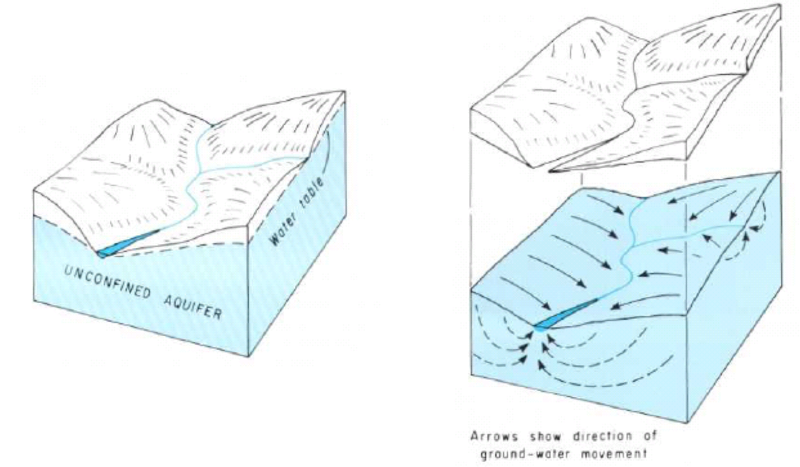
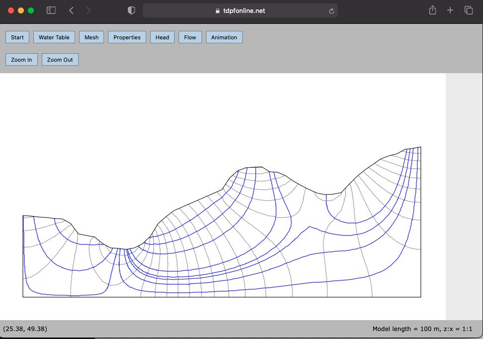
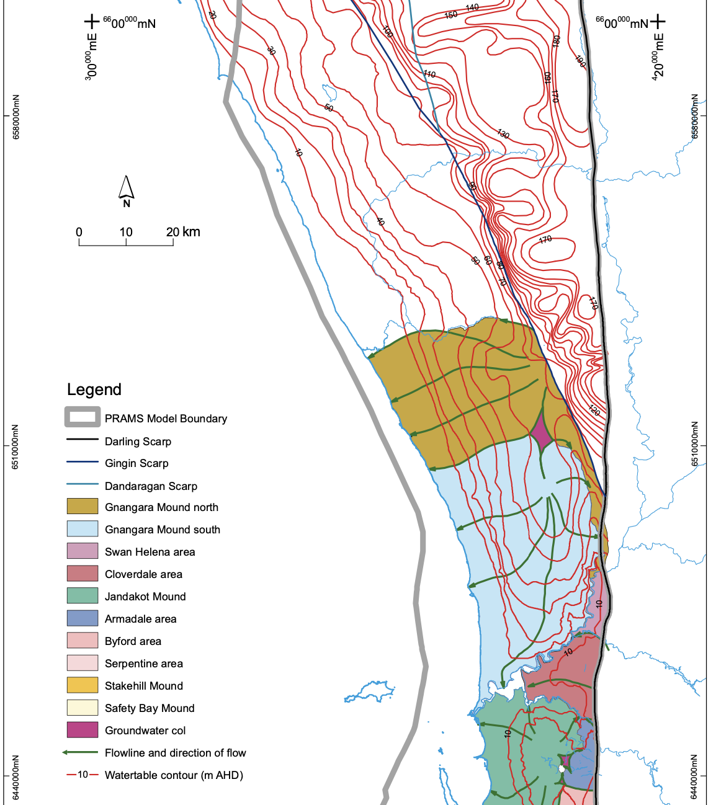
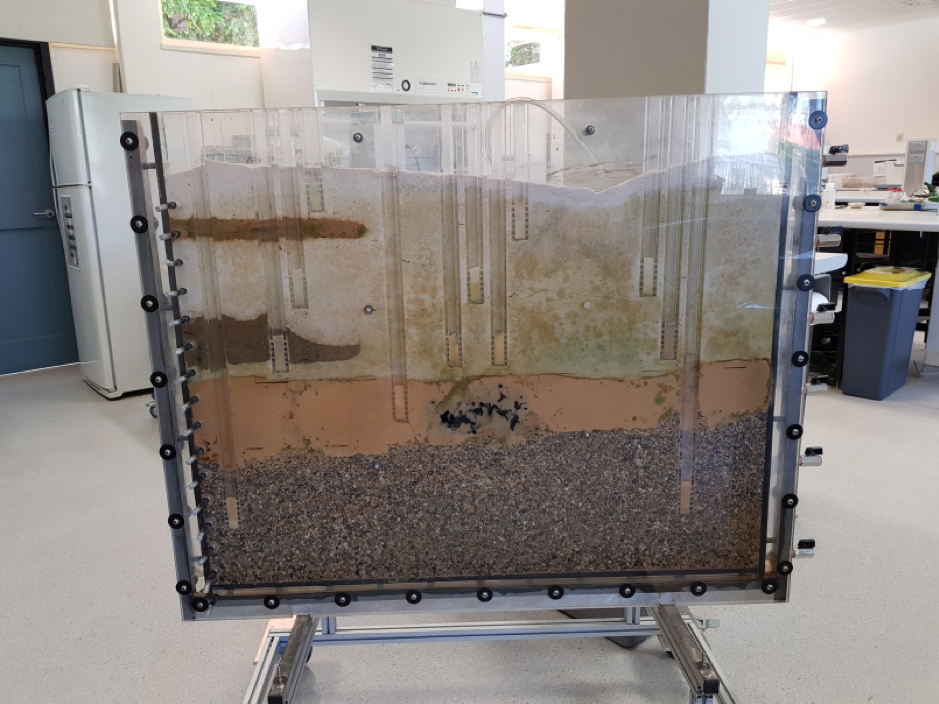
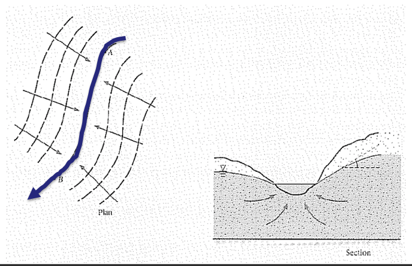

# Exercise 4 - Visualising groundwater {#E4 .unnumbered}

## Learning Objectives{#E4_1 .unnumbered}

In this exercise you will investigate what controls the direction and rate of groundwater flow, and investigate groundwater storage and flow within a layered groundwater system.

At the completion of this exercise students will be able to

-   calculate groundwater flow rates

-   describe the range of flow rates within natural groundwater systems and explain the key factors controlling these rates

-   identify patterns of groundwater flow and hydraulic head contours within layered groundwater systems

## Groundwater flow rates {#E4_2 .unnumbered}

As a first step lets consider the flux law for groundwater flow. Groundwater flow is driven by the distribution of water pressure (hydraulic head, which has units of length) within the groundwater system. The flow of groundwater follows a flux law;

<center>

```{=tex}
\begin{equation}
q=\frac{Q}{A}=-K \frac{\Delta h}{\Delta l}                                                         (\#eq:E3Bequation1)
\end{equation}
```
</center>

Where $q$ is the specific discharge (or Darcy Flux) with units of L T^-1^, $Q$ is the volumetric flow rate (L^3^ T^-1^), $A$ is the cross-sectional area through which the water flow (L^2^), and $\frac{\Delta h}{ \Delta l}$ is the hydraulic gradient. This gradient is simply the change in water pressure ($h_1-h_2$) over a given distance (L/L, unitless). The key system property in this flux law is the hydraulic conductivity ($K$), which has units of L T^-1^. In natural groundwater systems the value of hydraulic conductivity can vary over 12 orders of magnitude. Even though this water flux $q$ has units of L T^-1^, it's not actually the velocity of the groundwater, because the water wasn't flowing through the whole area, just the pore space. To correct for this and calculate the average velocity we need to use the area of the pore space ($An$, where $n$ is porosity), instead of the total area. This gives us;

<center>

```{=tex}
\begin{equation}
\bar{v}=\ \frac{Q}{An}=-\frac{K}{n} \frac{\Delta h}{\Delta l}                                           (\#eq:E3Bequation2)
\end{equation}
```
</center>

Where $\bar{v}$ is the average linear velocity of the water flowing through the porous media.

Now that we know these simple equations let's look at some experimental data from simple "Darcy tubes" that allow us to measure the relationships between rates of groundwater flow, hydraulic gradients and the hydraulic conductivity of the porous media that it flows through. This is how the idea of a "hydraulic conductivity" was first defined, empirically, and it was only decades later that the physical basis for hydraulic conductivity and Darcy's Law was fully elucidated from first principles (see [Hubbert 1940](https://agupubs.onlinelibrary.wiley.com/doi/abs/10.1029/TR021i002p00648-1) for some light bedtime reading).

<center>

```{r E3Bimage1, echo=FALSE, fig.cap="a) Photo of simple Darcy Tube and b) diagram showing terms in Darcy’s Law Equation", out.width = '100%'}
knitr::include_graphics("images/exercise3B/picture1.png")
```

</center>

Let's have a go at using this experimental setup to estimate the hydraulic conductivity of different sedimentary materials. To do this all we need to do is measure the flow rate through the tube for our chosen porous media. For each porous material, the slope determines the hydraulic gradient and we just need to measure the volume that flows out of the tube over a set time interval.

During this experiment;

-   the diameter of the tubes was 40 mm

-   the inlet at the top of the tube was 25 cm above the outlet at the bottom of the tube, and the lateral distance between the inlet and the outlet was 0.5 m

-   Over a period 24 hours 168 mL was collected from the tube filled with sand, 3.6 mL was collected from the tube filled with silty sand, and 814 mL of water was collected from the tube filled with gravel.

1.  Based on this information you can rearrange Eq (10) to calculate the hydraulic conductivity of each porous media. Are you results consistent with the range of values for similar porous media in the literature? Could you measure the hydraulic conductivity of a clay sample using this experimental setup? What could you do to improve this experiment?


## Using Darcy's Law to calculate flow to a stream {#E3B_3 .unnumbered}

Now we understand the concept of Darcy's Law within a small-scale context, lets think about how we can apply it in the "real world". The below diagram shows the flow in an aquifer towards a stream.


<center>
```{r E4imageX, echo=FALSE, fig.cap="Water table and topography of a idealised hillslope", out.width = '80%'}

```
</center>


2.  Consider the digram above. If the slope of the water table hydraulic gradient perpendicular to the stream is on average approximately 1/1000 (m/m), what is the Darcy flux, q, of groundwater towards the river? Use a hydraulic conductivity, K, of 1 m /day.

## Creating a flow net {#E3B_3 .unnumbered}
We can trace the path of a "parcel" of water  at any point in a groundwater system by creating a "flow net". To do this we map the lines of "equipotential" (i.e., lines of constant head), like height contours on a topographic map, but instead of land height, its water height. Based on the gradient in water height (hydraulic gradient) we can work out the path that a parcel of wtare would take, as water will flow from high to low pressure.

Before we go further, lets check out this cool flow-net tool called "[TopoDrive](https://tdpfonline.net/topodrive.html)" . This is an online interactive tool that allows you to visulise groundwater flow nets! 

<center>

```{r E4imageY, echo=FALSE, fig.cap="Creating a hillslope flow-net. For an overview, check out this youtube instruction video [here](https://www.youtube.com/watch?v=d9f4iTh09bo).", out.width = '80%'}

```

</center>

3.  Create a hypothetical hillslope water table cross-section with the tool. Use the tool to show the water flow pathways. Make a note of your observations - is there anythign unexpected? Depending on your flow-net you may be surprised that water does not always flow in a straight line!

One thing to note with flow-lines (or sometimes we call them streamlines), water flow paths must cross lines of equipotetnial at right-angles (i.e. perpendicular). 


4.  Now look at the below image - a plan view of the water table contours around Perth. Given the sort of hydraulic conductivities estimated above, what would the range of linear velocity we could expect in a groundwater system like the Gnangara Mound? Use the following watertable map (taken from Davidson and Yu 2008, [HG20](https://www.water.wa.gov.au/__data/assets/pdf_file/0015/5280/71802.pdf)) to estimate a hydraulic conductivity, and then calculate linear velocity using Eq (11). You will need to assume a porosity - look these up, or just use 0.25 (which is a good indicative value for back-of-the-envelope calculations in aquifer materials - why not in clays?). *Note that it's probably ok to assume a porosity value because the range of porosity is within one order of magnitude, whereas hydraulic conductivity will vary by multiple orders of magnitude, even within the same type of material, so this will be the larger source of uncertainty in your calculation.*

<center>

```{r E3Bimage2, echo=FALSE, fig.cap="Section of a map of the watertable across Perth", out.width = '100%'}

```

</center>


## Physical model of groundwater system {#E3B_3 .unnumbered}

In this part of the exercise we will look at a model of a layered groundwater system. Each layer has a different hydraulic conductivity, $K$, forming two aquifers and an aquitard. Within each layer there will also be variation in hydraulic conductivity. This spatial variation is called "heterogeneity", and it is an important feature of real groundwater systems.

Start by annotating the photo of this model (Figure \@ref(fig:E3Bimage2)) to show the following;

1)  Aquifers and aquitards

2)  Recharge and discharge zones

3)  Water levels in each of the wells

4)  The water table

5)  Hydraulic head boundaries

<center>
```{r E3Bimage3, echo=FALSE, fig.cap="Physical model of a layered groundwater system.", out.width = '80%'}

```
</center>

Now watch [this video](https://echo360.org.au/media/beef71b3-fdca-4a62-9a58-4ad9f0b7b58a/public) to see how water moves through the model when dye is injected to see the direction of groundwater flow. Does the flow direction vary spatially? Does the flow direction change over time?

Draw arrows on the following screen-shot to show the direction of groundwater flow within the model domain. We have learnt that the measure of potential for groundwater flow is "hydraulic head" and we also know that groundwater flows from high hydraulic head to low hydraulic head. In fact, groundwater flow will be perpendicular to the equipotentials (lines of equal hydraulic head). Based on your inferred flow paths, try now to add in the hydraulic head contours (or equipotentials).

*It might help for you to think about topographic contours on a landscape map - in this case you have elevation contours, and if you placed a ball at the top of a hill it would roll (or flow) from the higher elevation to the lower elevation. As a general rule, we also know that flow through high conductivity layers will be primarily horizontal, and flow through low conductivity layers will be primarily vertical.*

<center>

```{r E3Bimage4, echo=FALSE, fig.cap="Physical model of a layered groundwater system.", out.width = '80%'}
knitr::include_graphics("images/exercise3B/picture3.png")
```

</center>

What can you learn from this physical model about groundwater systems? By using the physical model we have been able to see directly in the subsurface, but in the real world, the only information we have would be the wells.

-   If you only had the hydraulic head measurements in the wells what would you know about the groundwater system?

-   What else would you need to know about this system to calculate groundwater flow velocities (and therefore contaminant transport)?

-   How important is it that we understand the geology as well as having measurements of hydraulic heads?

-   What else might you measure in a real groundwater system to get a fuller picture of what is happening?

## Computer model of groundwater system {#E3B_4 .unnumbered}

We can also run a "digital twin" of the physical model that we have built in the lab. For this activity we will now use the ParFlow Sandtank model. This is a computer model simulating groundwater flow, and allows users to change aquifer configurations and explore the essential features of groundwater and contaminant flow.

<center>

<iframe title="vimeo-player" src="https://player.vimeo.com/video/398697315" width="100%" height="360" frameborder="0" allowfullscreen>

</iframe>

</center>

Once you have watched the introductory video lets take a look at running the model. Navigate to this model [website](https://pvw.kitware.com/sandtank/). You can learn how to customise the sandtank and run a simulation [here](https://www.hydroframe.org/sand-tank-user-manual). Have a go at manipulating the soil conditions and the hydraulic head sliders, and run simulations pumping or injecting groundwater. Can you reproduce our lab-based physical model?


## Example calculation of groundwater baseflow to a river {#E3B_4 .unnumbered}

In this section is an example of how we can apply Darcy's Law to work out how an aquifer is "working", i.e., how much water it is conducting and entering the river as baseflow. Consider the following.

After a prolonged period without rain, the discharge of a river at a measuring station A is 10 m3/s and at a downstream station B it is 15 m3/s. The distance between A and B is 2 km.

<center>

```{r E4imageZ, echo=FALSE, fig.cap="Plan and cross sectional view of a river valley", out.width = '80%'}

```

</center>


Between the stations, the river receives water from both sides, from an unconfined aquifer, and the equipotentials are assumed to be parallel to the river.

The slope of the water table (hydraulic gradient) on average is approximately 1/1000 (m/m).

Based on this information, use Darcy’s Law to determine the transmissivity of the aquifer, in m2/s. 

Note that, Transmissivity of an aquifer is the depth integrated hydraulic conductivity


<center>

```{=tex}
\begin{equation}
Transmissivity = T = Aquifer Depth * K 
(\#eq:E4equation2)
\end{equation}
```
</center>

Start by drawing a diagram and annotate with the information that you know.
