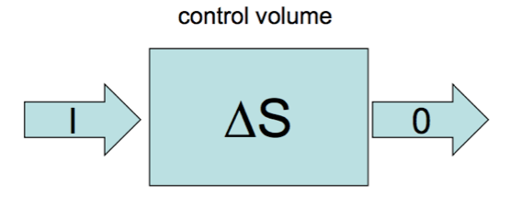
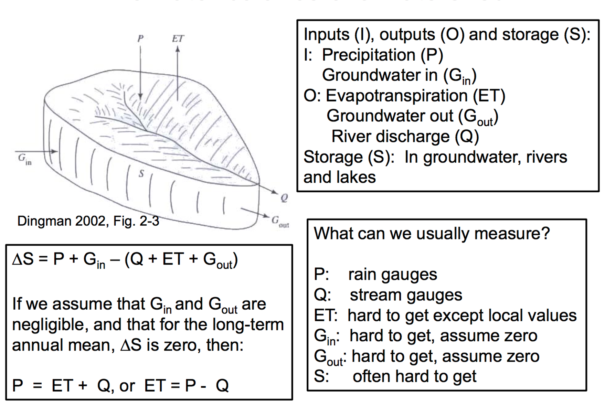

# Exercise 5 - Undertaking a water balance {#E5 .unnumbered}

## The water balance and principle of conservation {#E5_1 .unnumbered}

The water balance concept is the most important conceptual framework we have in hydrology. At its simplest it is a basic accounting system able to resolve the inputs and outputs to a given 'system'. A system could be a lake or reservoir, or a catchment, an agricultural field, or even a suburb in a city. In fact, we can do a water balance at the global scale. The approach can be expanded to undertake very detailed tracking of water sources and stores.

We have already relied on this concept implicitly when considering the Desktop Catchment data, such as how much rain entered, what the soil water storage was and how much water was discharged. Lets now consider this at the field scale.

The fundamental equation for a water balance is :

\begin{equation}
\text{Change in water storage} = \text{Inputs} - \text{Outputs}
(\#eq:E5eq1)
\end{equation}

or written more formally:

\begin{equation}
\frac{\Delta S}{\Delta t}  = I - O
(\#eq:E5eq2)
\end{equation}

where $S$ is the storage volume of water in the system of interest, $I$ is the rate of water input, and $O$ is the rate of water output. This is depicted schematically below. Sometimes we call the box (store) our 'control volume'. the use of $\Delta$ means "change in". $\Delta t$, is the time-scale over which the storage change occurred.
<br>
<center>
```{r E5image1, echo=FALSE, fig.cap="Conceptual depiction of the water balance", out.width = '50%'}

```
</center>
<br>

So the concept is pretty simple, but the challenge we have is applying it to a particular context. Lets consider the landscape near to Perth.
<br>

<center>
```{r E5image2, echo=FALSE, fig.cap="Water balance diagram for a landscape", out.width = '70%'}

```
</center>

<br>
Here we can "tailor" the water balance concept to fit our application context. For example:

\begin{equation}
\text{Runoff} = \text{Precipitation} - \text{Evapotranspiration} \pm  \text{Storage changes}
(\#eq:E5eq3)
\end{equation}

<br>
In this case, storage changes is referring to any increase or decrease in surface stores of waters (like dams), but more likely in this case is large changes to the volume stored in groundwater; this would manifest as a increase or decrease in the water table elevation.


## 1D (vertical) water balance at the plot/landscape scale {#E5_2 .unnumbered}

Let's now consider a plot of land - this could be an ecosystem of interest we're studying, or some agricultural land. You can also think of some other examples.

The water balance can be more conveniently assumed to be "1D" (one-dimensional) - that is, we consider the upper soil for a generic unit of area, as per the below diagram.

<br>
<center>
```{r E5image3, echo=FALSE, fig.cap="Water balance diagram for a landscape - in one-dimension (1D)", out.width = '90%'}
knitr::include_graphics("images/exercise6/Picture3.png")
```
</center>
<br>

In this case, we can formulate the water balance equation, over a time increment, as:

\begin{equation}
(P + I + U) - (ET + R + D + L) = \Delta S
(\#eq:E5eq4)
\end{equation}

where:

- $P$ = precipitation
- $U$ = upward capillary flow
- $I$ = irrigation additions
- $ET$ = evapotranspiration
- $R$ = runoff
- $D$ = vertical drainage
- $L$ = lateral drainage
- $\Delta S$ = change in soil water storage

As it is 1-dimensional, we can use the units for this in $mm$, which is usually more intuitive. This could be done for example on an annual or monthly time increment (remember $\Delta t$ = the time-step).

<br>
<center>
```{r E5image55, echo=FALSE, fig.cap="Example monthly water balance components being used to determine times of water excess or deficit. ", out.width = '100%'}

```
</center>
<br>

The above can be tailored to a given situation, and shows how we can customise the approach to a given context.

### Example:  Calculate the water balance for a hillslope {#E5_3 .unnumbered}

Consider the following case-study. The soils in a very small drainage basin near Albany in WA are characterized by a clayey B horizon at 29 $cm$ depth. 

- At the beginning of a rainy day in September, the soil moisture deficit in the upper 29 $cm$ of the soil equals -5 $mm$.
- The rainfall amount was 27 $mm$, with losses by canopy interception and evaporation estimated to be 9 $mm$.
- At the end of the day the upper layer of soil is water-saturated. The contribution of throughflow to the brook discharge was estimated as being 11 $mm/day$. 
- All parts of the drainage basin contribute to the brook discharge and the B horizon may be regarded as water-impermeable

1) Based on this information, how much overland flow (in units of $mm$) occurred during the day? Start by sketching a catchment ‘bucket’ water balance diagram, and then annotate with the relevant information.


## The water balance for a watershed {#E5_4 .unnumbered}

The above 1D approach is convenient for catchments that are spatially homogeneous. For larger, more complex catchments we can expand the approach to consider the different water stores and how water is redistributed.


<center>
```{r E5image567, echo=FALSE, fig.cap="Components of a catchment water balance", out.width = '90%'}

```
</center>


## The water balance for a wetland {#E5_5 .unnumbered}

We can also undertake a water balance assessment for a waterbody, like a wetland, lake, river or estuary. Take a look at the below diagram for a wetland.


<center>
```{r E5image5, echo=FALSE, fig.cap="Components of a wetland water balance. Source:USGS Water Supply Paper 2425", out.width = '90%'}
knitr::include_graphics("images/exercise6/Picture5.png")
```
</center>


In this case, try to write down the water balance consistent with the above notation. Consider how would we measure the different input and output terms?

<!-- dss
\begin{equation}
P+SWI+GWI=ET+SWO+GWO+\Delta S
(\#eq:E5eq4)
\end{equation}
-->

### Example: Calculate the water balance for an irrigation dam {#E5_6 .unnumbered}

Consider the following case-study. A land-holder wants to understand if a small dam will hold water throughout a season. 
<br>    
<center>
```{r E5image60, echo=FALSE, fig.cap="An irrigation dam. How long will this water last?!", out.width = '50%'}

```
</center>
<br>

2a) You have measured an annual average decline of $7 mm/day$ in a small dam (the average of higher values during the summer months and lower during winter). Assuming that the dam is sealed but leaks $~1 mm/day$ to the sub-surface, and that the starting depth is $4m$, what is the time-scale (in days) for the dam to dry out, assuming an average annual rainfall of $431 mm$?

 *(Hint: First define all the input and outputs, and then re-arrange the water balance equation for time)*

2b) If an amount of $5.8mm/day$ was extracted for irrigation, how long would it last?
<br>


## Tracking the volume of a lake over time {#E5_7 .unnumbered}

Lets now consider a simple "bucket" storage model of how a lake level fluctuates through time. This is a modified version of an exercise from @wainwright2002environmental (see p38). Similar types of models have been used for paleo-environmental reconstructions [@bradley1999paleoclimatology] and in hillslope hydrology [@dunin1976infiltration], where the bucket represents the ability of soil to hold water. This type of approach can also be used to simulate solute concentrations, which is particularly useful for quantifying exchanges between surface water and groundwater [@cook2013estimating].

### Defining the system {#E5_88.unnumbered}

In this activity you will use a simple "bucket" storage model to simulate changes in lake water level through time. The depth of the lake increases due to rainfall and inflows and decreases due to evaporation and seepage (Figure \@ref(fig:E5image1)). There is also a maximum level to which the lake can be filled, $h_{\text{max}}$ (m), above which water will overflow from the lake, such that $0\le h\le h_{\text{max}}$. This simple system is described by the equation;

```{=tex}
\begin{equation}
\frac{dh}{dt}= r+i-e-kh
(\#eq:E5equation1)
\end{equation}
```
where $r$ is the rate of rainfall (m yr^-1^), $i$ is the rate of water inflow from rivers and runoff (m yr^-1^), $e$ is the rate of evaporation from the lake (m yr^-1^), and $kh$ is the seepage rate from the base of the lake (infiltration to the underlying aquifer), which is assumed to be a linear function of the depth of water in the lake, $h$ (m). This seepage is controlled by the coefficient $k$ (yr^-1^), which describes the permeability of the lake bed. Before proceeding, satisfy yourself that you understand this equation and that each term in this equation has the same units, as required.

<br>
<center>
```{r E5image6, echo=FALSE, fig.cap="Conceptual model of lake water balance.", out.width = '70%'}
knitr::include_graphics("images/exercise6/picture6.png")
```
</center>
<br>

Surface waters can be either gaining (groundwater discharge to streams and lakes), losing (recharge of aquifers by streams and lakes), or through-flow systems [@winter1998ground]. Based on the information you have, what type of lake (gaining, losing or through-flow) is the system shown in Figure \@ref(fig:E5image1)? What other data might you want to measure to confirm this?

### Activity: Simulating the system  {#E5_9 .unnumbered}

The above water balance equation, \@ref(eq:E5equation1), is a differential equation, that describes the rate of change of water level over time. We know that $\frac{dh}{dt}$ is technically the instantaneous rate of change of lake water level. But calculus tells us that we can approximate $\frac{dh}{dt}$ by calculating the change in water level over small increments of time, with the most accurate approximation using the smallest increments of time.

So we have an equation for the rate of change in lake water level (Equation \@ref(eq:E5equation1)). But how do we calculate the lake level as a function of time, $h(t)$? That is, how do we solve the above balance equation to calculate $h$ for any given time? To do this we use an *iterative* approach. Start with an initial lake level, $h_{i}$, and then calculate the change in lake level over each small increment of time (in this case $dt = 1$ year is fine), using the rates for each process. The water level at the next time-step is then calculated by summing the initial level and the calculated change; $h_{i+1} = h_{i} + \text{inputs} - \text{outputs}$. 


<center>
```{r E5image7, echo=FALSE, fig.cap="Simulated lake level under three different model scenarios (A, B and C).", out.width = '70%'}
knitr::include_graphics("images/exercise6/picture7.png")
```
</center>

<br>
3) Lets now open Excel and see if we can reproduce the above results. Use the below numbers as input. Start with a lake level of $10m$ and see if you can work out which set of parameters matches which line.
<br>


<center>
```{r E5table1, echo=FALSE, message=FALSE, warning=FALSE}
library(knitr)
library(kableExtra)
options(kableExtra.html.bsTable = F, knitr.kable.NA = '')
table1 <- read.csv("tables/exercise5/table1.csv", check.names=FALSE)
kable(table1,"html", escape = F, align = rep('c', 5), caption = "Model parameters for lake level simulations shown in Figure 2.",
      bootstrap_options = "hover") %>%
  kable_styling(table1, bootstrap_options = "hover", "striped",
                full_width = F, position = "center",
                font_size = 16) %>%
   column_spec(1, width_min = "10em") %>%
   column_spec(2, width_min = "10em") %>%
   column_spec(3, width_min = "10em") %>%
   column_spec(4, width_min = "10em") %>%
   column_spec(5, width_min = "10em")
```
</center>


