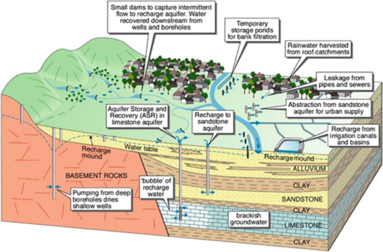
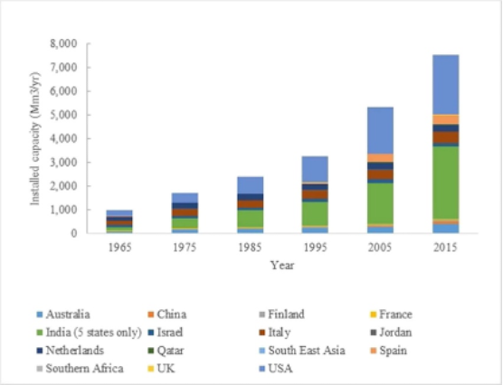

# Exercise 6 - Managed aquifer recharge {#E6 .unnumbered}

## Objectives {#E6_1 .unnumbered}

In this exercise students will consolidate their understanding of managed aquifer recharge, and the role it plays in securing water resources in a changing climate. At the end of this exercise students will be able to:

-   Describe the processes involved in managed aquifer recharge
-   Identify the key benefits and limitations of managed aquifer recharge

## What is managed aquifer recharge {#E6_2 .unnumbered}

The term managed aquifer recharge refers to the any process by which people intentionally add water to aquifers so that it can be stored in the subsurface. Managed aquifer recharge provides a mechanism to short-circuit the water cycle, so that we don't need to wait thousands of years for water to re-enter the groundwater system. We aren't doing anything that wouldn't happen naturally, we are just making it happen faster (or preferentially) so that we can offset some of the impacts of groundwater withdrawals and climate change. The following diagrams summarizes the key processes that can be associated with managed aquifer recharge - *make sure you understand all these processes before proceeding*.

<center>
```{r E6image1, echo=FALSE, fig.cap="Processes related to managed aquifer recharge (after @dillon2019sixty).", out.width='80%'}

```
</center>

## How do we get the water into the aquifer? {#E6_3 .unnumbered}

The addition of water to the subsurface can be facilitated by infiltration from the surface (through water spreading, infiltration basins or galleries), or by injecting the water into specially designed injection wells. Let's think about the pros and cons of each of these approaches. Consider the resources required, associated costs, and potential limitations of each of these two options to *complete Table \@ref(tab:E6table1) below*.

```{r E6table1, echo=FALSE, message=FALSE, warning=FALSE}
library(knitr)
library(kableExtra)
options(kableExtra.html.bsTable = F, knitr.kable.NA = '')
table1 <- read.csv("tables/exercise6/table1.csv", check.names=FALSE)
kable(table1,"html", escape = F, align = rep('c', 5), caption = "Pros and cons of surface infiltration vs injection wells for managed aquifer recharge.",
      bootstrap_options = "hover") %>%
  kable_styling(table1, bootstrap_options = "hover", "striped", 
                full_width = F, position = "center",
                font_size = 12) %>%
  column_spec(1, width_min = "20em") %>%
  column_spec(2, width_min = "20em") %>%
  column_spec(3, width_min = "20em") %>%
  row_spec(1:2, background = 'white') %>%
  scroll_box(width = "100%",
             fixed_thead = FALSE) 
```

## What are the benefits of managed aquifer recharge? {#E6_4 .unnumbered}

Managed aquifer recharge provides another tool for water resource managers to secure water resources for people and the environment. Subsurface water storage has minimal impact on existing landholders (as compared to dams) and can provide an important mechanism to minimize evaporative losses, and outflows of freshwater to the ocean. By implementing a managed aquifer recharge scheme using water that would otherwise be going out to sea, water resource managers are able to provide an additional water source that is not dependant on rainfall. Sometimes water that has been intentionally added to the aquifer will be used within years or decades by people for potable water or irrigation, or by flora and fauna that depend on groundwater. But even just adding this extra water to the groundwater system can provide protection against risks like 1) seawater intrusion, 2) surface water depletion, or 3) acidification (oxidation of acid sulphate soils), which can be exacerbated by changing climate and groundwater withdrawals. *Choose one of these risks and draw a diagram to show how managed aquifer recharge might be used to reduce the risk*.

## What are the potential risks of MAR? {#E6_5 .unnumbered}

The major risk of managed aquifer recharge is about water quality -- but maybe not in the way you would think. Sometimes people think of drinking poo-water, and think "icky, no way". But actually, with the groundwater replenishment scheme here in Perth, the risk is that we are adding very clean oxic water to groundwater that anoxic and contains dissolved solids. The mixing of oxic and anoxic waters results in chemical reactions, and lots of scientific research has been undertaken to determine the likely products of these reactions and that they will not negatively impact our groundwater resources. The injection of groundwater is also not close to the location of drinking water abstraction, so that the water that is added to the groundwater system will remain in the aquifer for a very long time. Time spent in the subsurface can be particularly useful for reducing viral loads or bacteria (but this usually only requires weeks or months, not thousands of years!).

In Australia managed aquifer recharge schemes are covered by a national guideline that describes how the potential risks should be determined and managed. There are also policies in Western Australia that address potential impacts to the environment, other water users and human health. *Read the section on Governance of MAR in @dillon2019sixty (page 20) to learn about how MAR is managed in other countries*.

## Where is managed aquifer recharge happening {#E6_6 .unnumbered}

Managed aquifer recharge is taking place all over the world, ranging from small local-scale schemes to large regional-scale schemes that cost millions of dollars to implement. Enhanced aquifer recharge has actually been happening for decades (leaky water pipes are one example), but the term managed aquifer recharge has been used more recently to describe the intentional additions of water to groundwater systems that are becoming increasingly common as a strategy for water resource management. The following chart from @dillon2019sixty shows the development of managed aquifer recharge since 1965 in a range of countries.

-   Which countries were early adopters?
-   Which countries are the current leaders?
-   What proportion of global groundwater use these countries account for (Refer to Table 2 of @dillon2019sixty)?

<center>
```{r E6image2, echo=FALSE, fig.cap="", out.width='65%'}

```
</center>

## What do you think about MAR? {#E6_7 .unnumbered}

Hopefully this exercise, and the learning materials in the module on Managed Aquifer Recharge, have helped you learn more about this process, and the relative risks and benefits.

-   What did you know about MAR before this unit?
-   What have you learned that you didn't know before?
-   Has this module changed your thinking on MAR?
