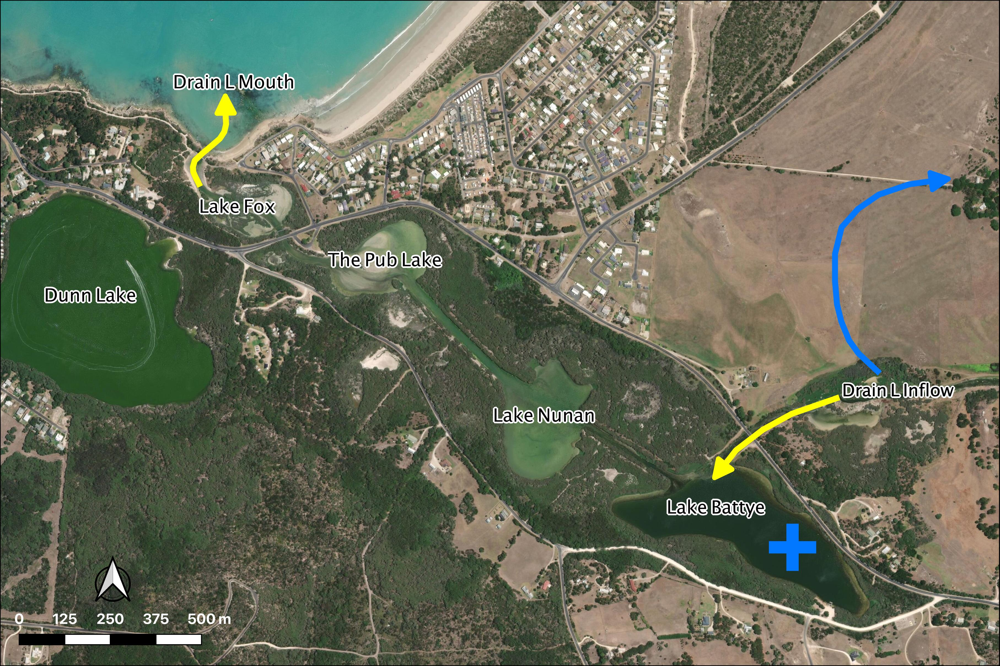
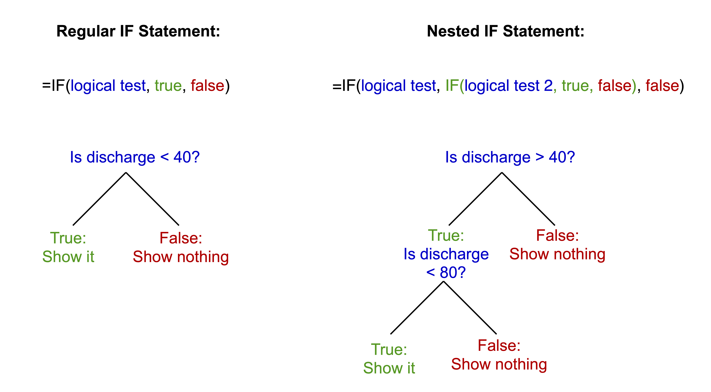
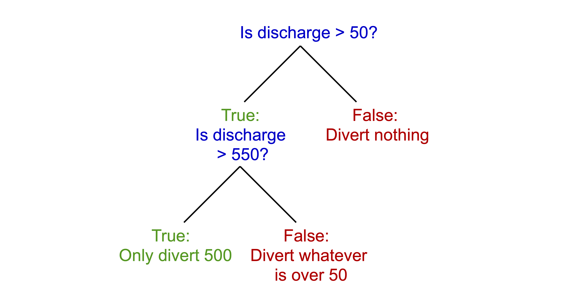

# Exercise 7 - Assessing environmental flow impacts {#E7 -}

## Objectives {#E7_1 -}

Use scenario assessment to identify the impacts of water diversion on a coastal lake system.
Become familiar with basic spreadsheet commands in Excel by conducting an environmental flow analysis and building a simple impact model.

## What are environmental flows? {#E7_2 -}

Lakes, rivers and estuaries are adapted to receive water based on the natural hydrological condition, but often water is required upstream for other purposes. An environmental flow is water that is provided to the environment to maintain its health and natural diversity

> In simple terms: Provision of water to satisfy environmental requirements for ‘healthy’ (natural) function.
<br>


<div style="left: 0; width: 100%; height: 0; position: relative; padding-bottom: 56.25%;">
<center>
<iframe
style="border: 0; top: 0; left: 0; width: 90%; height: 90%; position: absolute;"
src="https://www.youtube.com/embed/BLeA1l0IH3w"
allowfullscreen scrolling="no"
allow="encrypted-media; accelerometer; gyroscope; picture-in-picture">
</iframe>
</center>
</div>


> Environmental flows are a form of river/wetland restoration. They are sometimes referred to as "e-flows".

<br>

In the Murray-Darling Basin ([MDB](https://www.mdba.gov.au/importance-murray-darling-basin)), a water market was established that allows for irrigation entitlements to be "traded"; e-water must be bought from the "water holder" (in this case that is the Commonwealth Environmental Water Holder, [CEWH](http://www.environment.gov.au/water/cewo)).

## A - Classifying e-flow benefits case study : MDB {#E7_3 -}

After viewing the 6 videos on LMS related to the Murray-Darling Basin water management issues, you can reflect on the nature of the environmental, economic and social interactions that have characterised the basin. Could you describe the historical events that led to the issues as described, management responses, and the perceived policy failures?

The overall management plan for the MDB uses a thing called Sustainable Diversion Limits (SDL's) where managers identify what is able to be taken from the river, and in converse, what the river needs to function normally.

In any river system, water and flows are needed in rivers to maintain:

-   Physical integrity of the river channel and floodplains (e.g., movement of sediment and maintenance of habitat)
-   Species and biological communities
-   Ecological processes (eg. nutrient, carbon, energy flow)
-   Ecosystem services:
    -   Flood attenuation
    -   Water purification
    -   Fish production

When we talk about river flows, from an eco-hydrology point of view, we can categorise them as having specific flow "components".

-   **Extreme low flows** - reduced connectivity and limited species migration
-   **Low flows / base flows** - maintain adequate habitat; drinking water for terrestrial animals;
and soil moisture for plants
-   **High flow pulses** - Support feeding and spawning activities of fish
-   **Small floods** (2 – 10yr ARI) - enable migration to flood plains, wetlands, and other habitats that act as breeding grounds and provide resources to many species. Drive reproduction processes of riparian plants
-   **Large floods** (>10yr ARI) – Can change the path of the river, form new habitat, and move sediment and plant matter, connect remote environments

When allocating water we try to maintain a "realistic" flow hydrograph based on historical (reference) data. But how do we measure the success or failure? Buying e-water costs a lot of money and is a politically charged issue. So we need to know we are getting it right!

Ideally we use a "flow-response" model - a measure of what ecological benefit we will get from a certain flow regime. But this is easier said than done, and measuring benefits is an important area of research.

So we need to use indicators – “measures of response”. This can include things like:

-   Vegetation
-   Water Quality (WQ)
-   Biodiversity – e.g., fish / macroinvertebrate trophic index

We then monitor/assess indicators and adjust environmental flow management regime ... in an ideal world. The Murray-Darling Basin Authority (MDBA) has a program called "FLOW MER" - Measuring Evaluation Research to do just this.

<center>=
```{r E7image1, echo=FALSE, fig.cap="Focus study sites where environmental water delivery is assessed in the MDB. Visit: https://flow-mer.org.au", out.width='100%'}
knitr::include_graphics("images/exercise7/image1.png")
```
</center>

Take some time now to choose a selected MDBA focus site accessible from the above link. For your allocated/chosen focus region:

-   Identify its location and key "values"
-   Read the background and description of the approach to assessment of benefits

Review and be able to answer the following questions:
-   What are the expected stresses to be caused if natural water-flow regimes are lost?
-   List the current type of work being undertaken to assess how e-water is affecting the
region
-   Describe the key findings / key learnings of the assessment that was undertaken at that site


After reviewing the overview of the environmental flow monitoring focus areas, complete a table categorising the general benefits of environmental water delivery, and for each category give examples.

<center>

```{r E7image2, echo=FALSE, fig.cap="Example table to audit the variety of benefits reported across the different sites. Get the word template by clicking the download button in the tool bar.", out.width='100%'}
knitr::include_graphics("images/exercise7/image2.png")
```
</center>

## B - Flow diversion case study : Robe Lakes {#E7_4 -}

<center>
```{r E7map1, fig.cap="Explore the case study area with this interactive map.", out.width='100%', out.height='350px', echo=FALSE, message=FALSE, warning=FALSE}
library(leaflet)
library(magrittr)
leaflet::leaflet() %>%
  leaflet::setView(lat = -37.170055016065895, lng = 139.78148241493437, zoom = 15) %>%
  leaflet::addProviderTiles(providers$Esri.WorldImagery)
```
</center>

We can further plan for e-water requirements to a critical system using scenario modelling, and as outlined above, the concept of "flow-response". In this case we look at an example in South Australia where an assessment for water diversion is being undertaken, and we seek to look at what impact this might have on the salinity of a coastal lake. In other words, if we change the flow regime, what will the response be. In this case, salinity is an environmental indicator of ecological requirements.

Specifically in this example, we assess the impact of diverting water from "Drain L", thereby reducing water to the Robe Lakes. Before we assess our diversion scenario, we must first analyse the historical flow data, to understand the historical flow regime.

<center>
```{r E7image3, echo=FALSE, fig.cap="Drain L inflows (yellow arrow) will be diverted (blue arrow).", out.width='100%'}

```
</center>

### Module resources {#E7_5 .unnumbered}

Download the Excel spreadsheet for this module by clicking the download button in the tool bar <i class="fa fa-download" aria-hidden="true"></i>.

### Categorising flow data {#E7_6 .unnumbered}

You are given a time-series of daily river flow and need to assess how different diversion scenarios impact the freshwater flow delivery to a down stream estuary.

1) For this flow time-series, calculate the **volume of daily flow** within the following bands
0-40; 40-80; 80-120; 120-200; 200-400; 400-1000; >1000

```{block2, E7hint1, type='rmdtip2'}
Use a nested `IF()` statement in adjacent columns to partition flows
<center>
{width=100%}
</center>
```

<center>
<video width="100%" height="100%" controls>
  <source src="images/exercise7/video1.mp4" type="video/mp4">
</video>
</center>

2) For this flow time-series, calculate the **number of days** of daily flow within the above bands and work out **annual average number of days**

```{block2, E7hint2, type='rmdtip2'}
Use `COUNT()` to get the number of entries in the column
```

3) Calculate the **annual amount of flow** in total and in each band

You may do the annual averaging manually or the pivot table method. For the pivot table method: Insert a new column B, Label it Year.
Type the year number into the first cell, make sure it is formatted as a number.

<center>
<video width="100%" height="80%" controls>
  <source src="images/exercise7/video2.mp4" type="video/mp4">
</video>
</center>

Click two times on the little square in the corner of the box.  This will fill down the page.
Repeat this at each year change and you will have the year only information which you can then use to summarise data.  As the original date has day numbers and decimal time each one is unique so you end up with a record for each day.  This way you get a record for each year.

```{block2, E7hint3, type='rmdtip2'}
Use `YEAR()` to speed this step up
```

Highlight all the data.  It must have headings for each column or it won’t work.
Go to “Insert” then “Pivot Table”. Click OK as you want the default settings.
Then you just fiddle until you get what you want. The following is an example:

<center>
<video width="90%" height="90%" controls>
  <source src="images/exercise7/video3.mp4" type="video/mp4">
</video>
</center>

4) **Sort the years** from highest to lowest total annual flow:
    a. Add a new column next to the flows indexing the years sequentially (i.e. 1, 2, 3...)
    b. Add a new column next to the indices calculating the probability of meeting the annual flow: $P(Yri) =  \frac{i}{\text{number of years}+1}$

<center>
  <video width="100%" height="100%" controls>
    <source src="images/exercise7/video4.mp4" type="video/mp4">
  </video>
</center>
|            c. Scatter plot the flow vs probability curve


```{block2, E7hint4, type='rmdtip2'}
Sum each year
```

### Flow diversion scenarios {#E7_7 .unnumbered}

5) Assess the amount of water available for **flow diversion for two scenarios** by adding a new time-series column for each option:
    a. Water below 50 ML/day and above 550 ML/day is NOT diverted
    b. Water below 150 ML/day and above 1000 ML/day is NOT diverted

```{block2, E7hint5, type='rmdtip2'}
Construct a nested `IF()` that solves the following:
<center>
{width=100%}
</center>
```

6) Add two new columns for each of the above to work out **cumulative amount** (running total) of diverted water
    a. $\text{Cumulated Volume} = \text{Previous Cumulated Volume}+\text{Today's Diverted Discharge}$

### Assessing impacts on lake salinity {#E7_8 .unnumbered}

7) Create a scatter plot of historical salinity (as EC) collected from the site marked in the map (+) vs daily discharge from the drain (see sheet: Estuary – Salinity).
8) Fit a trendline to the data and display equation and R^2^ – this is a statistical model.
9) In a new time-series column in the previous sheet, use the statistical model from above to predict a salinity time-series for the above station in the estuary under the two diversion scenarios compared to the base case.

## Conclusions {#E7_9 -}

In this exercise, we have explored the complexities of allocating water to the environment in a contested situation (i.e., where there are competing "customers" for the water resource).  In particular, we can sumamrise **environmental flows**:

-   appreciate that there is a potential conflict between e-flow vs irrigation allocation
-   e-flow allocation is a river restoration and maintenance tool
-   the array of benefits from e-water need to quantified and maybe site specific
-   there is a need for identifying "Sustainable Diversion Limits" based on assessment of historical flow requirements.
