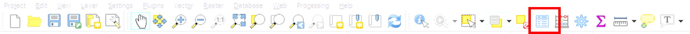
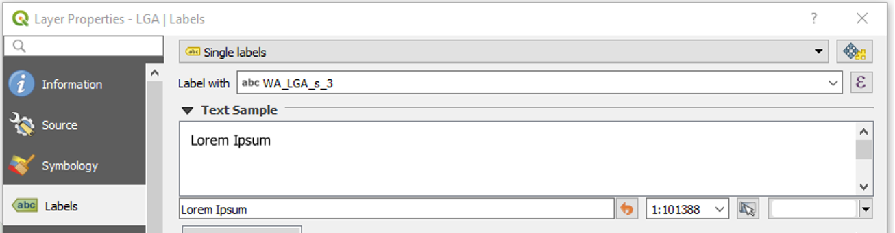

# Exercise 7 -- Land-use mapping {#E7 .unnumbered}

For Assignment 2, you will undertake a catchment management report for Yule Brook catchment - an urban catchment within the City of Perth that drains into the Swan-Canning Estuary. Understanding land cover and land use within a catchment is critical to support management.

<center>
```{r E7image0, echo=FALSE, fig.cap="Yule Brook catchment land cover pattern.", out.width='100%'}
knitr::include_graphics("images/exercise7/7_image0.png")
```
</center>


## Yule Brook mapping exercise - **QGIS** {-}

In this exercise, you will build a series of maps of [Yule Brook](https://www.water.wa.gov.au/__data/assets/pdf_file/0010/9775/115586.pdf) using QGIS.


**Getting started**

-	Install [QGIS](https://qgis.org/en/site/)
-	Open QGIS and wait for it to load. 
-	Download the mapping zip folder by clicking the download button in the tool bar <i class="fa fa-download" aria-hidden="true"></i>.
-	*Extract* the folder to a drive with enough space.
-	Locate the data in the *Browser window* and add it as layers to the *Layers window*. 

**Become confident with the files and the display**

-	You can choose to display or hide any of the layers by ticking or unticking the little box. 
-	You can edit the layers by right clicking on the layer name and right clicking on the layer name and choosing *Properties*, or double clicking on the layer name, which gets you to *Layer Properties*. You will use *Layer Properties* throughout this exercise.
-	You can open the attribute table using *Layers > Open Attribute Table*, or hit the button in the image below. The attribute table allows you to view the properties in a way that is similar to Excel. You can also access the attribute table in Windows by opening the `*.dbf` file.

<center>
```{r E7image1, echo=FALSE, fig.cap="Attribute Table.", out.width='100%'}

```
</center>

-	If you want to save a layer as a new file in a particular location on your computer, use *right click > Export > Save Features As*.
-	In the *Layer Properties* menu, you can do a few useful things
    -	*Source* – edit the display name; check the coordinate reference system
    -	*Symbology* – use the top dropdown to change it from No symbols to Single symbol or Categorized. You can choose which Column to add values to and hit the Classify button. You can also edit the Opacity here.
    -	*Labels* – you can turn the labels on with *Layer Properties > Labels*, then switch from No labels to Single labels in the top dropdown menu. You can choose which category of the file you want to use for the label by using the dropdown menu named Label with. 
    
<center>
```{r E7image2, echo=FALSE, fig.cap="Choosing a category of data for layer labels.", out.width='100%'}

```
</center>

- If you want to do anything else, your best bet is to search for it online. It is likely that someone will have done it before and there will be an answer on a web forum. If you want to find a QGIS function, use *Processing > Toolbox (> Searchbar)*.

**Drainage**

-	Note the flow paths of the stormwater drains and the positions of the compensation basins. Go to Google Earth or Google Maps and compare the shapefile with the aerial photos of the same spots. Consider whether they are as clear as the shapefile indicates. Are they filled with water or are they dry? Do they cross roads or follow roads?  
-	Check the hydrological subcatchments. Do they match the drainage lines well? Are there any subcatchments that are not well represented?
Land cover
-	Set your labels and colours so that they make nice images that communicate the permeability and interception of the landscape. Use *Properties > Symbology > Unique Values*. The categories are:
    -	Hard surfaces
    -	Open water
    -	Roads
    -	Grass
    -	Roofs
    -	Trees
    -	Sand
-	Check this layer against aerial photos. Zoom in on a few areas and assess how accurate the layer is. It should be good but not perfect. 
-	Select a few broad areas and describe how infiltration and interception would be different in these areas. 

**Land use**

-	Similarly to how you edited the land cover data, edit the land use layer so that it displays the land use in a meaningful way. Set the symbology to display `LAND_CAT` (*Layer Properties > Symbology > Categorized > Classify*). Check this layer against Google Earth and determine its accuracy. Consider the accuracy of this layer – bear in mind that this dataset was created by a machine-learning algorithm by the GIS team at the Department of Biodiversity, Conservation and Attractions. 
-	Consider the future of remote sensing for environmental management and compare this to what Google and Facebook can do.

**Groundwater**

-	Add the groundwater contours minimum layer. Turn the labels on. Set the labelling field to `ELEV_AHD_M`. You may want to increase the font size.

**Race stations**

-	Add the Race Stations layer and create a map of where you went or will go on the Amazing Race field trip and the route you took. 
-	You can add a basemap if you like, using:
    -	*Plugins > Manage and Install Plugins*
    -	Search for `QuickOSM` or `OpenMapServices`
    -	Go to Web and open up a map, such as `OSM Standard`
-	Add the flow gauges

**External resources**

-	Using a web-browser, such as the program Microsoft Edge, which is the new version of Internet Explorer, go to 
[WIR](http://wir.water.wa.gov.au/Pages/Water-Information-Reporting.aspx). 
This is where you could get flow and water quality data if you wanted to. Track down the flow gauges on this map.
-	Go to the Intramaps website:
https://www.gosnells.wa.gov.au/About_our_City/Maps/Map_Module_List.  
Pick any local government area, and dig into the local data on stormwater drainage. To see which local government area you want, use the shapefile LGA.shp. Turn on the labels using the Label with `WA_LGA_s_3`. You can make the shape transparent using *Symbology > Opacity*.
-	Go to the floodplain mapping tool:
https://www.water.wa.gov.au/maps-and-data/maps/flood-maps
Examine the bottom of the catchment and the floodplain layers. The menus at the top right give you access to the legend, different layers that you can turn on and off and different base maps. 
-	Compare Land Use, Land Cover, the aerial photography from Google, Intramaps layers and Floodplain Mapping. 

## Summary {-}

Now you have a clear idea of different types of geospatial data relevant to catchments:

- Land cover
- Land use
- Monitoring sites
- Drainage lines and sub-catchment areas.
- Groundwater
- Stormwater
- Flood inundation risk

Some data is from State Government public resources and some is available through local councils; bringing these information sources together will be useful later when preparing your report.

