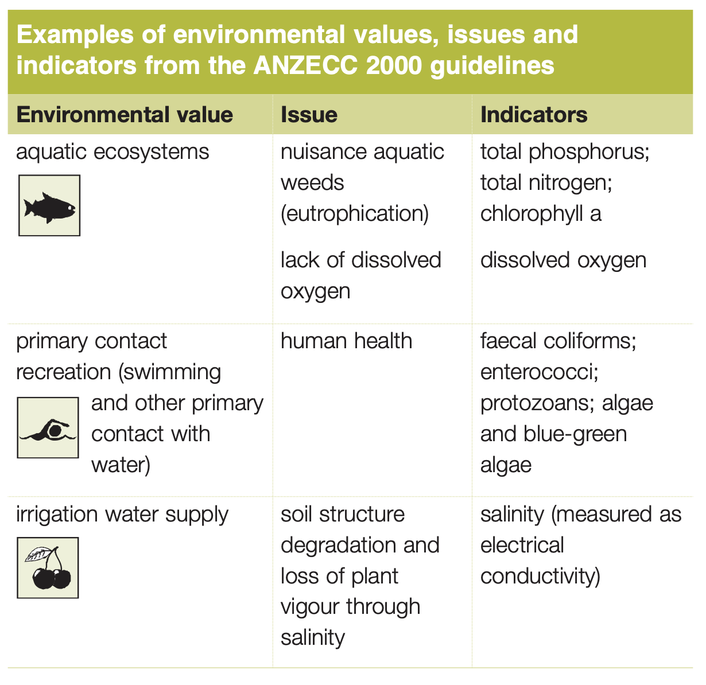
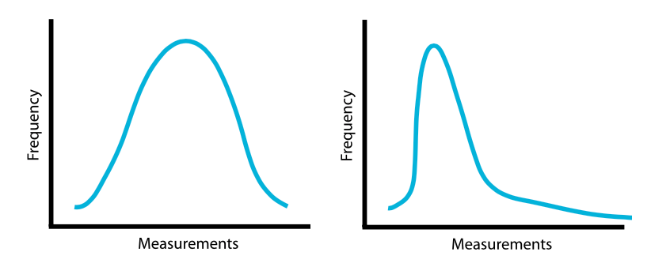
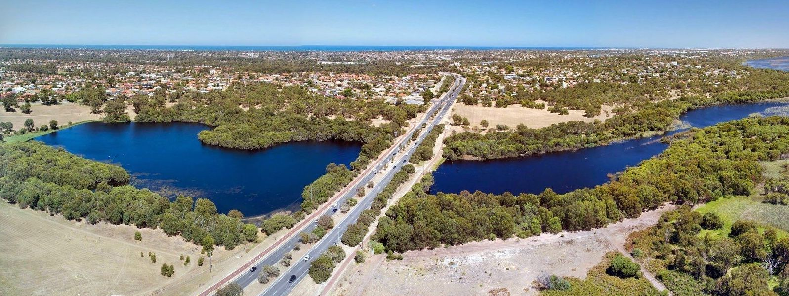
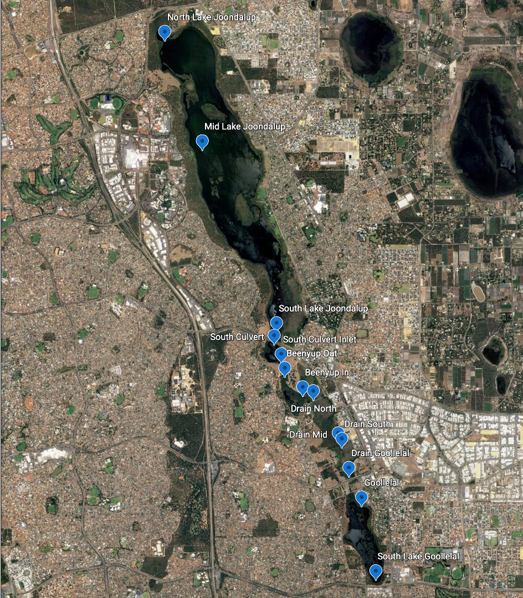
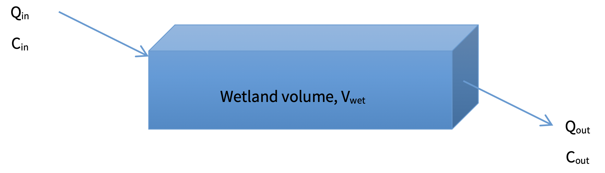
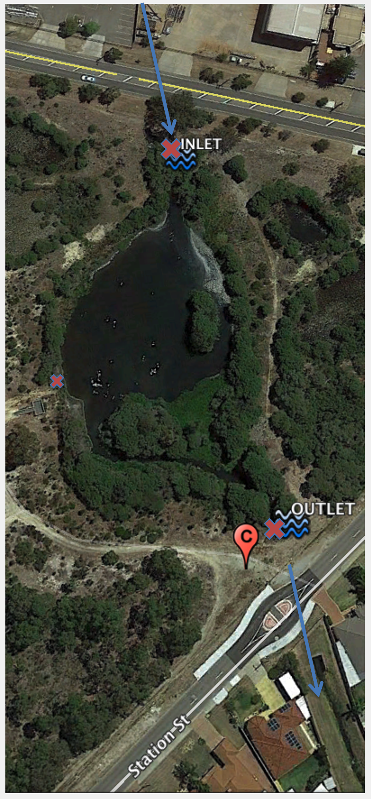

# Exercise 8 -- Lake nutrient assessment {#E8 .unnumbered}


<br>

## Indicators of wetland health  {-}

Indicators of wetland health include dissolved oxygen, pH, salinity, temperature, turbidity and colour; measuring these parameters over time is used to monitor the result of any threats to ecosystem health. For example, turbidity is used as a measure (indicator) of potential excessive sediment in the water column that may result in either in sedimentation or reduce light penetration (the specific threat). Turbidity measures the *potential* for an impact, whereas a more direct measure of impact would be actually measuring light penetration - however this is more time consuming and difficult so us not generally undertaken.

<br>

## Water quality attributes of interest  {-}

A summary of the suite of measurements we make to measure an aquatic system include:

- **Dissolved oxygen**, $DO$ or $O_2$ : *is a measure of the concentration of oxygen gas dissolved in water. Oxygen can be generated from photosynthesis within a wetland, mixed into surface waters from the atmosphere or imported from river inflows. It is is consumed by organism respiration.*
- **Turbidity** : *is a measure of the clarity of water. As suspended particulate matter including clay, silt, detritus and plankton in the water increases, the clarity decreases and the water takes on a muddy appearance. Turbidity does not measure the quantity of suspended matter in the water, just its effects on clarity.*
- **pH** : *The pH of water is a measure of its acidity or alkalinity. The actual component of the water being measured is its concentration of hydrogen ions (H+). In water, some of the H2O molecules will dissociate into H+ ions (also called protons) and OH- ions (hydroxide). When there are more H+ ions than OH- ions the water will have a pH below 7 and is acidic. Conversely, when there are more OH- ions than H+ ions the water has a pH greater than 7 and is alkaline. When the pH of a water body is 7, the H+ concentration is the same as the concentration of hydroxide (OH-) ions and is neutral. When the water is approximately neutral, it is called circum-neutral.*
- **Colour** : *The colour of water results from the combination of dissolved and suspended substances. These include metals e.g. iron and manganese, dissolved organic matter e.g. humus and peat materials, plankton e.g. diatoms and Cyanobacteria, colloidal substances e.g. carbonates and clays and industrial wastes. Turbidity, even at low levels, will make the apparent colour higher than the true colour. The true colour of a water sample can be measured after removing all suspended material. *
- **Salinity**, $S$ : *Salinity is the amount of salt dissolved in the water. There are many salts dissolved in water, most notable sodium chloride. The amount of salt in the water can be measured directly by evaporating the water from a known volume of water and weighing the residual. However this is time consuming. A solution of salt will conduct electricity, and the amount it conducts depends on the concentration of the dissolved salts, the conductivity in a solution increases as the amount of salts dissolved in the water increases. Electrical Conductivity (EC) uses this characteristic to estimate the levels of salinity. The units of EC in water are usually expressed as micro Siemens per centimetre (μS/cm).* 
- **Nitrogen**, $N$ :  *is a key nutrient in an aquatic ecosystem and made up of* :
    - Total Nitrogen $TN$
    - Dissolved Organic Nitrogen $DON$
    - Nitrate $NO_3$
    - Ammonium $NH_4$
- **Phosphorus**, $P$ :  *is a key nutrient in an aquatic ecosystem and made up of* :
    - Total Phosphorus, $TP$:
    - Dissolved Organic Phosphorus $DOP$
    - Phosphate, $PO_4$ :
- **Chlorophyll-a**, $Chl-a$
- Heavy metals 
- Micropollutants 
- Faecal coliforms

<br>

## Turning data into information {-}

Data are the measurements you take that represent the condition or health of the environment at that time. The environmental conditions in an aquatic ecosystem will change over time, at least seasonally but often daily.

A suite of data covering a range of indicators of condition taken only on one occasion can tell you about condition at that time only. This is often called a snapshot of the condition. Data collected from several occasions begins to tell you about variability and change over time. As data accumulate, seasonal and longer term changes will be discovered and confidence will increase.

Data needs to be analysed and interpreted to provide information. A good quality long term data set will assist in providing good information, but understanding and achieving good wetland management only occurs when the data is correctly interpreted.

### Guidelines and thresholds  {-}

One approach is to compare data and data summaries to water quality *guidelines* (objectives or targets). Guidelines are available in the [National Water Quality Guidelines](https://www.waterquality.gov.au/anz-guidelines) (ANZECC & ARMCANZ, 2000), and State policies are also of assistance in interpreting water quality data.

The Australian and New Zealand Environment Conservation Council (ANZECC) [published the widely used Australian and New Zealand guidelines](https://www.waterquality.gov.au/anz-guidelines/resources/previous-guidelines/anzecc-armcanz-2000) for fresh and marine water quality in 2000. These guidelines, which are usually called the 'ANZECC guidelines' and are available on the internet at www.deh.gov.au/water/quality/nwqms, provide government and the community – especially regulators, industry, consultants, community groups and catchment and water managers – with a framework for conserving ambient water quality in our rivers, lakes, estuaries and marine waters.

### Linking water quality indicators to environmental values  {-}
 
‘Environmental values’ are those values or uses of water that the community believes are important for a healthy ecosystem – for public benefit, welfare, safety or health. These include, but are not limited to, protection of aquatic ecosystems, drinking water, primary and secondary recreation, visual amenity, and agricultural water for irrigation, livestock and growing aquatic foods.

The environmental values (and uses) of water apply to waterways such as natural rivers, creeks, lagoons, wetlands, lakes, groundwater, and estuarine and marine waters. The quality of artificial waterways such as reservoirs, where the waters are valued by the community for aquatic ecosystems or human uses, are also addressed by the guidelines, but enclosed and piped waters are excluded.

For each environmental value, the guidelines identify particular water quality characteristics or ‘indicators’ that are used to assess whether the condition of the water supports that value. The presence of faecal coliforms, for example, is used as an indicator for recreational and drinking water quality, because this directly puts those uses at risk, but it is not an indicator for the protection of aquatic ecosystems.
The ANZECC guidelines are a powerful tool that allows ambient water quality management to be an important element in decision-making for environment protection, land- use planning and natural resource management.

The ANZECC guidelines advocate an ‘issues-based’ approach to assessing ambient water quality, rather than the application of rigid numerical criteria with no appreciation of the context. This means that the guidelines focus on:
- the environmental values we are seeking to achieve or maintain
- the outcomes being sought
- the ecological and environmental processes that drive any water quality problem.

For each environmental value of water, the ANZECC guidelines outline common ‘issues’ (or pressures) that may be a problem and provide ‘packaged’ solutions on how to deal with them. These common issues in waterways include such problems as algal blooms and salinity.


<center>
```{r E8image0, echo=FALSE, fig.cap="Example relationship between values and indicators", out.width='50%'}

```
</center>

### Trigger values  {-}

Trigger values are fundamental to using the ANZECC guidelines. The trigger values for different indicators of water quality may be given as a threshold value or as a range of desirable values. Where an indicator is below the threshold value or within the desirable range for its trigger value in a particular waterway, the risk to the protection of the environmental value is low.

Where an indicator is higher than the threshold value or outside the desirable range for its trigger value in a particular waterway, there may be a risk that the environmental value will not be protected. 

<center>
```{r E8image01, echo=FALSE, fig.show='hold',fig.align='center',fig.cap="Trigger values show when a variable of interest exceeds a threshold", out.width='45%'}
knitr::include_graphics(c("images/exercise8/trigger1.png","images/exercise8/trigger2.png"))

```
</center>


There are standard recognised approaches for analysing and interpreting data that can provide comparison between different sites and systems, changes over time and an evaluation against guidelines and targets.
Data can be summarised using basic statistical tools. 


### Summary statistics {-}

A simple measure of the typical state of an aquatic ecosystem is to determine the central tendency of the data, often called the median or mean.

The distribution of data is important in understanding central tendency. The graphs below show the data as a frequency distribution (that is the frequency or number of times a particular measurement was taken). Data may be evenly distributed (often called normal distribution) or can be skewed, with more measurements at one end of the range of results.

Water quality data generally has a skewed distribution – most of the time the level is similar, and when there is a change in water quality data it is generally for a short period of time. For example, turbidity measurements are generally low in a healthy system when fresh water inflows are low. Or algae (chlorophyll-a) will be low until a bloom occurs. 

<center>
```{r E8image5, echo=FALSE, fig.cap="Example distributions of WQ data - normal (left) and skewed (right).", out.width='80%'}

```
</center>


### Time-series trends {-}

As discussed above, variability is a natural part of the aquatic environment, and typically there is a 10-20 per cent difference between consecutive water quality measurements. There will be more substantial changes following floods, after long dry periods and after entrance opening. For example, turbidity may go up tenfold during a flood event.

Displaying the data in a time series provides a picture of change over time. Time series plots are useful to illustrate seasonal patterns, major events or when one-off high or low levels are measured.

Trend lines can also be added to time series graphs to establish if there have been substantial increases or decreases of parameters over time. For the clearest picture, a long time period is required to show changes. Usually less than five years will not provide a good assessment.


<br>

## Wetland data case study : Yellagonga  {-}

Let's explore the above ideas by analysing data from a case-study wetland. The [Yellagonga wetlands](https://parks.dpaw.wa.gov.au/park/yellagonga) within the Swan Coastal Plain (SCP) are a Groundwater Dependent Ecosystem (GDE) within the Cities of Joondalup and Wanneroo. 

<center>
```{r E8image1, echo=FALSE, fig.cap="Yellagonga (Lake Joondalup).", out.width='100%'}

```
</center>

A spreadsheet of historical monitoring data is available for download. 

1. Take a look through the data set and note:

- The number of variables
- The time frame of monitoring
- The number of monitoring sites

<br>

<center>
```{r E8image10, echo=FALSE, fig.cap="WQ Monitoring Sites.", out.width='70%'}

```
</center>

2. What is the mean of the various water quality attributes? How does this compare between sites? (*Hint: use column filtering and pivot tables to quickly summarise the data*)
3. Do any variables exceed guideline values?

Often we are interested how nutrients are "partitioned" - that is, how the different nutrient species that make up total nitrogen or total phosphorus change over time.

4. For a chosen site in the data-set, produce a "stacked area" time-series of $TN$ and $TP$. To do this you must compute the organic amount and then make a stacked graph of the components :
    - Organic Nitrogen : $ON=TN-NO_3-NH_4$
    - Organic Phosphorus : $OP=TP-PO_4$

5. Looking at the nutrient trend over time for the chosen site, do you see any changes in either the total amount of nutrients or the bioavailable fraction? 

<br>

## Quantifying wetland function  {-}

Monitoring tells us about the state of an environmental system, but in some circumstances we are also interested in how a system is **functioning**. 

In the case of constructed or engineered wetlands our focus is on improving water quality by reducing nutrient concentrations. Wetlands act as a temporary store of water flowing through a river. They may filter out the hydrograph peak by slowing the flow down, and also they act as a “biogeochemical reactor” able to change the water chemistry in the river water as it moves through.

### Wetland retention time  {-}

We can compute a characteristic time-scale of flow through a wetland, called the Hydraulic Residence Time, using this formula:

Hydraulic Residence Time ($HRT$, days) = $V_{wetland} / Q$

where $V_{wetland}$ is the wetland volume (m^3^) and can be approximated from wetland area and depth, and $Q$ is the average flow going through the wetland (m^3^/day). If we assume the wetland is at steady-state (not changing volume rapidly) then $Q_{in} ~ Q_{out}$, and this can be assumed as the average flow through rate.

<center>
```{r E8image3, echo=FALSE, fig.cap="Schematic of wetland flushing time calculation.", out.width='90%'}

```
</center>

6. For the Black Creek wetland (the one monitored on the Yule Brook catchment race), the area was estimated to be 3850 m^2^. If you assume a mean depth of 0.5 m, and a flow rate of 0.1 m^3^/s, what is the retention time of water at this site?
7. The HRT estimate above assumes complete mixing in the wetland. For this site do you think that is the case?

<center>
```{r E8image4, echo=FALSE, fig.cap="Black Creek wetland in the Yule Brook catchment, highlighting the inlet and outlet. How many nutrients can it assimilate?", out.width='40%'}

```
</center>


### Nutrient assimilation efficiency {-}

The efficiency of a wetland to reduce nutrients (or suspended sediment or salt etc.) can be computed based on the ratio of the outlet to inlet nutrient concentration, corrected for an assumed background concentration.

<center>
\begin{equation}
\mathrm{Removal\ Efficiency\ (\%)\ =\ }1-\frac{C_{out}-C_0}{C_{in}-C_0} \times \: 100 \%
(\#eq:E8equation1)
\end{equation}
</center>

where: $C_0$ is the ‘background’ concentration (the value expected in a “clean river”), $C_{in}$ is the input concentration, $C_{out}$ is the outlet concentration. The above expressions can be applied to all nutrients and contaminants, however, note the following when applying it:
 
- For attributes that are improving (e.g., $DO$) during their transit through the wetland, then the above fraction can be reversed. 
- The value $C_0$ needs to be realistic and smaller than $C_{out}$. This value could be based on a value like form the ANZECC guidelines or based on a locally set target.

Now do the following tasks:

8. For the provided data set on Black Lake wetland (the one monitored on the Yule Brook catchment race), compute the efficiency using the above formula for the different nutrient species.
9. Which ones improve the most? Using your knowledge of wetland processes, can you explain why some species are changing? List the potential processes contributing to the changes.
10. Is their a relationship between $HRT$ (i.e. the time the water is within the wetland) and the reduction efficiency? What could be done to improve water retention?

<br>

## Getting further info on wetlands  {-}

There is a lot of information about wetlands online. The "[WetlandInfo](https://wetlandinfo.des.qld.gov.au/wetlands/)" pages managed by the Qld government is a great summary and information resource. Take some time to peruse the pages here and see what you can find.

