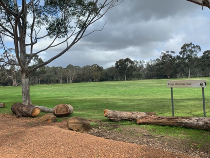

# Week 5 - Helena River field visit {#F1_1 .unnumbered}

#### On arrival {#F1_2 -} 

Arrive at the carpark near King’s Meadow Oval. Firstly check-in with an instructor and get your bearings. You will take a pack with you, and other equipment you will see at the stations.

<center>
```{r image04-8, echo=FALSE, fig.cap="", out.width='65%'}

```
</center>

During your site visit you will be instructed to follow the tasks below and record your data in handout<i class="fa fa-download" aria-hidden="true"></i>. If in doubt, please ask for assistance. You will undertake 4 main activities (Tasks A to D). 

#### Task A – Surface Water Flows and Salinity {#F1_2 -} 

- Explore the site, considering the surface water pathways. Bear in mind there is an estuary a river a lake and some stormwater drainage in your vicinity! Use the LIDAT map provided and consider the relief.
- Be able to identify flow direction in the main waterways bounding the site (Swan River to the west and Helena River to the south-east).
- Be able to identify water accumulation areas within the site itself.
- Consider the horizontal and vertical movement pathways of this water.
- Identify *Eucalyptus rudis* trees and their health in context of the landscape.

<center>
```{r image04-9, echo=FALSE, fig.cap="",out.width='45%', out.height='25%', fig.show='hold'}
knitr::include_graphics(c("images/surface_ground_water_interaction/picture9.png",
                          "images/surface_ground_water_interaction/picture10.png"))
```
```{r image04-10, echo=FALSE, fig.cap="", out.width='45%', out.height='25%', fig.show='hold'}
knitr::include_graphics(c(
                          "images/surface_ground_water_interaction/picture11.png",
                          "images/surface_ground_water_interaction/picture12.png"))
```
</center>

Measure at two contrasting locations the surface water salinity, and note details the data sheet. 
Include the GPS locations. Take one from each of your allocated regions. You can Take them from Helena or Swan river, or any internal site. We will collate data from students to make a class data summary. Use waders provided for deeper waters – *use a stick/ruler to judge depth of water before taking steps and do not enter into fast-running water above knee height*. 

<center>
```{r image04-11, echo=FALSE, fig.cap="Example inundation pattern. Which way is the water flowing?", out.width='65%'}
knitr::include_graphics("images/surface_ground_water_interaction/picture13.png")
```
</center>

#### Task B – Helena River Flow {#F1_3 -}  

Navigate to the Helena River, where it flows under the Bridge. Say hi to Kirsty, and tell her your favorite song at the moment.

Undertake a stream gauging measurement to determine the river flow. Refer to [Lab 2 - Streamflow analysis] ... here we will undertake the “Velocity-Area method”. 

You'll need to jot down the stream cross-sectinoal profile and velocity measurements.

#### Task C – Groundwater sampling {#F1_4 -} 

Visit the two allocated existing piezometer wells (refer to map below, consult instructor for locations if you cant find them). Note the Well Identification Number. e.g. HW-1, HW-2 etc.

<center>
```{r image04-12, echo=FALSE, fig.cap="", out.width='45%', out.height='25%', fig.show='hold'}
knitr::include_graphics(c(
                          "images/surface_ground_water_interaction/picture14.png",
                          "images/surface_ground_water_interaction/picture15.png"))
```
</center>

Record results from the following tasks:

a) Record the depth from the Top of the Casing (TOC) to the ground level.
b) Record the depth from the water to the top of the casing. Use the “dipper” provided.
c) "Bail the well" with the bailer, and take a sample of the water for salinity determination (measure EC of the groundwater).
d) Consider the hydraulic slope – how do you think the height of the water table varies along the transect. Try sketching a cross-section along the transect, and consider how you would apply Darcy’s Law.

<center>
```{r image04-13, echo=FALSE, fig.cap="", out.width='65%'}
knitr::include_graphics("images/surface_ground_water_interaction/picture16.png")
```
</center>

#### Task D – Soil salinity {#F1_5 -} 

In this task we want to expand our data beyond the transect of bores more widely. What is the thickness of the unsaturated zone where these trees can root into?

Goto the bridge location and look for Chris. Once you give him the secret handshake (in a covid-safe way), he will give you some gear.

Identify a soil/groundwater sampling location away from the piezometer transect, in your given region (Chris will sort you out). Take an exact GPS reading to log your site. Split the tasks below between your team mates:

a) Measure the soil salinity of a sample at the **surface**, and **20 cm below the surface**. Note soil salinity measurement is different from the water salinity measurement.
b) Use the hand auger, drill to reach the water table (~ 50cm) below the surface (this may vary depending on the exact site chosen). Carefully extract the soil, without the hole collapsing. 
Once settled (~5-10mins), take an EC reading of the water pooling in the bottom, and note the water level below the ground surface. Take caution the depth is accurate relative to the pre-disturbed surface.


