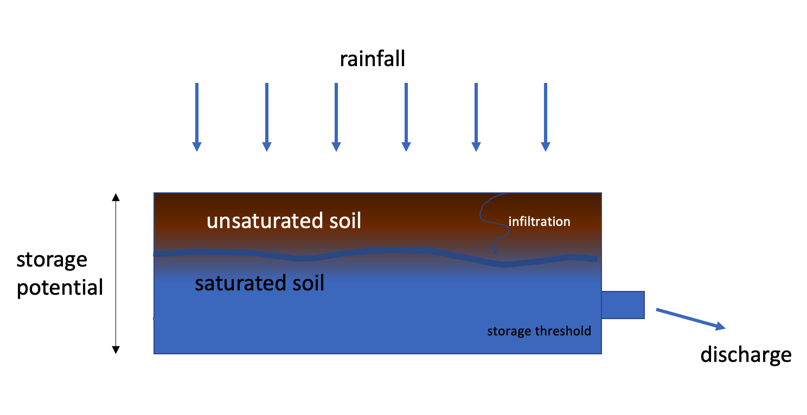
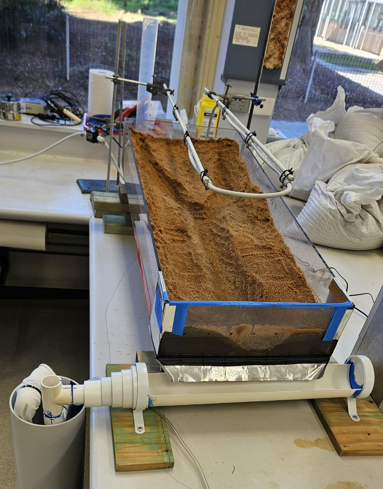
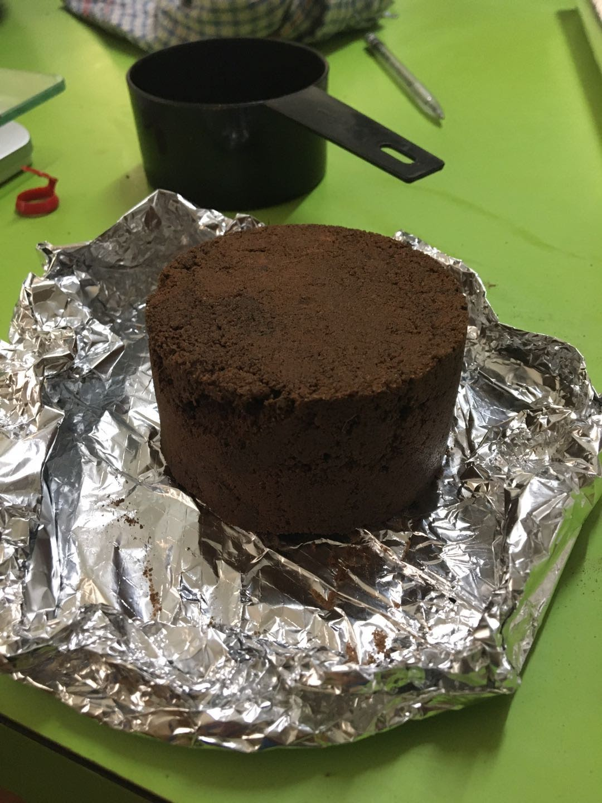
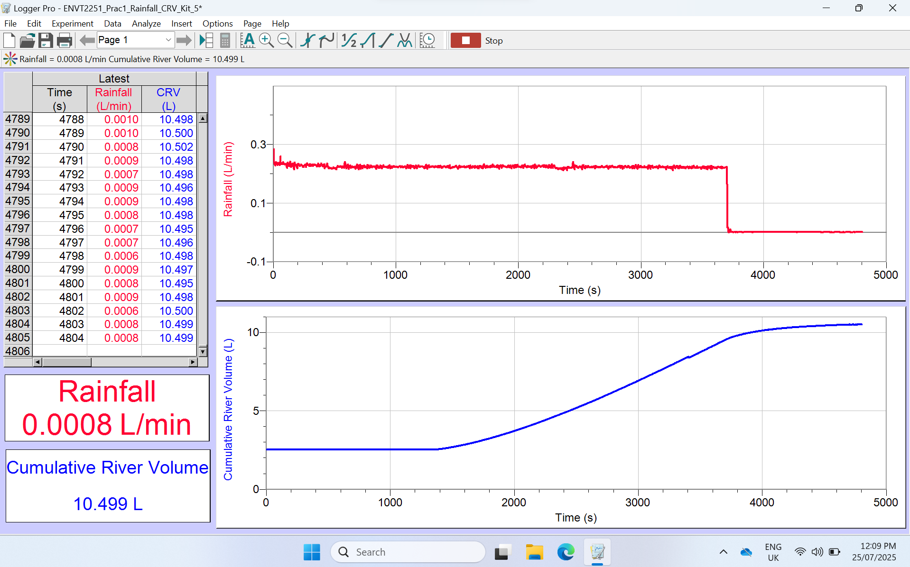

# (PART) LABS / FIELD TRIPS {.unnumbered}

# Week 2 - Desktop catchments {#L1 .unnumbered}

## Learning Objectives {#L1_1 .unnumbered}

-   To be able to conceptualise how catchments store and release water in response to rainfall
-   To understand that the relationship between rainfall and runoff depends on soil and catchment conditions.
-   Develop skills related to laboratory data analysis and interpretation.

## Building a "Desktop Catchment" {#L1_2 .unnumbered}

A real-world catchment is sometimes conceptualised as a "bucket" of soil. This is somehwat simplistic but it does help us clarify a few key concepts that underpin our understanding of the water balance.

Using this analogy, the soil acts like a "sponge" that can store water. Improtantly, a certain amount of water needs to be stored in the sponge before it will release any. Think about your kitchen sponge - it will soak up water to a point, after which it becomes saturated and cannot hold more - any excess added will simply leak away.

The catchment geomorphology and soil also means that the bucket needs to have a certain amount of water stored before it will leak any to the river network. We call this a storage threshold. This threshold amount of water storage needs to be met before any discharge will occur. In a pure bucket of soil, the soil capilliarity will hold onto water. In soil science, the amount of water that soil can hold before the water starts to flow (e.g. drain away) is called the field capacity.

If rain falls on a catchment at a time when the storgae threshold is already met (i.e., the bucket is already partially full), then even a small amount of rain can cause a discharge to occur. However, if a rainfall event occurs when the bucket is near to empty, then the rainfall will first be soaked up and not lead to any discharge unless the storage threshold is met. The starting conditions at the begining of an event are called the antededent conditions.

<center>
```{r L1imageA, echo=FALSE, fig.cap="A catchment can be conceptualised as a bucket of soil, which holds and releases water.", out.width = '80%'}

```
</center>


In this laboratory we will create a desktop catchment able to simulate this behaviour. By comparing data collected using different "bucket" settings, we can assess the importance of soil properties and antecedent conditions on the relationship between discharge and rainfall.


### Step 1 : Catchment Setup {#L1_3 .unnumbered}

In the lab you will be introdcued to the desktop cacthment setup.

Start by filling the catchment with soil. Estimate the volume of soil that was added - start by making a regualr shape to compute the volume and then shape the catchment to be more realistic.

<center>
```{r L1imageBb, echo=FALSE, fig.cap="Photo of the desktop catchment.", out.height = '50%'}

```
</center>
<center>
```{r L1imageB, echo=FALSE, fig.cap="Rain falling on the desktop catchment.", out.height = '50%'}
knitr::include_graphics("images/exercise4/picture5.png")
```
</center>

Across the class we will compare different settings, comparing a) catchment slope and b) antecedent conditions (in the form of different soil moisture amounts).

Depending on your allocated settings, prepare your catchment! 

-  Adjust slope with blocks provided. 
-  Add an initial amount of moisture using the watering can as guided.

We are now ready to start the experiment, but first we must characterise how much water is stored in the soil.


### Step 2 : Characterising soil moisture {#L1_4 .unnumbered}

#### Soil water terms {#L1_5 .unnumbered}

During this exercise you will measure some of the key properties for soil hydrology. To do this, you will collect soil from locations of your choosing to analyse. You will then calculate soil moisture content, porosity and field capacity. Let's start by remembering some key terms:

**Porosity:** The porosity is the ratio of the volume of the voids to the total volume of the sample. So if you have a sample of 100 cm^3^ and 30 cm^3^ is void space (non-solid), then you have a porosity of 0.3 or 30%.

**Total Moisture Content:** is measured by calculating mass loss during oven drying of wet samples at 103-105˚C for 1-2hrs. You can also measure the air-dried moisture content (measured as loss of mass during air-drying at a temperature of around 40˚C.

**Saturated Water Content:** Where all pore space in the soil is occupied by water and no further absorption of rainfall is possible. This will be equal to the total porosity.

**Field capacity:** The water content remaining after water has drained out of the soil under gravity. Technically, this is the moisture content remaining in soil subjected to -0.033MPa (0.3Bar) pressure (i.e. slight vacuum) because capillary action, osmotic pressure and gravity are balanced at this point. In the landscape, the excess water has moved downwared through the soil to become groundwater recharge.

**Wilting Point:**  Plant roots can’t extract any more water (i.e. apply a suction stronger than -1.5 MPa) from this soil and begin to die. Permanent wilting point is the moisture content remaining in soil subjected to -1.50MPa (15 Bar) pressure (i.e. moderate vacuum). 

**Available Water Content:** This is the amountof  moisture available for plants to extract, and is caluclated from Field Capacity – Permanent Wilting Point. This water does not drain through to the watertable under gravity, and also is not held too tightly by the soil, so that plants are able access it for uptake through their roots.  

#### Sample Collection {#L1_6 .unnumbered}

First, start by collecting your soil samples. If your in the lab, this will be from our setup. If your stuck at home, you can do this in your kitchen as an exercise!

Clear the surface and use a small "core" (e.g. measuring cup or inverted can) to collect your samples. Collect two replicate samples. You will probably want to wrap these in foil to keep them from falling apart and then place them in a zip-lock bag (sealed tight to stop the sample drying out) with the sample ID recorded in permanent marker ready for transport back to "the lab" (i.e. your kitchen). While you are in the field make sure you record the coordinates (or location) where you collected the samples.

You should also make a brief description of the soil - what colour is it (in real scientific studies we use colour charts to make sure colour descriptions are robust and repeatable). Would you describe your soil sample as sand? Or is it silty, making it feel with finer grains because of the finer grains. Sometimes it's difficult to tell just by touch whether a sample contains silt or clay because these are both fine-grained. To test for clay you can roll a sample in your palm, if it holds a cylindrical sausage shape then it contains clay. Does your sample seem to have a lot of dark brown organic matter, or not much?

For each sample use a balance to record the sample weight, making sure you correctly blank the balance to account for the sample container weight. Record the dimensions and volume of your samples. Then place them onto a tray that is suitable for going into the oven. Then place the tray into the oven for drying at \~105˚C. Leave in the oven until the sample is totally dry and then re-weigh (check after for 1-2 hours; in the meantime goto Step 3).

Now you can use your measured data to compute the soil moisture and porosity of each sample following the instructions below. 

<center>
```{r E3BimageA, echo=FALSE, fig.cap="A soil sample (core) collected using a kitchen measuring cup.", out.width = '50%'}

```
</center>


#### Computing Soil Moisture and Soil Porosity {#L1_7 .unnumbered}

Soil moisture (water content) and porosity (proportion of void space) are key parameters that describe the capacity of soils to store water. Let's calculate these parameters for each the the soil samples you collected.

**Soil moisture**: For each of your soils samples you should have measured the soil weight before and after drying in the oven. The mass-loss during oven drying represents the weight of water contained in that soil volume. (Note that clayey soils can retain considerable amounts of water when they are air-dry). Based on this water mass we can work out the gravimetric (by weight) and/or volumetric (by volume) water content of each soil sample. The volumetric water content (VWC, $\theta$, theta, unitless because it is a ratio), is calculated from the mass of wet and oven dried samples and taking into account the total sample volume using Equation \@ref(eq:E3Aequation1). You can express this value as a % by multiplying your result from \@ref(eq:E3Aequation1) by 100. Enter your results into the online table (via Google Sheets)

<center>
```{=tex}
\begin{equation}
\theta=\frac{V_w}{V_T}=\frac{\left(M_{\text{sample}}-M_{\text{dry}}\right)}{V_T\ \rho_w}
(\#eq:E3Aequation1)
\end{equation}
```
</center>

**Soil Porosity**: Let's now calculate the bulk density of the soil, and therefore the porosity of the soil. Bulk density $\rho_b$ is the mass of dry soil per unit volume. You have already measured the dry volume of your soil, so to determine the bulk density you just need to work out the volume of your soil sample (if it was a column of core then volume = $\pi r^2 h$ where $r$ is radius and $h$ is height of soil in the sample). From the bulk density and particle density $\rho_p$ (2.65 g cm^-3^) you can then calculate the porosity $\phi=\ \left(1-\frac{\rho_b}{\rho_p}\right)$. This value will also be a ratio, and you can multiply it by 100 to calculate the porosity as a %.

Now that you know the porosity, you can estimate the water storage potential, $S_{\text{max}}$ of your sample by multiplying the soil volume by the porosity as shown in Equation \@ref(eq:E3Aequation2). Add your results of these analyses to the online Google Sheet.

<center>
```{=tex}
\begin{equation}
S_{max}=\ \phi{\ V}_{soil}
(\#eq:E3Aequation2)
\end{equation}
```
</center>

### Step 3 : Collect experimental data {#L1_8 .unnumbered}

Once you have prepared the experimental setup, and taken the soil samples to the oven, you are now ready to go. Refer to the local instructions,  start the logger on the computer, and then start the rainfall (i.e., turn the tap on). 

The rain should occur for around 15-30 minutes, or at least long enough for the catchment flow to be occurring. 

<center>
```{r L1imageBc, echo=FALSE, fig.cap="Data logging system.", out.height = '50%'}

```
</center>

After you turn off the rainfall tap, **keep the system logging**, and wait for the soil to keep draining. After 15 or so minutes stop the logger and export the data as a csv or xls file.


### Step 4 : Data analysis {#L1_9 .unnumbered}

The experimental data saved from the data-logger can be used to visualise the change in rainfall and runoff (discharge) over time, and used to calculate the total rainfall and runoff amount.

#### Plotting the experimental data {#L1_10 .unnumbered}

In Excel, plot a time-series graph showing rainfall and the cumulative volume of discharge. We can compute the discharge rate by looking at the difference between the output volume between two time-steps.

Make sure the units are described correctly - the units of rainfall or L/min and the units in the "tank" are L.

Once you are happy with your clean data set you can use the logged data to identify the properties of the storm event, including:

a)  Time from rainfall onset to when runoff began to be recorded (mins),
b)  Time to peak discharge (mins),
c)  Total rainfall volume (cm^3^),
d)  Total runoff volume (cm^3^),
e)  Average rainfall intensity (cm/min),
f)  The runoff coefficient, $c$, for the 'storm' event.

#### Estimate the lag time {#L1_11 .unnumbered}

Once you have plotted the rainfall and discharge, estimate the start time of the rain event, and the start time of the discharge. The time difference is the lag time that it took to fill the storage threshold - the amount the soil needed to be wetted prior to discharge occuring.

#### Computing the runoff coefficient {#L1_12 .unnumbered}

The runoff coefficient is the ratio of discharge to the input rainfall amount. Simply calculate this total discharge volume / total rainfall volume. 

#### Share and compare your results {#L1_13 .unnumbered}

Once the above steps are completed, log onto the shared data spreadsheet [here] and enter your results. Use the shared data to compare the parameters computed for different cacthment settings. 

Explore the data, for example, make a scatter plot comparing discharge and rainfall. How does runoff coefficient compare to antecedant conditions. What about catchment slope?


## What did we learn? {#L1_14 .unnumbered}

-   Spatial heterogeneity is a substantial issue in subsurface hydrology. What is the variation between sample replicates? How does this compare to the mean of the measured values (i.e. is the variation large relative to the mean?). How much do the soil parameter estimates vary across the whole data set?

-   How did the volumetric water content in your soil compare to your estimate of the total porosity? Was the soil close to saturated, or very dry? Does this make sense in terms of where and when you collected it (time since rainfall, proximity to surface water or drainage).

-   Based on your measured S~*max*~, what would be the water storing capacity in the upper 2 m of soil over an area of 1 km^2^ ? Does this seem like a lot of water, or not much?

-   How does your estimate of field capacity compare to your estimate of the total porosity? Does this seem reasonable? What does this mean for plant water availability?

-   What are the sources of error in your parameter estimates? What could you improve if you had to do this again?

-   What haven't we measured that would also be useful to know about soils if we want to understand runoff and streamflow generation mechanisms?
