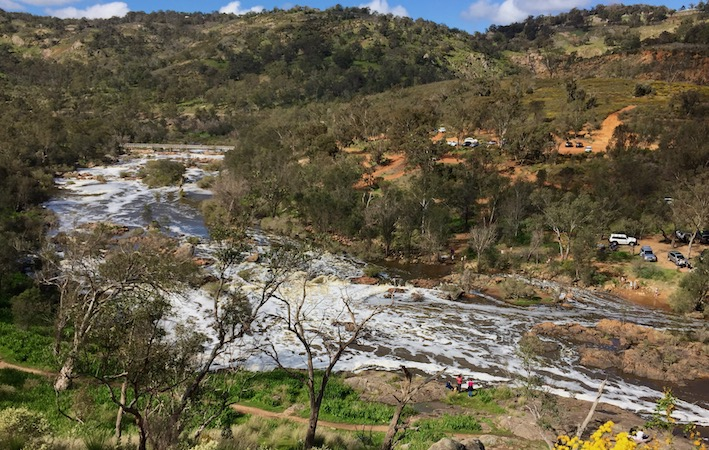
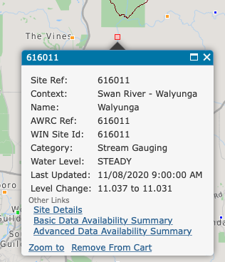
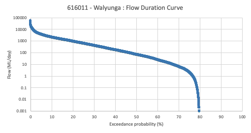
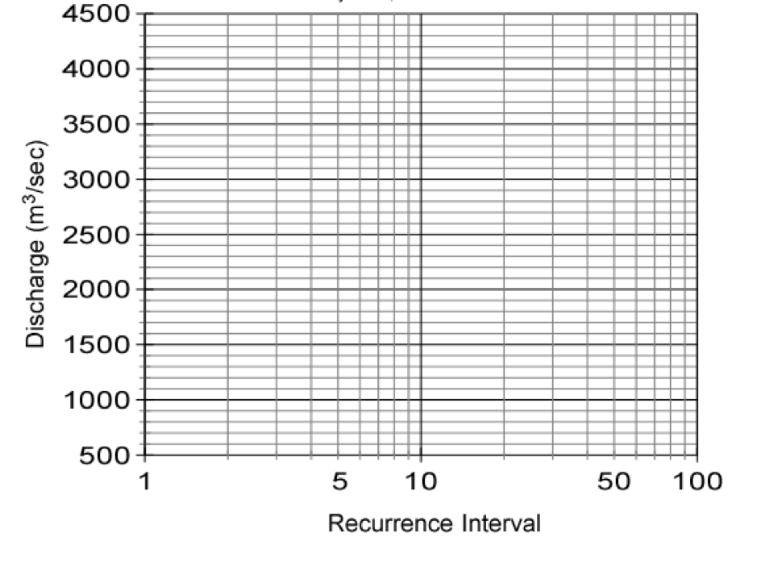

---
editor_options:
  markdown:
    wrap: 72
---

# (Lecture 4 - Streamflow analysis) {#L2 .unnumbered}

In Lecture 4, we discussed how we can interpret patterns in streamflow data, and
how to use it characterise variability in stream discharge rates. Stream dsicharges could be changing over time due to climate change (e.g., less rainfall, or more floods), or due to land-use change (e.g., land clearing).

This is a self-paced activity designed to show you different ways we can look at the raw streamflow data.

#### Making Sense of Streamflow Data {#E2_5 .unnumbered}

The first step in any hydrologic data analysis project is to gather the
data and relevant background information on your catchment of interest.
In Western Australia the [WIR
website](http://wir.water.wa.gov.au/Pages/Water-Information-Reporting.aspx)
contains all of the data and information you need, and we have used this previously (Exercise 3). All states/countries have something similar;
the USA has one of the best examples through the [USGS NWIS
website](http://waterdata.usgs.gov/nwis).

If you click the site information button, enter your gauge name or
number, and browse the available datasets for your river. For this
analysis, you will need daily discharge data, peak streamflow, and the
annual water data report. Other datasets may also be helpful for
understanding the hydrologic behavior of your river.

Hydrologic analyses are almost always conducted for "water years" not
calendar years. In the Northern Hemisphere. A water year begins on
October 1 and ends September 30 . In the Southern Hemisphere it Starts
May 1 and ends April 30, though this can be region specific.

## Daily Unit Discharge Hydrograph {#E2_6 .unnumbered}

<center>
```{r E2image4, echo=FALSE, fig.cap="[The Avon River, Western Australia](https://en.wikipedia.org/wiki/Avon_River_(Western_Australia))", out.width = '80%'}

```
</center>

Unit discharge is the total discharge of the river divided by the
watershed area. Thus, it has units of m^3^/s/km^2^. Unit discharge is
very useful for comparing the hydrologic behaviour of catchments of
different size (since discharge scales with area). Depending on your
data source you will need to download data and do appropriate
conversions in a spreadsheet.

A properly formatted unit discharge hydrograph has a descriptive title,
labelled axes, and a logarithmic y-axis. If you need help with
formatting the graph in Excel, please don't hesitate to ask for help!

**Activity:** Get the Swan River "Walyunga"
gauge data (616011) from the download button (or alternatively goto the [WIR web
link](http://wir.water.wa.gov.au/Pages/Water-Information-Reporting.aspx),
and download the continuous flow data for the site directly from the database).  

<center>
```{r E2image5, echo=FALSE, fig.cap="Navigate to the 'Walyunga' guage (616011)", out.width = '50%', out.height = '50%'}

```
</center>


In Excel, explore the data; note the different columns are the same discharge data in different units. Create a hydrograph
comparing discharge between a wet year and a dry year. Use the column which is "total" in units of ML/day. For the plot, compare the two years on a common x-axis by aligning the two years side-by-side and plotting as two series.  On the x-axis, use a "hydrologic year" rather than calendar
years, which spans from 1 Apr to 31 Mar. Label accordingly. 

This is the flow leaving the catchment area. Now repeat the exercise but this time by creating a
*unit hydrograph* - for this you will need to divide by the catchment
area; refer to the above information and check units are consistent.
This gauge is draining the Avon catchment which has an area 125,000 km^2.

## Flow Duration Curves {#E2_7 .unnumbered}

#### What is it? {#E2_8 .unnumbered}

The flow duration curve is a plot that shows the percentage of time that
flow in a stream is likely to equal or exceed some specified value of
interest. For example, it can be used to show the percentage of time
river flow can be expected to exceed a design flow of some specified
value (e.g., 20 m^3^/s), or to show the discharge of the stream that
occurs or is exceeded some percent of the time (e.g., 80% of the time).


#### How is it calculated? {#E2_9 .unnumbered}

The basic time unit used in preparing a flow-duration curve will greatly
affect its appearance. For most studies, mean daily discharges are used.
These will give a steep curve. When the mean flow over a long period is
used (such as mean monthly flow), the resulting curve will be flatter
due to averaging of short-term peaks with intervening smaller flows
during a month. Extreme values are averaged out more and more, as the
time period gets larger (e.g., for a flow duration curve based on annual
flows at a long-record station).

**Step 1:** Sort (rank) average daily discharges for period of record
from the largest value to the smallest value, involving a total of $n$
values. ($n$ is the sample size).

**Step 2:** Assign each discharge value a rank ($M$), starting with 1
for the largest daily discharge value.

**Step 3:** Calculate exceedence probability ($P$) as follows:

<center>

```{=tex}
\begin{equation}
P = 100 * [\frac{M}{n+1}]
(\#eq:E2equation3)
\end{equation}
```
</center>

where, $P$ = the probability that a given flow will be equaled or
exceeded (% of time), $M$ = the ranked position on the listing
(dimensionless), and $n$ = the number of events for period of record
(dimensionless).

**Activity:** Follow the above steps using the 616011 gauge data to
create your own flow duration curve.

#### What does this particular information tell you about your stream? {#E2_10 .unnumbered}

A flow duration curve characterizes the ability of the basin to provide
flows of various magnitudes. Information concerning the relative amount
of time that flows past a site are likely to equal or exceed a specified
value of interest is extremely useful for the design of structures on a
stream. For example, a structure can be designed to perform well within
some range of flows, such as flows that occur between 20 and 80% of the
time (or some other selected interval).

The shape of a flow-duration curve in its upper and lower regions is
particularly significant in evaluating the stream and basin
characteristics. The shape of the curve in the high-flow region
indicates the type of flood regime the basin is likely to have, whereas,
the shape of the low-flow region characterizes the ability of the basin
to sustain low flows during dry seasons. A very steep curve (high flows
for short periods) would be expected for rain-caused floods on small
watersheds. Snowmelt floods, which last for several days, or regulation
of floods with reservoir storage, will generally result in a much
flatter curve near the upper limit. In the low-flow region, an
intermittent stream would exhibit periods of no flow, whereas, a very
flat curve indicates that moderate flows are sustained throughout the
year due to natural or artificial streamflow regulation, or due to a
large groundwater capacity which sustains the base flow to the stream.

An example, properly formatted flow duration curve is shown below
(Figure \@ref(fig:E2image6)).

<center>
```{r E2image6, echo=FALSE, fig.cap="Aproperly formatted flow duration curve", out.width = '85%', out.height = '85%'}

```
</center>

## Flood Frequency Analysis {#E2_11 .unnumbered}

#### What is it? {#E2_12 .unnumbered}

Flood frequency analyses are used to predict design floods for sites
along a river. The technique involves using observed annual peak flow
discharge data to calculate statistical information such as mean values,
standard deviations, skewness, and recurrence intervals. These
statistical data are then used to construct frequency distributions,
which are graphs and tables that tell the **likelihood** of various
discharges as a function of recurrence interval or exceedence
probability.

Flood frequency distributions can take on many forms according to the
equations used to carry out the statistical analyses. Four of the common
forms are: **Normal Distribution**; **Log-Normal Distribution**;
**Gumbel Distribution**; and **Log-Pearson Type III Distribution**. Each
distribution can be used to predict design floods; however, there are
advantages and disadvantages of each technique.

While the log Pearson Type III distribution is the recommended
technique, its application is a bit more complex than we are going to
undertake for this class. Instead, we will use the older Weibull
plotting position method.

Flood frequency information can be determined from knowledge of the peak
discharge (highest discharge) in any given year provided enough years of
information has been collected. This allows one to relate the expected
recurrence interval for a given discharge, and determine the probability
that a flood of a given discharge will occur in any given year. The
recurrence interval for a given discharge can be calculated by first
ranking the discharges.

**Activity:** In the Table below for "Big River", fill in the Rank
column. To do this, enter a 1 for the maximum discharge that has
occurred during the 20 years of available data. The second highest
discharge will be given a rank of 2, etc. with the lowest discharge
given a value of 20. <br>

<center>
```{r E2table2, echo=FALSE, message=FALSE, warning=FALSE}
library(knitr)
library(kableExtra)
options(kableExtra.html.bsTable = F, knitr.kable.NA = '')
table2 <- read.csv("tables/exercise2/table2.csv", check.names=FALSE)
kable(table2,"html", escape = F, align = rep('c'), caption = "Complete the table for 'Big River'",
      bootstrap_options = "hover") %>%
  kable_styling(table2, bootstrap_options = "hover", "striped",
                full_width = F, position = "center",
                font_size = 12) %>%
  column_spec(1, width_min = "15em") %>%
  column_spec(2, width_min = "15em") %>%
  column_spec(3, width_min = "15em") %>%
  column_spec(4, width_min = "15em") %>%
  row_spec(1:20, background = 'white') %>%
  scroll_box(width = "100%", height = "515px",
             fixed_thead = FALSE)
```
</center>

<br> After you have filled in the Rank column, you can now calculate the
recurrence interval for each peak discharge. The recurrence interval,
$R$, is given by the Weibull Equation:

<center>
```{=tex}
\begin{equation}
R = \frac{n+1}{m}
(\#eq:E2equation4)
\end{equation}
```
</center>

where $n$ is the number of years over which the data was collected (20
years in this case), and $m$ is the rank of each peak discharge. Use
this equation to calculate the recurrence interval for each peak
discharge.

Next, use the graph below (or Excel) to plot a graph of discharge (on
the y-axis) versus recurrence interval (on the x-axis). Note that the
x-axis must be a logarithmic scale. If drawig by hand you should try to
estimate as best you can where the data point will fall between the
lines on the graph. Once you have plotted the points use a ruler to draw
the best fit straight line through the data points (lay a ruler on the
graph and try to draw a line that most closely approximates all of the
data points). Do not draw lines that connect individual data points. If
you are plotting in Excel you will fit a linear trendline.

<center>
```{r E2image7, echo=FALSE, fig.cap="", out.width = '70%'}

```
</center>

By extrapolating your line on the graph, determine the peak discharge
expected in a flood with a recurrence interval of 50 years and 100
years. These are the discharges expected in a 50 year flood and a 100
year flood.

The annual exceedence probability, $P_{e}$, is the probability that a
given discharge will occur in a given year. It is calculated as the
inverse of the recurrence interval, $R$:

<center>
```{=tex}
\begin{equation}
P_{e} = \frac{1}{R}
(\#eq:E2equation5)
\end{equation}
```
</center>

Thus, the probability that a flood with a 10 year recurrence interval
will occur in any year is 1/10 = 0.1 or 10%. What are the probabilities
that a 50 year flood and a 100 year flood will occur in any given year?

**Extra activity:** Repeat the above flood frequency analysis using the
616011 Walyunga data set that you downloaded in Excel (Hint, use a pivot
table and the max option to get the annual maximum discharge).


