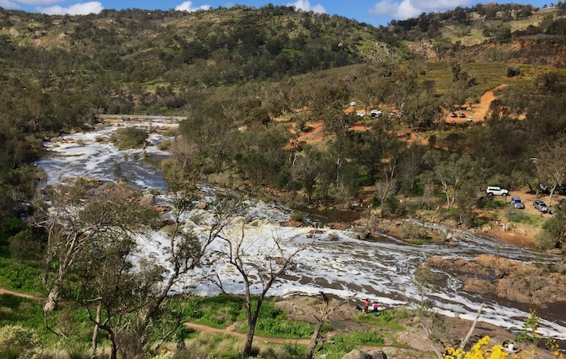

---
editor_options:
  markdown:
    wrap: 72
---

# Lab 2 - Streamflow analysis {#L2 .unnumbered}

In this module we understand how to generate streamflow data, and
how to use it charcaterise variability in stream discharge rates.


## Making Sense of Streamflow Data {#E2_5 .unnumbered}

The first step in any hydrologic data analysis project is to gather the
data and relevant background information on your catchment of interest.
In Western Australia the [WIR
website](http://wir.water.wa.gov.au/Pages/Water-Information-Reporting.aspx)
contains all of the data and information you need, and we will use this
in our future assignments. All states/countries have something similar;
the USA has one of the best examples through the [USGS NWIS
website](http://waterdata.usgs.gov/nwis).

If you click the site information button, enter your gauge name or
number, and browse the available datasets for your river. For this
analysis, you will need daily discharge data, peak streamflow, and the
annual water data report. Other datasets may also be helpful for
understanding the hydrologic behavior of your river.

Hydrologic analyses are almost always conducted for "water years" not
calendar years. In the Northern Hemisphere. A water year begins on
October 1 and ends September 30 . In the Southern Hemisphere it Starts
May 1 and ends April 30, though this can be region specific.

### Daily Unit Discharge Hydrograph {#E2_6 .unnumbered}

<center>
```{r E2image4, echo=FALSE, fig.cap="[The Avon River, Western Australia](https://en.wikipedia.org/wiki/Avon_River_(Western_Australia))", out.width = '80%'}

```
</center>

Unit discharge is the total discharge of the river divided by the
watershed area. Thus, it has units of m^3^/s/km^2^. Unit discharge is
very useful for comparing the hydrologic behaviour of catchments of
different size (since discharge scales with area). Depending on your
data source you will need to download data and do appropriate
conversions in a spreadsheet.

A properly formatted unit discharge hydrograph has a descriptive title,
labelled axes, and a logarithmic y-axis. If you need help with
formatting the graph in Excel, please don't hesitate to ask for help!

**Activity:** Get the Swan River "Walyunga"
gauge data (616011) from the download button (or alternatively goto the [WIR web
link](http://wir.water.wa.gov.au/Pages/Water-Information-Reporting.aspx),
and download the continuous flow data for the site directly from the database).  

<center>
```{r E2image5, echo=FALSE, fig.cap="Navigate to the 'Walyunga' guage (616011)", out.width = '50%', out.height = '50%'}
knitr::include_graphics("images/exercise2/image5.png")
```
</center>


In Excel, explore the data; note the different columns are the same discharge data in different units. Create a hydrograph
comparing discharge between a wet year and a dry year. Choose these years based on an annual pivot table, and use the column which is "total" in units of ML/day. For the plot, compare the two years on a common x-axis by aligning the two years side-by-side and plotting as two series.  On the x-axis, use a "hydrologic year" rather than calendar
years, which spans from 1 Apr to 31 Mar. Label accordingly. 

This is the flow leaving the catchment area. Now repeat the exercise but this time by creating a
*unit hydrograph* - for this you will need to divide by the catchment
area; refer to the above information and check units are consistent.
This gauge is draining the Avon catchment which has an area 125,000 km^2.

### Flow Duration Curves {#E2_7 .unnumbered}

#### What is it? {#E2_8 .unnumbered}

The flow duration curve is a plot that shows the percentage of time that
flow in a stream is likely to equal or exceed some specified value of
interest. For example, it can be used to show the percentage of time
river flow can be expected to exceed a design flow of some specified
value (e.g., 20 m^3^/s), or to show the discharge of the stream that
occurs or is exceeded some percent of the time (e.g., 80% of the time).


#### How is it calculated? {#E2_9 .unnumbered}

The basic time unit used in preparing a flow-duration curve will greatly
affect its appearance. For most studies, mean daily discharges are used.
These will give a steep curve. When the mean flow over a long period is
used (such as mean monthly flow), the resulting curve will be flatter
due to averaging of short-term peaks with intervening smaller flows
during a month. Extreme values are averaged out more and more, as the
time period gets larger (e.g., for a flow duration curve based on annual
flows at a long-record station).

**Step 1:** Sort (rank) average daily discharges for period of record
from the largest value to the smallest value, involving a total of $n$
values. ($n$ is the sample size).

**Step 2:** Assign each discharge value a rank ($M$), starting with 1
for the largest daily discharge value.

**Step 3:** Calculate exceedence probability ($P$) as follows:

<center>

```{=tex}
\begin{equation}
P = 100 * [\frac{M}{n+1}]
(\#eq:E2equation3)
\end{equation}
```
</center>

where, $P$ = the probability that a given flow will be equaled or
exceeded (% of time), $M$ = the ranked position on the listing
(dimensionless), and $n$ = the number of events for period of record
(dimensionless).

**Activity:** Follow the above steps using the 616011 gauge data to
create your own flow duration curve.

#### What does this particular information tell you about your stream? {#E2_10 .unnumbered}

A flow duration curve characterizes the ability of the basin to provide
flows of various magnitudes. Information concerning the relative amount
of time that flows past a site are likely to equal or exceed a specified
value of interest is extremely useful for the design of structures on a
stream. For example, a structure can be designed to perform well within
some range of flows, such as flows that occur between 20 and 80% of the
time (or some other selected interval).

The shape of a flow-duration curve in its upper and lower regions is
particularly significant in evaluating the stream and basin
characteristics. The shape of the curve in the high-flow region
indicates the type of flood regime the basin is likely to have, whereas,
the shape of the low-flow region characterizes the ability of the basin
to sustain low flows during dry seasons. A very steep curve (high flows
for short periods) would be expected for rain-caused floods on small
watersheds. Snowmelt floods, which last for several days, or regulation
of floods with reservoir storage, will generally result in a much
flatter curve near the upper limit. In the low-flow region, an
intermittent stream would exhibit periods of no flow, whereas, a very
flat curve indicates that moderate flows are sustained throughout the
year due to natural or artificial streamflow regulation, or due to a
large groundwater capacity which sustains the base flow to the stream.

An example, properly formatted flow duration curve is shown below
(Figure \@ref(fig:E2image6)).

<center>
```{r E2image6, echo=FALSE, fig.cap="Aproperly formatted flow duration curve", out.width = '85%', out.height = '85%'}
knitr::include_graphics("images/exercise2/image6.png")
```
</center>

### Flood Frequency Analysis {#E2_11 .unnumbered}

#### What is it? {#E2_12 .unnumbered}

Flood frequency analyses are used to predict design floods for sites
along a river. The technique involves using observed annual peak flow
discharge data to calculate statistical information such as mean values,
standard deviations, skewness, and recurrence intervals. These
statistical data are then used to construct frequency distributions,
which are graphs and tables that tell the **likelihood** of various
discharges as a function of recurrence interval or exceedence
probability.

Flood frequency distributions can take on many forms according to the
equations used to carry out the statistical analyses. Four of the common
forms are: **Normal Distribution**; **Log-Normal Distribution**;
**Gumbel Distribution**; and **Log-Pearson Type III Distribution**. Each
distribution can be used to predict design floods; however, there are
advantages and disadvantages of each technique.

While the log Pearson Type III distribution is the recommended
technique, its application is a bit more complex than we are going to
undertake for this class. Instead, we will use the older Weibull
plotting position method.

Flood frequency information can be determined from knowledge of the peak
discharge (highest discharge) in any given year provided enough years of
information has been collected. This allows one to relate the expected
recurrence interval for a given discharge, and determine the probability
that a flood of a given discharge will occur in any given year. The
recurrence interval for a given discharge can be calculated by first
ranking the discharges.

**Activity:** In the Table below for "Big River", fill in the Rank
column. To do this, enter a 1 for the maximum discharge that has
occurred during the 20 years of available data. The second highest
discharge will be given a rank of 2, etc. with the lowest discharge
given a value of 20. <br>

<center>
```{r E2table2, echo=FALSE, message=FALSE, warning=FALSE}
library(knitr)
library(kableExtra)
options(kableExtra.html.bsTable = F, knitr.kable.NA = '')
table2 <- read.csv("tables/exercise2/table2.csv", check.names=FALSE)
kable(table2,"html", escape = F, align = rep('c'), caption = "Complete the table for 'Big River'",
      bootstrap_options = "hover") %>%
  kable_styling(table2, bootstrap_options = "hover", "striped",
                full_width = F, position = "center",
                font_size = 12) %>%
  column_spec(1, width_min = "15em") %>%
  column_spec(2, width_min = "15em") %>%
  column_spec(3, width_min = "15em") %>%
  column_spec(4, width_min = "15em") %>%
  row_spec(1:20, background = 'white') %>%
  scroll_box(width = "100%", height = "515px",
             fixed_thead = FALSE)
```
</center>

<br> After you have filled in the Rank column, you can now calculate the
recurrence interval for each peak discharge. The recurrence interval,
$R$, is given by the Weibull Equation:

<center>
```{=tex}
\begin{equation}
R = \frac{n+1}{m}
(\#eq:E2equation4)
\end{equation}
```
</center>

where $n$ is the number of years over which the data was collected (20
years in this case), and $m$ is the rank of each peak discharge. Use
this equation to calculate the recurrence interval for each peak
discharge.

Next, use the graph below (or Excel) to plot a graph of discharge (on
the y-axis) versus recurrence interval (on the x-axis). Note that the
x-axis must be a logarithmic scale. If drawig by hand you should try to
estimate as best you can where the data point will fall between the
lines on the graph. Once you have plotted the points use a ruler to draw
the best fit straight line through the data points (lay a ruler on the
graph and try to draw a line that most closely approximates all of the
data points). Do not draw lines that connect individual data points. If
you are plotting in Excel you will fit a linear trendline.

<center>
```{r E2image7, echo=FALSE, fig.cap="", out.width = '70%'}
knitr::include_graphics("images/exercise2/image7.png")
```
</center>

By extrapolating your line on the graph, determine the peak discharge
expected in a flood with a recurrence interval of 50 years and 100
years. These are the discharges expected in a 50 year flood and a 100
year flood.

The annual exceedence probability, $P_{e}$, is the probability that a
given discharge will occur in a given year. It is calculated as the
inverse of the recurrence interval, $R$:

<center>
```{=tex}
\begin{equation}
P_{e} = \frac{1}{R}
(\#eq:E2equation5)
\end{equation}
```
</center>

Thus, the probability that a flood with a 10 year recurrence interval
will occur in any year is 1/10 = 0.1 or 10%. What are the probabilities
that a 50 year flood and a 100 year flood will occur in any given year?

**Extra activity:** Repeat the above flood frequency analysis using the
616011 Walyunga data set that you downloaded in Excel (Hint, use a pivot
table and the max option to get the annual maximum discharge).


## Measuring Stream Velocity & Discharge {#E2_2 .unnumbered}

The process of measuring stream flow (volume rate of flow), or
discharge, is called stream gauging. There are numerous methods of
stream gauging, including direct methods, such as volumetric gauging,
and dilution methods, as well as indirect methods involving
stage-discharge relations, or rating curves. Since the velocity of a
stream varies with depth and width across a stream, it is important to
understand what it is you want to measure when choosing a stream gauging
method. If you are interested in stream surface velocity, a simple float
method would work well. This method involves throwing some buoyant,
highly visible object into the stream and measuring the time it takes to
float a known distance. If you are interested in obtaining a more
accurate stream discharge measurement, the velocity-area method is your
method of choice.

Stream flow (discharge) can be measured based on two fundamental
methods, which are each expanded upon below (refer to lecture 3 for
details). The first requires a direct measurement of velocity, whereas
the second is an approximation based on stream-bed slope and geometry.

### Flow Rate: Velocity-Area Method {#E2_3 .unnumbered}

Flow estimates in natural streams and artificial channels under steady
(no change in depth with time) and uniform (no change in depth with
space) conditions can be computed by the product of mean flow velocity
(integrated in depth and across the channel) and the cross-sectional
area of flow. The equation $Q = V * A$, were $V$ (m/s) is the mean
velocity and $A$ (m^2^) is the flow (or water) cross-sectional area is
used for this purpose. Large streams and rivers, a section control is
needed to generate the "rating curve" thus establishing a relationship
between water stage height ($H$) and flow discharge ($Q$). In this case,
both flow velocity measurements and cross-sectional areas are needed.

Discharge using the Velocity-Area method is measured by integrating the
area and velocity of each point across the stream. The channel or stream
is divided into sections based on where the velocity and stage height
measurements were taken in the cross-section of the stream/channel. The
flow velocity is measured using a current meter (i.e. propeller,
electromagnetic, ultrasonic, and Doppler).

The discharge is computed using:

<center>
```{=tex}
\begin{equation}
Q = \sum^{n}_{i=0} (V_{i} * \text{Area}_{i})
(\#eq:E2equation1)
\end{equation}
```
</center>

where $n$ is the number of vertical for measuring velocities, $V_{i}$ is
the mean velocity value for vertical $i$ (m/s) and $\text{Area}_i$ is
the cross-sectional area around vertical $i$ (m^2^). The cross-sectional
area is best estimated by treating the sections as rectangles, trapezia
or triangles.

<center>
```{r E2image1, echo=FALSE, fig.cap="Current-meter discharge measurements are made by determining the discharge in each subsection of a channel cross section and summing the subsection discharges to obtain a total discharge.", out.width = '50%'}
knitr::include_graphics("images/exercise2/image1.png")
```
</center>

To measure stream velocity we can utilise a "**swoffer**" -- a pole with
a propeller on the end with an electronic logger recording the
rotations. A current meter is so designed that its rotation speed varies
linearly with the stream velocity at the location of the instrument.

A more modern alternative is an "ADV" (Acoustic Doppler Velocimeter).
This relies on a method where it looks at the scatter of sound waves
rebounding of particles/bubbles in the water, and based on the "Doppler
effect" (recall the sound of a train changing pitch as it moves past
you), it can compute the water velocity.

<center>
```{r E2image2, echo=FALSE, fig.cap="An ADV - used to measure stream velocity.", out.width = '30%'}
knitr::include_graphics("images/exercise2/image2.png")
```
</center>

<br>

**Activity:** Watch the videos below showing the principles of how to
measure the velocity of water. Then calculate the streamflow at the two
sites in Table. The "section" column tells you nominally where you are
across the x-section, the "width" column is the actual width of flow you
should use in your calculations. Each velocity and depth measurement was
made at the distance across the stream reported in the "distance"
column.

-   Does the wider stream section have more streamflow? Is this what you
    would have expected?

-   Site 1 is upstream of Site 2, did the flow increase or decrease
    downstream? What might have caused this change in flow?

<br>

<center>
::: {style="left: 0; width: 100%; height: 0; position: relative; padding-bottom: 56.25%;"}
<iframe style="border: 0; top: 0; left: 0; width: 100%; height: 100%; position: absolute;" src="https://www.youtube.com/embed/c1tQcxyRioQ" allowfullscreen scrolling="no" allow="encrypted-media; accelerometer; gyroscope; picture-in-picture">
</iframe>
:::
</center>

<br>

<center>
::: {style="left: 0; width: 100%; height: 0; position: relative; padding-bottom: 56.25%;"}
<iframe style="border: 0; top: 0; left: 0; width: 100%; height: 100%; position: absolute;" src="https://www.youtube.com/embed/_k1BTDjZfbU" allowfullscreen scrolling="no" allow="encrypted-media; accelerometer; gyroscope; picture-in-picture">
</iframe>
:::
</center>

<br>

<center>
```{r E2table1, echo=FALSE, message=FALSE, warning=FALSE}
library(knitr)
library(kableExtra)
options(kableExtra.html.bsTable = F, knitr.kable.NA = '')
table1 <- read.csv("tables/exercise2/table1.csv", check.names=FALSE)
kable(table1,"html", escape = F, align = rep('c'), caption = "Measured data for velocity-area method of calculating streamflow",
      bootstrap_options = "hover") %>%
  kable_styling(table1, bootstrap_options = "hover", "striped",
                full_width = F, position = "center",
                font_size = 12) %>%
  column_spec(1, width_min = "7.9em") %>%
  column_spec(2, width_min = "7.9em") %>%
  column_spec(3, width_min = "7.9em") %>%
  column_spec(4, width_min = "7.9em") %>%
  column_spec(5, width_min = "7.9em") %>%
  column_spec(6, width_min = "7.9em") %>%
  column_spec(7, width_min = "7.9em") %>%
  row_spec(1:12, background = 'white') %>%
  scroll_box(width = "100%", height = "467.5px",
             fixed_thead = FALSE)
```
</center>

<br>

### Flow Rate: Manning's Formula {#E2_4 .unnumbered}

Manning's formula for estimating streamflow (in m^3^s^-1^) from basic
channel geometry, slope and roughness is:

<center>
```{=tex}
\begin{equation}
Q = \frac{1}{n}(A\space{}R^{\frac{2}{3}}\space{}S^{\frac{1}{2}})
(\#eq:E2equation2)
\end{equation}
```
</center>

Where: $A$ is the channel cross-sectional area (m^2^) ; $R$ is the
hydraulic radius given by $\frac{A}{P}$ ; $P$ is the wetted perimeter
(i.e. bed plus banks; m); $S$ is the channel slope (m/m); $n$ is
Manning's 'n' (which is an empirical roughness coefficient).

In practice, when you are in the field the bottom slope ($S$) will be
measured by using a differential GPS (DGPS). You also need to measure
the 'wetted perimeter' ($P$) of the channel and the cross sectional area
($A$). The roughness coefficient ($n$) should be assumed from the
literature, based on your observations or the stream and a table like
the one below, or [here](https://pubs.usgs.gov/wsp/2339/report.pdf), or
[here](https://www.agric.wa.gov.au/water-management/mannings-roughness-coefficient),
or
[here](https://www.brisbane.qld.gov.au/sites/default/files/ncd_appendixc_part3.pdf).

<center>
```{r E2image3, echo=FALSE, fig.cap="", out.width = '70%'}
knitr::include_graphics("images/exercise2/image3.png")
```
</center>

<br>

**Activity:** For this activity we will use some of the same measured
data that we used for the velocity-area method. Those measurements were
taken on [Carey Brook](https://parks.dpaw.wa.gov.au/sites/default/files/downloads/parks/2019_153%20Carey%20Brook%20fact%20sheet%20May%202019.pdf), a tributary to the [Donnelly River](https://rivers.dwer.wa.gov.au/catchment/donnelly-river/) in south-west
Western Australia (near Pemberton). You have already calculated the
total area (sum the individual areas calculated in the velocity-area
method). Draw a scale diagram of your chosen cross-section to estimate
the wetted perimeter. Use the slope over the 5.2 km of Carey Bk between
the main highway (25 m AHD) and where it flows into the Donnelly River
(7 m AHD). Now you just need a roughness parameter, Manning's $n$, and
you can solve Equation \@ref(eq:E2equation2).

-   How does this streamflow estimate compare to the answer you got
    using the velocity-area method above?

-   How sensitive is your answer to the value of Manning's $n$?


