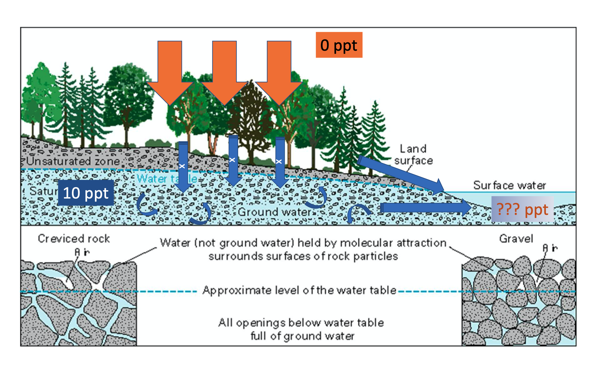
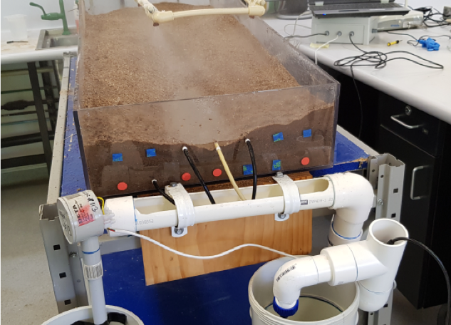
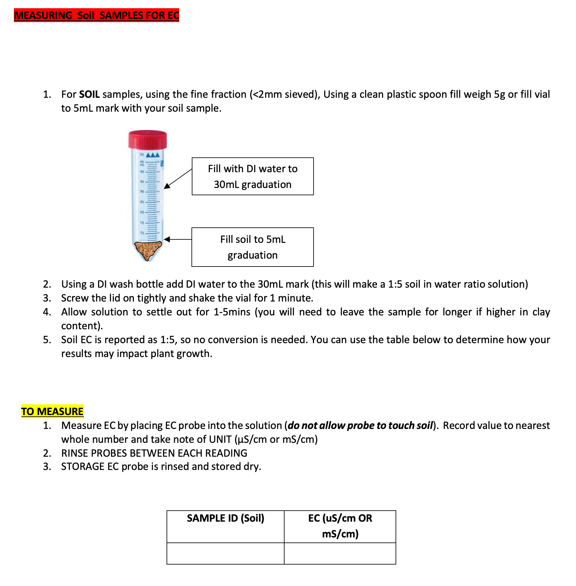

# Week 4 - Groundwater and surface water interaction {#L3_1 .unnumbered}

### Learning Objectives {#L3_2 .unnumbered}

In this experiment, you will use data from a physical model of a catchment during a simulated rainfall event to demonstrate the relative contributions of pre-event ('old') and event ('new') water to the observed streamflow. The real-world setting for the experiment is a gaining stream (Figure \@ref(fig:L3image1)).

At the conclusion of this exercise students will have demonstrated an ability to:

-   analyse measured experimental data to characterize the key properties of a rainfall event.

-   differentiate the quantity of pre-event and event components of water in a storm hydrograph (hydrochemical baseflow separation).

-   discuss the significance of experimental results for managing water resources in the context of surface water - groundwater interaction.


### Background {#L3_3 .unnumbered}

A question we often want to be able to answer is how much groundwater is contributing to flow in a river, and how much of the water we see came from recent rainfall. This is relevant for water resources planning so we can work out the discharge rate of an aquifer, or for water quality management.

<center>
```{r L3image1, echo=FALSE, fig.cap="Groundwater discharge to a gaining stream.", out.width = '60%'}
knitr::include_graphics("images/exercise4/image1.png")
```
</center>

Groundwater usually has different chemical characteristics to storm runoff during a rainfall event and we can use this chemical signal as a tracer for groundwater contribution. In this experiment you will demonstrate how groundwater (pre-event or 'old' water) contribution to river flow changes over the course of a storm event, relative to water that fell as rain during the storm event (event or 'new' water). You will use the tracer dilution technique with salinity (measured as electrical conductivity, $EC$) as the groundwater tracer.

<center>
```{r L3imageX, echo=FALSE, fig.cap="Schematic of interactions and different water sources being explored in this lab activity. Note that in this case the rain has 0ppt salinity and the groundwater has 10ppt salinity. What is the salinity in the outflowing water going to be?", out.height = '70%'}

```
</center>


### Experimental Method {#L3__4 .unnumbered}

#### Set up of apparatus {#L3__5 .unnumbered}

The experimental set-up consists of a tray of soil, the ability to add rainfall at a controlled rate (via a connection to the tap), and discharge outlets at the bottom of the catchment. During the experiment loggers are set up to measure the rainfall flow amount as well as the streamflow volume and EC of the catchment outlet water over time (Figure \@ref(fig:L3image2)). The loggers for rainfall, streamflow and EC that are connected to a computer.

<center>
```{r L3image2, echo=FALSE, fig.cap="Experimental setup showing the catchment tray, rainfall, sprinklers and logger location.", out.width = '90%'}
knitr::include_graphics("images/exercise4/image2.png")
```
</center>

#### Create the aquifer {#E4_6 .unnumbered}

The first step is to create the "aquifer" by loading the bottom of the tray with river sand. The top surface is set to be smoothed so that it has an even thickness laterally across the catchment, and shaped like a wedge, so then the volume of this layer can be estimated. Importantly, the top of aquifer sits below the top line of outlets as shown in Figure \@ref(fig:L3image3). At this step compute the volume of soil added in the aquifer layer, and note it down.

To create the aquifer (pre-event) groundwater, the sand should be saturated with saline water (making sure to note the initial EC of the starting saline solution; it should be about 10ppt). Note the volume of water added to fill the aquifer. Remove any excess ponded water removed with a syringe before proceeding.

<center>
```{r L3image3, echo=FALSE, fig.cap="Saturated aquifer correctly set up within catchment model.", out.width = '90%'}
knitr::include_graphics("images/exercise4/picture3.png")
```
</center>

#### Create the unsaturated zone {#L3__7 .unnumbered}

This saturated aquifer layer is then overlain with a second layer of **dry** soil, being careful not to disturb the original aquifer layer. This upper layer can be shaped into the form of a catchment (e.g., concave) so that when the subsurface fills up there is a stream flowing towards the catchment outlet (Figure \@ref(fig:L3image4)). The middle outlet should not be covered with soil, but the soil should be just below this outlet (this is your riverbed). At this step you could see some capillary rise of aquifer water into the vadose zone (upper soil layer).

<center>
```{r L3image4, echo=FALSE, fig.cap="Unsaturated zone on to of aquifer. Topography should slope towards the middle and the catchment outlet.", out.height = '70%'}
knitr::include_graphics("images/exercise4/picture4.png")
```
</center>

#### Make it rain {#L3_8 .unnumbered}

The rainfall outlets should then be brought close to the catchment surface, to avoid "raining" outside the catchment, and then the tubes at the bottom of the catchment checked to ensure they are not blocked and directed into the PVC drain where the outflow is measured.

Start the logger logging. And now the rain! The apparatus should then be left with the rain on for approximately 15-20 minutes until the catchment has filled up, streamflow has begun and the EC at the catchment outlet has clearly decreased (Figure \@ref(fig:L3image5)). To finish, turn the rain off but leave the loggers still running for another 15-20 minutes, or until streamflow ceased, so you can measure what happens after the rain has stopped.

Once all is done save the logger data as a *.csv file and share with your team.

<center>
```{r L3image5, echo=FALSE, fig.cap="Streamflow at the catchment outlet.", out.height = '30%'}

```
</center>

#### Measure the final soil EC {#L3_80 .unnumbered}

To find out how much of the initial salinity is left after the storm, after the rain has ceased, take two samples from the catchment for soil EC analysis - one from the aquifer near to the upper and lower areas. Follow the provided handout for instructions on measuring soil EC.

<center>
```{r L3imageY, echo=FALSE, fig.cap="Look for the instruction sheet on how to measure soil EC", out.height = '40%'}

```
</center>


### Data Analysis {#L3_9 .unnumbered}

#### QA-QC of data {#L3_10 .unnumbered}

Use the data collected from the data logger (saved as csv). If it is not available then download the reference/default data sheet provided on LMS.

Before you can start your analysis you might need to clean the data -- remove any outliers and identify where your experimental data start and stop. You have very high temporal resolution data (1Hz = 1 entry per second!), which combines with the sensitivity of your loggers to give you a lot of noise. You can smooth the data by calculating a running average (over 30 seconds or more) to get smooth temporal trends. Refer to analysis done in Lab 1 also.

#### Characterizing the rainfall event {#L3_11 .unnumbered}

Once you are happy with your clean data set you can use the logged data to identify the properties of the storm event, including:

a)  Time from rainfall onset to when runoff began to be recorded (mins),
b)  Time to peak discharge (mins),
c)  Total rainfall volume (cm^3^ or L),
d)  Total runoff volume (cm^3^ or L),
e)  Average rainfall intensity (L/min),
f)  The runoff coefficient, $c$, for the 'storm' event (fraction of rain that left as streamflow).

#### Separating pre-event and event water {#L3_12 .unnumbered}

Now let's calculate the contributions of pre-event (baseflow = groundwater) and event (rainfall and new runoff) water. Because the groundwater was saline you can use the *tracer dilution method* (see the blue box below for details) to calculate the fraction of the hydrograph that is from baseflow. In other words, we want to calculate and plot a hydrograph showing each of the components of the water balance:

<center>
$Q_{\text{out}}(t) = Q_{\text{event}} + Q_{\text{pre-event}}$
</center>

where $Q_{\text{out}}$ (cm^3^/s) is the volumetric flow rate measured at the outlet of the catchment, $Q_{\text{event}}$ (cm^3^/s) is the volumetric flow rate of event water (representing rainfall and runoff) and $Q_{\text{pre-event}}$ is the volumetric flow rate of pre-event water (representing groundwater).

```{block2, E4blubox1, type='bluebox'}
If there is a difference in the salinity of groundwater and rainfall-runoff then we can estimate the groundwater contribution to the streamflow by looking at changes in salinity at the catchment outlet (measured as electrical conductivity, or EC).

To do this we assume that the EC in groundwater is at a pre-event reference level, $S_{\text{pre-event}}$, and EC in the rain $S_{\text{event}}$ is effectively 0.  The level of dilution in EC in streamflow can then be used to estimate the fraction of pre-event (groundwater baseflow) and event (rainfall-runoff) water contributing to total streamflow.

The salt mass balance tells us that the total salt mass coming out of the catchment via the stream must equal the sum of pre-event and event components:
<center>
$S_{\text{out}} * Q_{\text{out}} =  S_{\text{event}} * Q_{\text{event}}   +   S_{\text{pre-event}} * Q_{\text{pre-event}}$
</center>

And because the rainfall and runoff didn't have any salt added, $S_{\text{event}} = 0$

So that we can cancel the "event" term and rearrange to solve for the pre-event component of volumetric flow:
<center>
$Q_{\text{pre-event}} = S_{\text{out}}*Q_{\text{out}} / S_{\text{pre-event}}$
</center>

And once this pre-event component is known, we can calculate the event component of volumetric flow from rearranging the water balance to give:
<center>
$Q_{\text{event}} = Q_{\text{out}} - Q_{\text{pre-event}}$
</center>

```

### Interpretation and conclusions {#L3_13 .unnumbered}

-   Create a summary plot that nicely shows the runoff and indicates the fraction leaving the catchment that is "baseflow" (i.e. aquifer water).

-   How do the relative amounts of pre-event and event water change over time? Is the change in $Q_{\text{pre-event}}/Q_{\text{event}}$ over time what you would expect?

-   How could attributes of the experimental setup have increased or decreased the baseflow contribution?

-   How would the results have changed if we ran the experiment again, starting with a wetted-up unsaturated zone?

-   How realistic is the experiment in terms of capturing the interaction of surface water and groundwater?

-   What are the significance of these results for water resource management?
